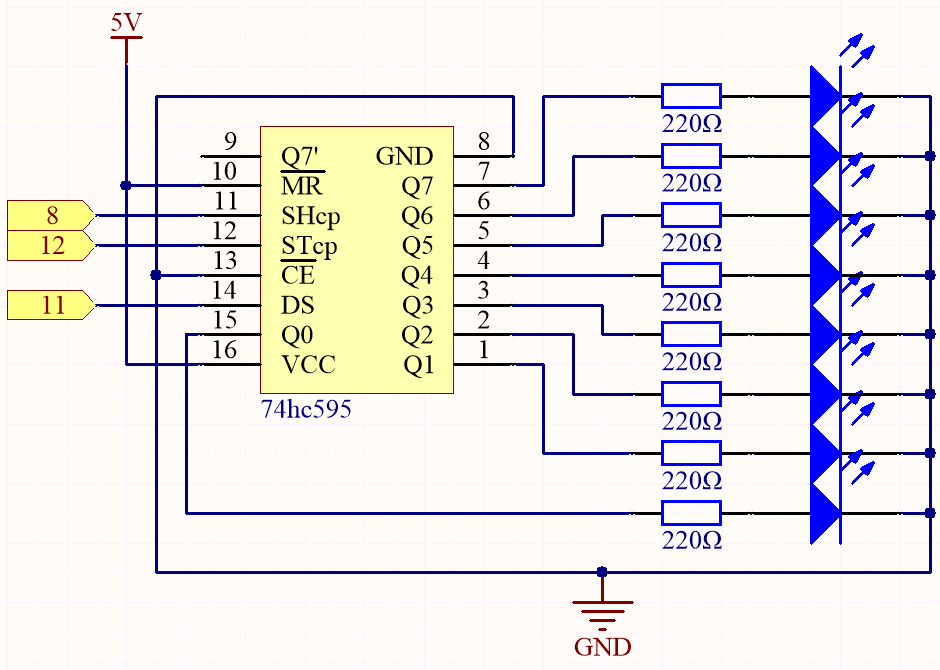
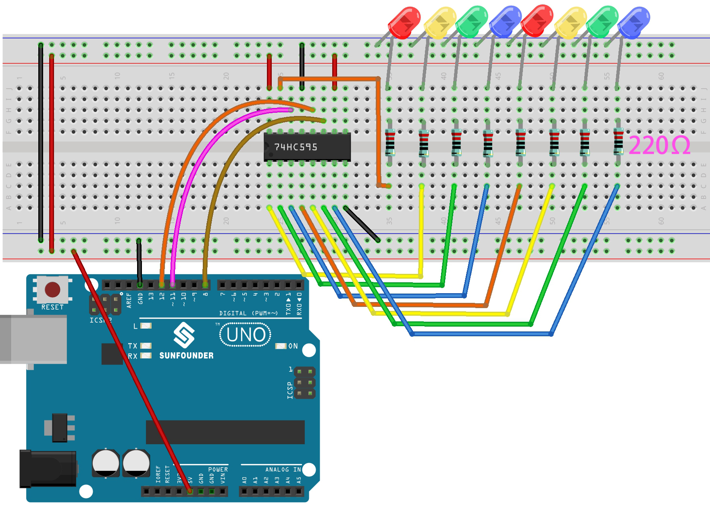

.. _ar_shiftout:

2.4 Microchip - 74HC595
=======================

``shiftOut()`` will make 74HC595 output 8 digital signals. It outputs the last bit of the binary number to Q0, and the output of the first bit to Q7. In other words, writing the binary number “00000001” will make Q0 output high level and Q1~Q7 output low level.

In this project, you will learn how to use 74HC595. 74HC595 consists of an 8−bit shift register and a storage register with three−state parallel outputs. It converts serial input into parallel output so you can save IO ports of an MCU.

Specifically, 74hc595 can replace 8 pins for digital signal output by writing an 8-bit binary number.

* `Binary number - Wikipedia <https://en.wikipedia.org/wiki/Binary_number>`_

**Schematic**

* When MR (pin10) is high level and OE (pin13) is low level, data is input in the rising edge of SHcp and goes to the memory register through the rising edge of SHcp.
* If the two clocks are connected together, the shift register is always one pulse earlier than the memory register.
* There is a serial shift input pin (Ds), a serial output pin (Q) and an asynchronous reset button (low level) in the memory register.
* The memory register outputs a Bus with a parallel 8-bit and in three states.
* When OE is enabled (low level), the data in memory register is output to the bus(Q0 ~ Q7).

**Wiring**

* :ref:`cpn_uno`
* :ref:`cpn_breadboard`
* :ref:`cpn_wires`
* :ref:`cpn_resistor`
* :ref:`cpn_74hc595`
* :ref:`cpn_led` 

**Code**

.. note::

    * Open the ``2.4_74hc595.ino`` file under the path of ``esp32-ultimate-kit\c\codes\2.4_74hc595``.
    * Or copy this code into **Arduino IDE**.
    
    

.. raw:: html

When you finish uploading the codes to the ESP32 board, you can see the LEDs turning on one after another.

**How it works?**

#. Declare an array, store several 8 bit binary numbers that are used to change the working state of the eight LEDs controlled by 74HC595. 

    .. code-block:: arduino

        int datArray[] = {B00000000, B00000001, B00000011, B00000111, B00001111, B00011111, B00111111, B01111111, B11111111};

#. ``loop()`` function.

    .. code-block:: arduino

        void loop()
            {
                for(int num = 0; num <10; num++)
                {
                    digitalWrite(STcp,LOW); //Set ST_CP and hold low for as long as you are transmitting
                    shiftOut(DS,SHcp,MSBFIRST,datArray[num]);
                    digitalWrite(STcp,HIGH); //pull the ST_CPST_CP to save the data
                    delay(1000);
                }
            }

    * Iterates through the ``datArray[]``, sequentially sending the binary values to the shift register.
    * The ``digitalWrite(STcp, LOW)`` and ``digitalWrite(STcp, HIGH)`` commands latch the data into the storage register.
    * ``shiftOut()`` function sends the binary values from ``datArray[]`` to the shift register using the data pin (DS) and shift register clock pin (SHcp). ``MSBFIRST`` means to move from high bits.
    * Then create a 1-second pause between each LED pattern update.
