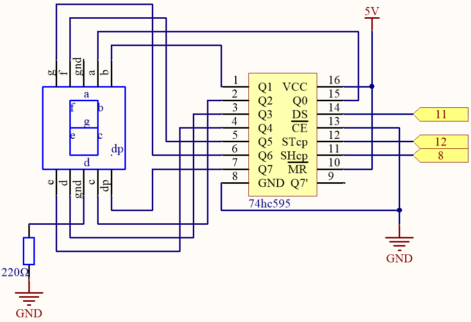
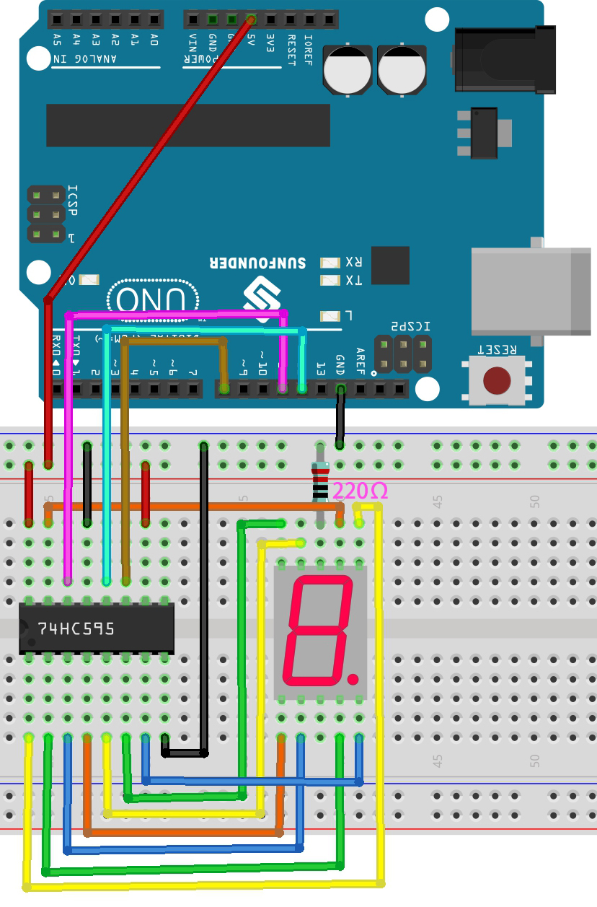
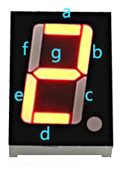

.. _ar_segment:

2.5 7 Segment Display
===================================

Previously, we used the ``shiftout()`` function to light up eight LEDs; here we use it to display 0-9 on the 7-aegment Display.

The 7-segment Display is essentially a device packaged by 8 LEDs, of which 7 strip-shaped LEDs form an "8" shape, and there is a slightly smaller dotted LED as a decimal point. These LEDs are marked as a, b, c, d, e, f, g, and dp. They have their own anode pins and share cathodes. Their pin locations are shown in the figure below.

.. image:: img/segment_cathode.png
    :width: 600
    :align: center

**Schematic**

**Wiring**

.. list-table:: Wiring
    :widths: 15 25
    :header-rows: 1

    *   - 74HC595
        - LED Segment Display
    *   - Q0
        - a
    *   - Q1
        - b
    *   - Q2
        - c
    *   - Q3
        - d
    *   - Q4
        - e
    *   - Q5
        - f
    *   - Q6
        - g
    *   - Q7
        - dp

* :ref:`cpn_uno`
* :ref:`cpn_breadboard`
* :ref:`cpn_wires`
* :ref:`cpn_resistor`
* :ref:`cpn_7_segment`
* :ref:`cpn_74hc595` 

**Code**

.. note::

    * Open the ``2.5_7segment.ino`` file under the path of ``esp32-ultimate-kit\c\codes\2.5_7segment``.
    * Or copy this code into **Arduino IDE**.
    
    

.. raw:: html

After the code is uploaded successfully, you will be able to see the LED Segment Display display 0~9 in sequence.

**How it works?**

In this project, we are using the ``shiftOut()`` function to write the binary number to the shift register. 

Suppose that the 7-segment Display display the number "2". This bit pattern corresponds to the segments **f**, **c** and **dp** being turned off (low), while the segments **a**, **b**, **d**, **e** and **g** are turned on (high). This is "01011011" in binary and "0x5b" in hexadecimal notation. 

Therefore, you would need to call ``shiftOut(DS,SHcp,MSBFIRST,0x5b)`` to display the number "2" on the 7-segment display.

* `Hexadecimal <https://en.wikipedia.org/wiki/Hexadecimal>`_

* `BinaryHex Converter <https://www.binaryhexconverter.com/binary-to-hex-converter>`_

The following table shows the hexadecimal patterns that need to be written to the shift register to display the numbers 0 to 9 on a 7-segment display.

.. list-table:: Glyph Code
    :widths: 20 20 20
    :header-rows: 1

    *   - Numbers	
        - Binary Code
        - Hex Code  
    *   - 0	
        - 00111111	
        - 0x3f
    *   - 1	
        - 00000110	
        - 0x06
    *   - 2	
        - 01011011	
        - 0x5b
    *   - 3	
        - 01001111	
        - 0x4f
    *   - 4	
        - 01100110	
        - 0x66
    *   - 5	
        - 01101101	
        - 0x6d
    *   - 6	
        - 01111101	
        - 0x7d
    *   - 7	
        - 00000111	
        - 0x07
    *   - 8	
        - 01111111	
        - 0x7f
    *   - 9	
        - 01101111	
        - 0x6f

Write these codes into ``shiftOut()`` to make the LED Segment Display display the corresponding numbers.