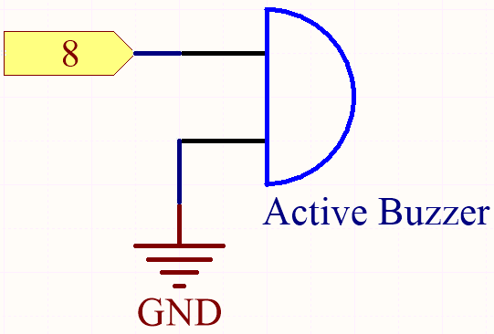
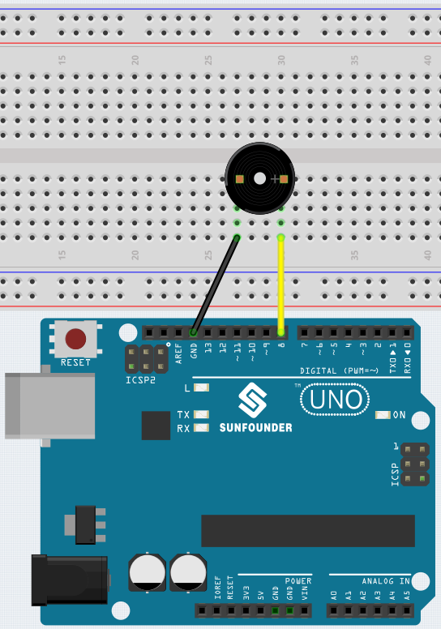

.. _ar_beep:

3.1 Beep
==================
The active buzzer is a typical digital output device that is as easy to use as lighting up an LED!

Two types of buzzers are included in the kit. 
We need to use active buzzer. Turn them around, the sealed back (not the exposed PCB) is the one we want.

.. image:: img/buzzer.png

**Schematic**

**Wiring**

* :ref:`cpn_uno`
* :ref:`cpn_breadboard`
* :ref:`cpn_wires`
* :ref:`cpn_buzzer`

**Code**

.. note::

   * You can open the file ``3.1_beep.ino`` under the path of ``esp32-ultimate-kit\c\codes\3.1_beep``. 
   * Or copy this code into **Arduino IDE**.
   
.. raw:: html
    

After the code is uploaded successfully, you will hear a beep every second.