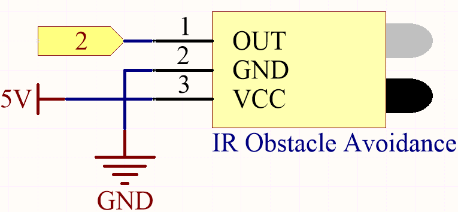
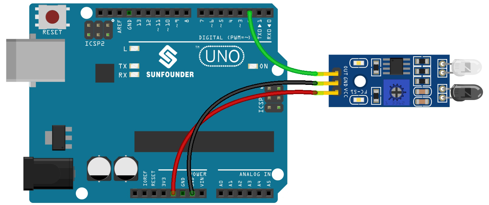

.. _ar_ir_obstacle:

5.3 Detect the Obstacle
===================================

This module is commonly installed on the car and robot to judge the
existence of the obstacles ahead. Also it is widely used in hand held
device, water faucet and so on.

**Schematic**

The digital pin 2 is used to read the
signal of IR Obstacle Avoidance Module. We get the VCC of IR
Sensor Module connected to 5V, GND to GND, OUT to digital pin 2.

**Wiring**

* :ref:`cpn_uno`
* :ref:`cpn_avoid`
* :ref:`cpn_wires`

**Code**

.. note::

   * You can open the file ``3.3.detect_the_obstacle.ino`` under the path of ``esp32-ultimate-kit\c\codes\3.3.detect_the_obstacle``. 
   * Or copy this code into **Arduino IDE**.
   
   

.. raw:: html

After the code is uploaded successfully, if the IR obstacle avoidance module detects something blocking in front of it, "0" will appear on the serial monitor, otherwise "1" will be displayed.