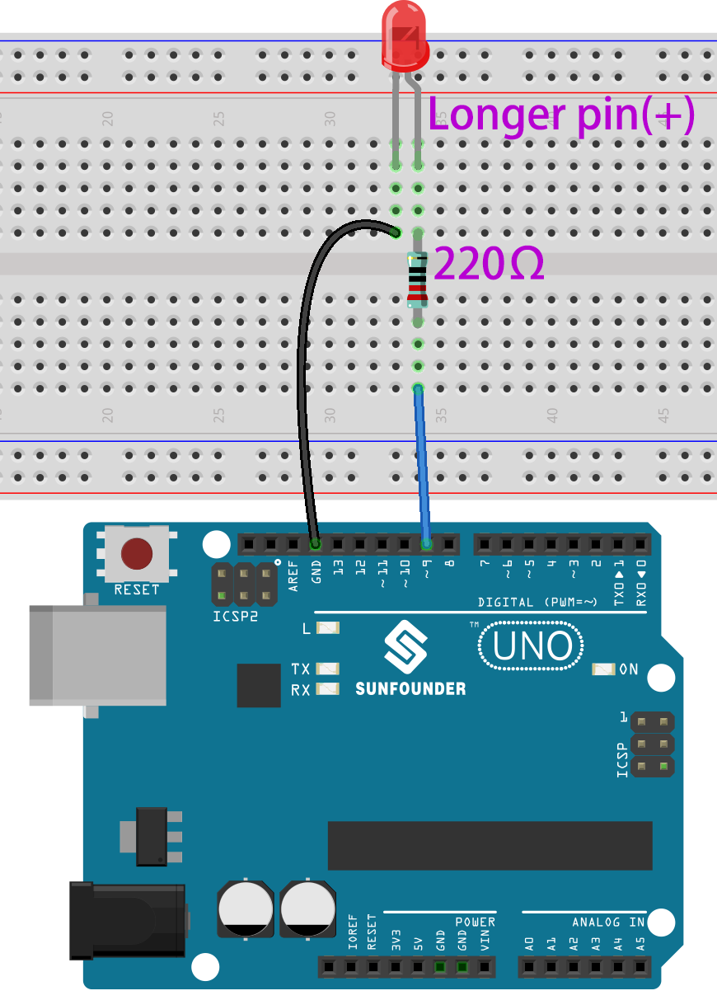

.. _ar_blink:

2.1 Hello, LED! 
=======================================

Just as printing “Hello, world!” is the first step in learning to program, using a program to drive an LED is the traditional introduction to learning physical programming.

**Schematic**

.. image:: img/circuit_1.1_led.png

The principle of this circuit is simple and the current direction is shown in the figure. When pin 9 outputs high level(5V), the LED will light up after the 220ohm current limiting resistor. When pin 9 outputs low level (0v), the LED will turn off.

**Wiring**

* :ref:`cpn_uno`
* :ref:`cpn_breadboard`
* :ref:`cpn_wires`
* :ref:`cpn_resistor`
* :ref:`cpn_led`

**Code**

.. note::

   * You can open the file ``2.1_hello_led.ino`` under the path of ``esp32-ultimate-kit\c\codes\2.1_hello_led``. 
   * Or copy this code into **Arduino IDE**.
   
   

.. raw:: html

After the code is uploaded successfully, you will see the LED blinking.

**How it works?**

#. Declare an integer constant named ``ledPin`` and assigns it the value 26. 

    .. code-block:: arduino

        const int ledPin = 26;  // The GPIO pin for the LED

#. Now, initialize the pin in the ``setup()`` function, where you need to initialize the pin to ``OUTPUT`` mode.

    .. code-block:: arduino

        void setup() {
            pinMode(ledPin, OUTPUT);
        }

    * ``void pinMode(uint8_t pin, uint8_t mode);``: This function is used to define the GPIO operation mode for a specific pin.

        * ``pin`` defines the GPIO pin number.
        * ``mode`` sets operation mode.

        The following modes are supported for the basic input and output:

        * ``INPUT`` sets the GPIO as input without pullup or pulldown (high impedance).
        * ``OUTPUT`` sets the GPIO as output/read mode.
        * ``INPUT_PULLDOWN`` sets the GPIO as input with the internal pulldown.
        * ``INPUT_PULLUP`` sets the GPIO as input with the internal pullup.

#. The ``loop()`` function contains the main logic of the program and runs continuously. It alternates between setting the pin high and low, with one-second intervals between the changes.

    .. code-block:: arduino

        void loop() {
            digitalWrite(ledPin, HIGH);   // turn the LED on (HIGH is the voltage level)
            delay(1000);                       // wait for a second
            digitalWrite(ledPin, LOW);    // turn the LED off by making the voltage LOW
            delay(1000);                       // wait for a second
        }

    * ``void digitalWrite(uint8_t pin, uint8_t val);``: This function sets the state of the selected GPIO to ``HIGH`` or ``LOW``. This function is only used if the ``pinMode`` was configured as ``OUTPUT``.
    
        * ``pin`` defines the GPIO pin number.
        * ``val`` set the output digital state to ``HIGH`` or ``LOW``.