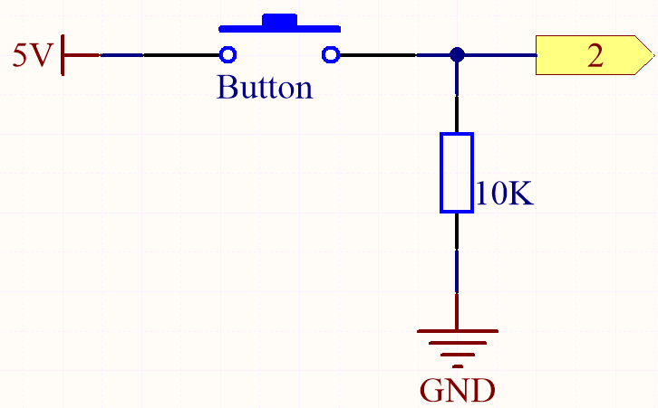
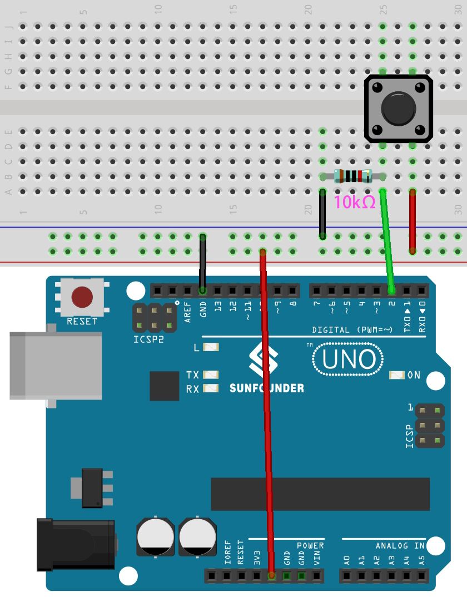
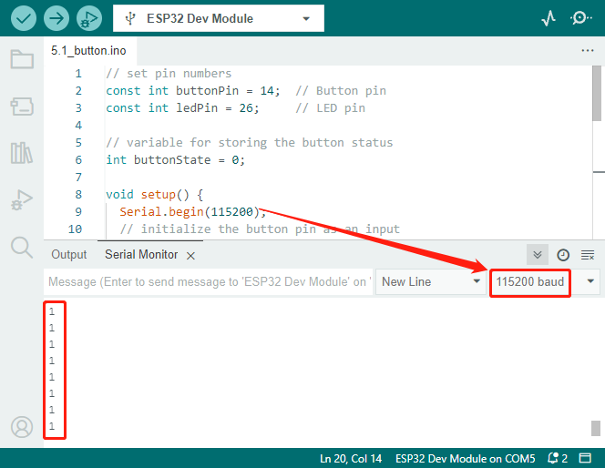

.. _ar_button:

5.1 Reading Button Value
==============================================

In the previous projects, we used the output function, in this chapter we will use the input function to input read the button value.

**Schematic**

One side of the button pin is connected to 5V, 
and the other side pin is connected to pin 2, 
so when the button is pressed, 
pin 2 will be high. However, 
when the button is not pressed, 
pin 2 is in a suspended state and may be high or low. 
In order to get a stable low level when the button is not pressed, 
pin 2 needs to be reconnected to GND through a 10K pull-down resistor.

**Wiring**

按键引脚接14，同侧引脚接10K电阻之后接GND，另外一侧接3.3V.
LED接26.

* :ref:`cpn_uno`
* :ref:`cpn_breadboard`
* :ref:`cpn_wires`
* :ref:`cpn_resistor`
* :ref:`cpn_button`

**Code**

.. note::

   * You can open the file ``5.1_button.ino`` under the path of ``esp32-ultimate-kit\c\codes\5.1_button``. 
   * Or copy this code into **Arduino IDE**.
   
   

.. raw:: html

 
Once the code is uploaded successfully, the LED lights up when you press the button and goes off when you release it.

At the same time you can open the Serial Monitor in the upper right corner to observe the value of the button, when the button is pressed, "1" will be printed, otherwise "0" will be printed.

**How it works**

The previous projects all involved outputting signals, either in the form of digital or PWM signals.

This project involves receiving input signals from external component to the ESP32 board. You can view the input signal through the Serial Monitor in Arduino IDE.

#. In the ``setup()`` function, the button pin is initialized as an ``input`` and the LED pin is initialized as an ``output``. The Serial communication is also initiated with a baud rate of 115200.

    .. code-block:: arduino

        void setup() {
            Serial.begin(115200);
            // initialize the button pin as an input
            pinMode(buttonPin, INPUT);
            // initialize the LED pin as an output
            pinMode(ledPin, OUTPUT);
        }
    
    * ``Serial.begin(speed)``: Sets the data rate in bits per second (baud) for serial data transmission.

        * ``speed``: in bits per second (baud). Allowed data types: ``long``.

#. In the ``loop()`` function, the state of the button is read and stored in the variable ``buttonState``. The value of ``buttonState`` is printed to the Serial Monitor using ``Serial.println()``.

    .. code-block:: arduino

        void loop() {
            // read the state of the button value
            buttonState = digitalRead(buttonPin);
            Serial.println(buttonState);
            delay(100);
            // if the button is pressed, the buttonState is HIGH
            if (buttonState == HIGH) {
                // turn LED on
                digitalWrite(ledPin, HIGH);

            } else {
                // turn LED off
                digitalWrite(ledPin, LOW);
            }
        }

    If the button is pressed and the ``buttonState`` is HIGH, the LED is turned on by setting the ``ledPin`` to ``HIGH``. Else, turn the LED off.

    * ``int digitalRead(uint8_t pin);``: To read the state of a given pin configured as INPUT, the function digitalRead is used. This function will return the logical state of the selected pin as ``HIGH`` or ``LOW``.

        * ``pin`` select GPIO

    * ``Serial.println()``: Prints data to the serial port as human-readable ASCII text followed by a carriage return character (ASCII 13, or '\r') and a newline character (ASCII 10, or '\n').

