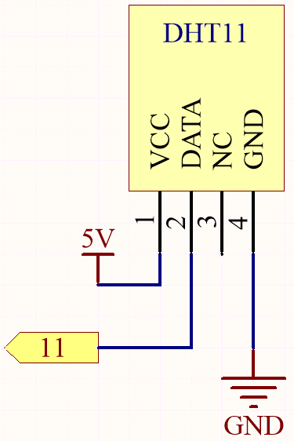
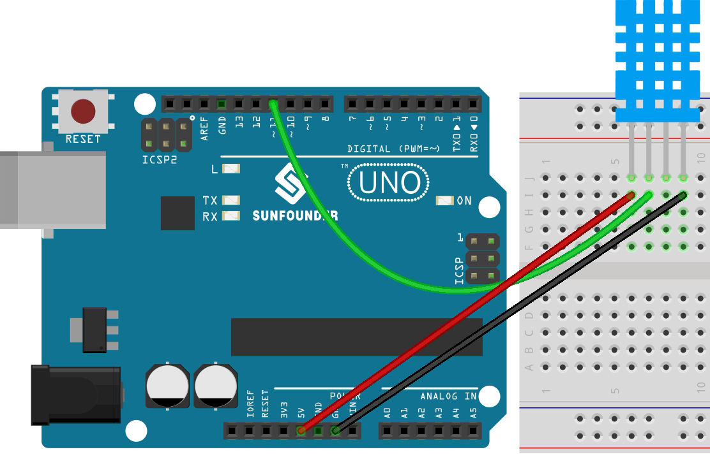

.. _ar_dht11:

5.13 Temperature - Humidity
=======================================

Humidity and temperature are closely related from the physical quantity itself to the actual people's life.
The temperature and humidity of human environment will directly affect the thermoregulatory function and heat transfer effect of human body.
It will further affect the thinking activity and mental state, thus affecting the efficiency of our study and work.

Temperature is one of the seven basic physical quantities in the International System of Units, which is used to measure the degree of hot and cold of an object.
Celsius is one of the more widely used temperature scales in the world, expressed by the symbol "℃".

Humidity is the concentration of water vapor present in the air.
The relative humidity of air is commonly used in life and is expressed in %RH. Relative humidity is closely related to temperature.
For a certain volume of sealed gas, the higher the temperature, the lower the relative humidity, and the lower the temperature, the higher the relative humidity.

.. image:: img/Dht11.png

The dht11, a digital temperature and humidity sensor, is provided in this kit. It uses a capacitive humidity sensor and thermistor to measure the surrounding air and outputs a digital signal on the data pin.

**Schematic**

**Wiring**

* :ref:`cpn_uno`
* :ref:`cpn_breadboard`
* :ref:`cpn_wires`
* :ref:`cpn_dht11`

**Code**

.. note::

    * Open the ``5.13_dht11.ino`` file under the path of ``esp32-ultimate-kit\c\codes\5.13_dht11``.
    * Or copy this code into **Arduino IDE**.
    * The ``dht`` library is used here, refer to :ref:`install_libraries_ar` for a tutorial to install.
    

.. raw:: html
    

After the code is uploaded successfully, you will see the Serial Monitor continuously print out the temperature and humidity, and as the program runs steadily, these two values will become more and more accurate.

**How it works?**

The function of the module is included in the library ``dht.h``.

.. code-block:: arduino

    #include <dht.h> 

Library Functions:

.. code-block:: arduino
    
    dht

Creates a new instance of the ``dht`` class.

.. code-block:: arduino

    int read11(uint8_t pin)

This function will return CHECK values.

* ``DHTLIB_OK`` means that DHT-11 is in good condition;
* ``DHTLIB_ERROR_CHECKSUM`` represents that the value may be abnormal;
* ``DHTLIB_ERROR_TIMEOUT`` indicates that there is timeout.

The function will store the detected humidity and temperature into the
variables with the same name in ``dht`` class.

The variables can be called and used directly in the main program.
(e.g. ``Serial.println(DHT.temperature,1);`` )

**Learn More**

You can also display the temperature and humidity on the I2C LCD1602.

.. note::

    * You can open the file ``5.10_thermistor_lcd.ino`` under the path of ``euler-kit/arduino/5.10_thermistor_lcd``. 
    * Or copy this code into **Arduino IDE**.
    * The ``LiquidCrystal_I2C`` and  ``dht`` libraries are used here, refer to :ref:`install_libraries_ar` for a tutorial to install.

.. raw:: html