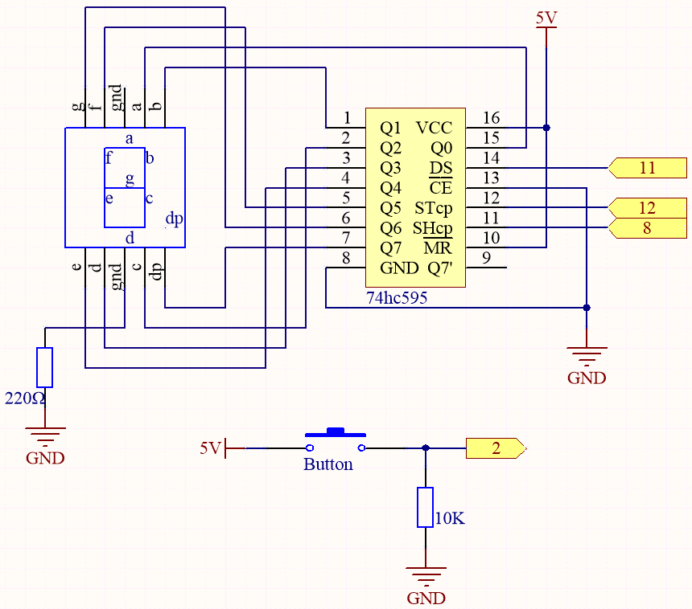
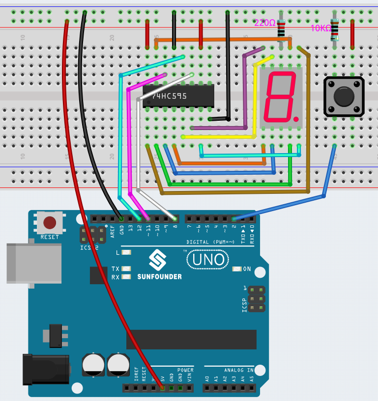

.. _ar_dice:

6.4 Electronic Dice
=============================

This is a dice project that simulates a traditional dice and displays the randomly generated number on a 7-segment display by controlling it using a 74HC595 shift register. This project is very simple and requires some basic knowledge of hardware and programming, making it a great learning and practice project for beginners.

**Schematic**

When the button is pressed, the Arduino generates a random number, converts it to the corresponding 7-segment display segment code, and then outputs the code to the 7-segment display using the 74HC595 shift register.

**Wiring**

STcp = 25
SHcp = 27
DS = 26
buttonPin = 14，同侧接10K电阻接GND, 另外一侧接3V3

* :ref:`cpn_uno`
* :ref:`cpn_breadboard`
* :ref:`cpn_wires`
* :ref:`cpn_resistor`
* :ref:`cpn_button`
* :ref:`cpn_74hc595`
* :ref:`cpn_7_segment`

**Code**

.. note::

    * Open the ``6.4_electronic_dice.ino`` file under the path of ``esp32-ultimate-kit\c\codes\6.4_electronic_dice``.
    * Or copy this code into **Arduino IDE**.
    
    
.. raw:: html
    

This project is based on :ref:`ar_segment` with a button to start/pause the scrolling display on the 7-segment Display.

When the button is pressed, the 7-segment display scrolls through the numbers 1-6, and when the button is released, it displays a random number.

