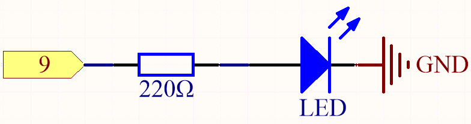
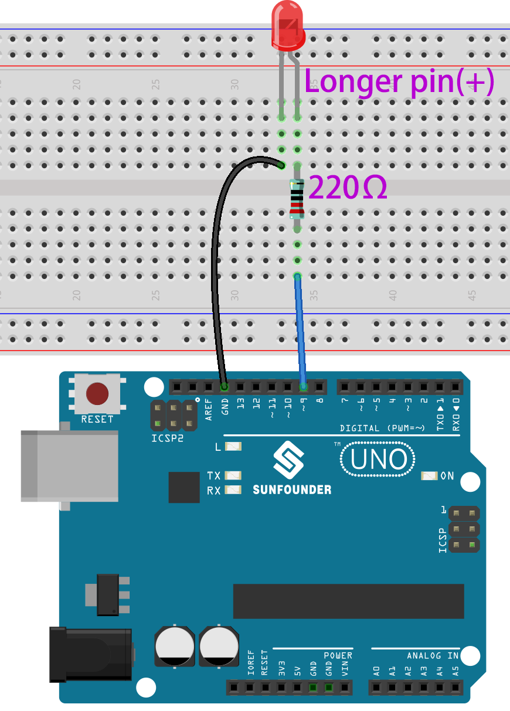

.. _ar_fading:

2.2 Fading
=================

This project is similar to :ref:`ar_blink` , the difference is the signal type.
The former is to make the LED light on or off by outputting a digital signal (0&1), this project is to control the brightness of the LED by outputting an analog signal.

**Schematic**

**Wiring**

* :ref:`cpn_uno`
* :ref:`cpn_breadboard`
* :ref:`cpn_wires`
* :ref:`cpn_resistor`
* :ref:`cpn_led`

**Code**

.. note::

   * You can open the file ``2.2_fading_led.ino`` under the path of ``esp32-ultimate-kit\c\codes\2.analogWrite\2.2_fading_led``. 
   * Or copy this code into **Arduino IDE**.
   
   

.. raw:: html

After the code is uploaded successfully, you can see the LED breathing.

**How it works？**

#. Define constants and variables。

    .. code-block:: arduino

        const int ledPin = 26; // The GPIO pin for the LED
        int brightness = 0;
        int fadeAmount = 5;
   
    * ``ledPin``: The GPIO pin number where the LED is connected (in this case, GPIO 26).
    * ``brightness``: The current brightness level of the LED (initially set to 0).
    * ``fadeAmount``: The amount by which the LED's brightness will change in each step (set to 5).

#. Initializes the PWM channel and configures the LED pin.

    .. code-block:: arduino

        void setup() {
            ledcSetup(0, 5000, 8); // Configure the PWM channel (0) with 5000Hz frequency and 8-bit resolution
            ledcAttachPin(ledPin, 0); // Attach the LED pin to the PWM channel
        }

    Here we use the |link_ledc| (LED control) peripheral which is primarly designed to control the intensity of LEDs, although it can also be used to generate PWM signals for other purposes.

    * ``uint32_t ledcSetup(uint8_t channel, uint32_t freq, uint8_t resolution_bits);``: This function is used to setup the LEDC channel frequency and resolution. It will return ``frequency`` configured for LEDC channel. If 0 is returned, error occurs and ledc channel was not configured.
            
        * ``channel`` select LEDC channel to config.
        * ``freq`` select frequency of pwm.
        * ``resolution_bits`` select resolution for ledc channel. Range is 1-14 bits (1-20 bits for ESP32).

    * ``void ledcAttachPin(uint8_t pin, uint8_t chan);``: This function is used to attach the pin to the LEDC channel.

        * ``pin`` select GPIO pin.
        * ``chan`` select LEDC channel.

#. The ``loop()`` function contains the main logic of the program and runs continuously. It updates the LED's brightness, inverts the fade amount when the brightness reaches the minimum or maximum value, and introduces a delay.

    .. code-block:: arduino

        void loop() {
            ledcWrite(0, brightness); // Write the new brightness value to the PWM channel
            brightness = brightness + fadeAmount;

            if (brightness <= 0 || brightness >= 255) {
                fadeAmount = -fadeAmount;
            }
            
            delay(50); // Wait for 20 milliseconds
            }

    * ``void ledcWrite(uint8_t chan, uint32_t duty);``: This function is used to set duty for the LEDC channel.
        
        * ``chan`` select the LEDC channel for writing duty.
        * ``duty`` select duty to be set for selected channel.