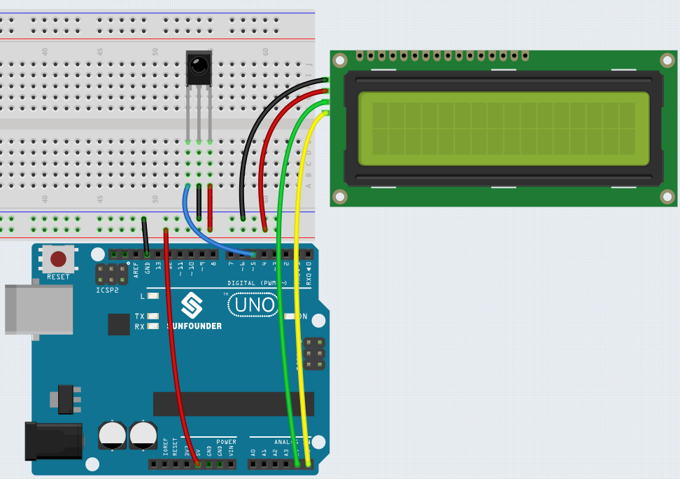
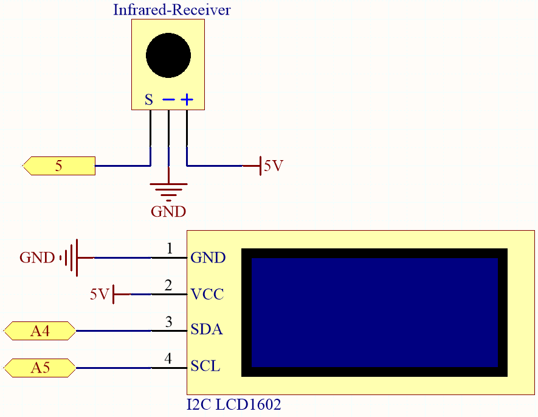

6.2 Flowing Light
=======================

Have you ever wanted to add some fun and interactive element to your living space? 
This project involves creating a running light using WS2812 LED strip and a obstacle avoidance module. 
The running light changes direction when an obstacle is detected, making it an exciting addition to your home or office decor.

**Schematic Diagram**

The WS2812 LED strip is composed of a series of individual LEDs that can be programmed to display different colors and patterns. 
In this project, the strip is set up to display a running light that moves in a particular direction and 
changes direction when an obstacle is detected by the obstacle avoidance module.

**Wiring**

**Code**

.. note::

    * You can open the file ``6.2_flowing_led.ino`` under the path of ``esp32-ultimate-kit\c\codes\6.2_flowing_led`` directly.
    * Or copy this code into Arduino IDE.

This project extends the functionality of the :ref:`ar_rgb_strip` project by adding the ability to display random colors on the LED strip. 
Additionally, an obstacle avoidance module has been included to dynamically change the direction of the running light.
