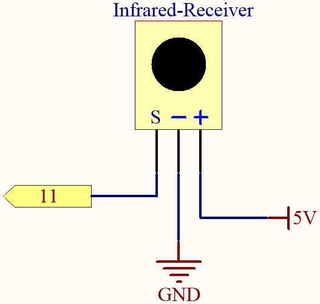
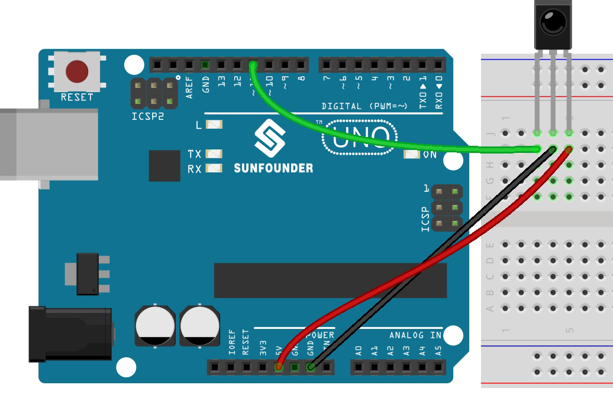

.. _ar_receiver:

5.14 IR Receiver
=========================

In this project, you will learn to use IR Receiver. 

An infrared-receiver is a component which receives infrared signals and can independently receive infrared rays and output signals compatible with TTL level. 
It is similar with a normal plastic-packaged transistor in size and is suitable for all kinds of infrared remote control and infrared transmission.

**Schematic**

**Wiring**

In this example, we wire up the left pin of IR Receiver to pin 11, 
the middle pin to GND, and the right pin to 5V.

* :ref:`cpn_uno`
* :ref:`cpn_breadboard`
* :ref:`cpn_wires`
* :ref:`cpn_receiver`

**Code**

.. note::

    * Open the ``5.14_ir_receiver.ino`` file under the path of ``esp32-ultimate-kit\c\codes\5.14_ir_receiver``.
    * Or copy this code into **Arduino IDE**.
    * The ``IRremoteESP8266`` library is used here, refer to :ref:`install_libraries_ar` for a tutorial to install.

.. raw:: html

After the code is uploaded successfully, press the different keys on the remote control and you will see the names of these keys appear in the serial monitor.

.. note::
    * The ``IRremoteESP8266`` library includes implementations for many different infrared protocols and devices, so the size of the library is relatively large. When the compiler has to process more code, the compilation time will also increase accordingly. Please be patient and wait for the compilation to finish.
    * The new remote control features a plastic tab at the end to insulate the battery inside. To power up the remote when using it, simply remove this plastic piece.

**How it works?**

#. This code uses the ``IRremoteESP8266`` library to receive infrared (IR) signals using an IR receiver module.

    .. code-block:: arduino

        #include <IRremoteESP8266.h>
        #include <IRrecv.h>

        // Define the IR receiver pin
        const uint16_t IR_RECEIVE_PIN = 14;

        // Create an IRrecv object
        IRrecv irrecv(IR_RECEIVE_PIN);

        // Create a decode_results object
        decode_results results;
    
#. In the ``setup()`` function, serial communication is started at a baud rate of 115200, and the IR receiver is enabled using ``irrecv.enableIRIn()``.

    .. code-block:: arduino

        void setup() {
            // Start serial communication
            Serial.begin(115200);
            
            // Start the IR receiver
            irrecv.enableIRIn();
        }

#. When you press a key on the remote control, the serial monitor will print the key name if it is received by the IR receiver.

    .. code-block:: arduino

        void loop() {
            // If an IR signal is received
            if (irrecv.decode(&results)) {
                String key = decodeKeyValue(results.value);
                if (key != "ERROR") {
                    // Print the value of the signal to the serial monitor
                    Serial.println(key);
                }
                irrecv.resume(); // Continue to receive the next signal
            }
        }

    * Firstly, check if an IR signal is received using the ``irrecv.decode()`` function. 
    * If a signal is received, then call the ``decodeKeyValue()`` function to decode the value of the signal. 
    * If the signal is successfully decoded, the decoded value is printed to the serial monitor using ``Serial.println()``.
    * Finally, ``irrecv.resume()`` is called to continue to receive the next signal.

#. The ``decodeKeyValue()`` function takes the decoded value of the IR signal as an argument and returns a string representing the key pressed on the remote control. 

    .. code-block:: arduino

        String decodeKeyValue(long result)
        {
            switch(result){
                case 0xFF6897:
                return "0";
                case 0xFF30CF:
                return "1"; 
                case 0xFF18E7:
                return "2"; 
                case 0xFF7A85:
                ...

    * The function uses a switch statement to match the decoded value with the corresponding key and returns the string representation of the key. 
    * If the decoded value does not match any known key, the function returns the string "ERROR".