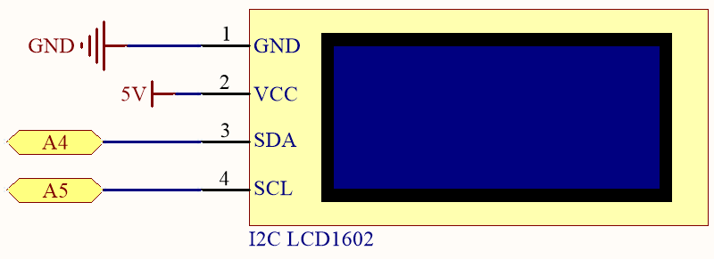
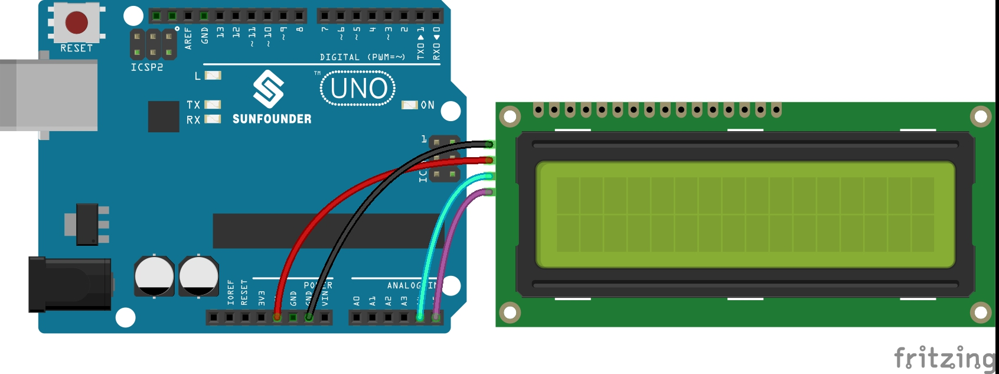

.. _ar_lcd1602:

2.6 Liquid Crystal Display
===============================

An I2C LCD1602 is composed of an LCD1602 and an I2C module, LCD1602 can be used to display characters, numbers, etc., but need to take up a lot of pins of the main control, after configuring an I2C module, only 2 I/0 pins are needed to drive this LCD1602.

Now look at how to make this I2C CDL1602 work.

**Schematic**

**Wiring**

.. note::
    The SDA and SCL of the R3 board are the pins A4 and A5.

* :ref:`cpn_uno`
* :ref:`cpn_wires`
* :ref:`cpn_i2c_lcd1602`

**Code**

.. note::

    * Open the ``2.6_lcd1602.ino`` file under the path of ``esp32-ultimate-kit\c\codes\2.6_lcd1602``.
    * Or copy this code into **Arduino IDE**.
    * The ``LiquidCrystal_I2C`` library is used here, refer to :ref:`install_libraries_ar` for a tutorial to install.

.. raw:: html

When this program is uploaded, the I2C LCD1602 will display the welcome message, "Hello, Sunfounder!", for 3 seconds. After that, the screen will show a "COUNT:" label and the count value, which increments every second.

.. note:: 

    If the code and wiring are correct, but the LCD still fails to display any content, you can adjust the potentiometer on the back to increase the contrast.

**How it works?**

By calling the library ``LiquidCrystal_I2C.h``, you can easily drive the LCD. 

.. code-block:: arduino

    #include <LiquidCrystal_I2C.h>

Library Functions：

* Creates a new instance of the ``LiquidCrystal_I2C`` class that represents a particular LCD attached to your Arduino board.

    .. code-block:: arduino

        LiquidCrystal_I2C(uint8_t lcd_Addr,uint8_t lcd_cols,uint8_t lcd_rows)

    * ``lcd_AddR``: The address of the LCD defaults to 0x27.
    * ``lcd_cols``: The LCD1602 has 16 columns.
    * ``lcd_rows``: The LCD1602 has 2 rows.

* Initialize the lcd.

    .. code-block:: arduino

        void init()

* Turn the (optional) backlight on.

    .. code-block:: arduino

        void backlight()

* Turn the (optional) backlight off.

    .. code-block:: arduino

        void nobacklight()

* Turn the LCD display on.

    .. code-block:: arduino

        void display()

* Turn the LCD display off quickly.

    .. code-block:: arduino

        void nodisplay()

* Clear display, set cursor position to zero.

    .. code-block:: arduino

        void clear()

* Set the cursor position to col,row.

    .. code-block:: arduino

        void setCursor(uint8_t col,uint8_t row)

* Prints text to the LCD.

    .. code-block:: arduino

        void print(data,BASE)

    * ``data``: The data to print (char, byte, int, long, or string).
    * ``BASE (optional)``: The base in which to print numbers.

        * ``BIN`` for binary (base 2)
        * ``DEC`` for decimal (base 10)
        * ``OCT`` for octal (base 8)
        * ``HEX`` for hexadecimal (base 16).
