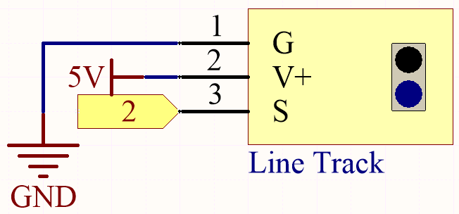
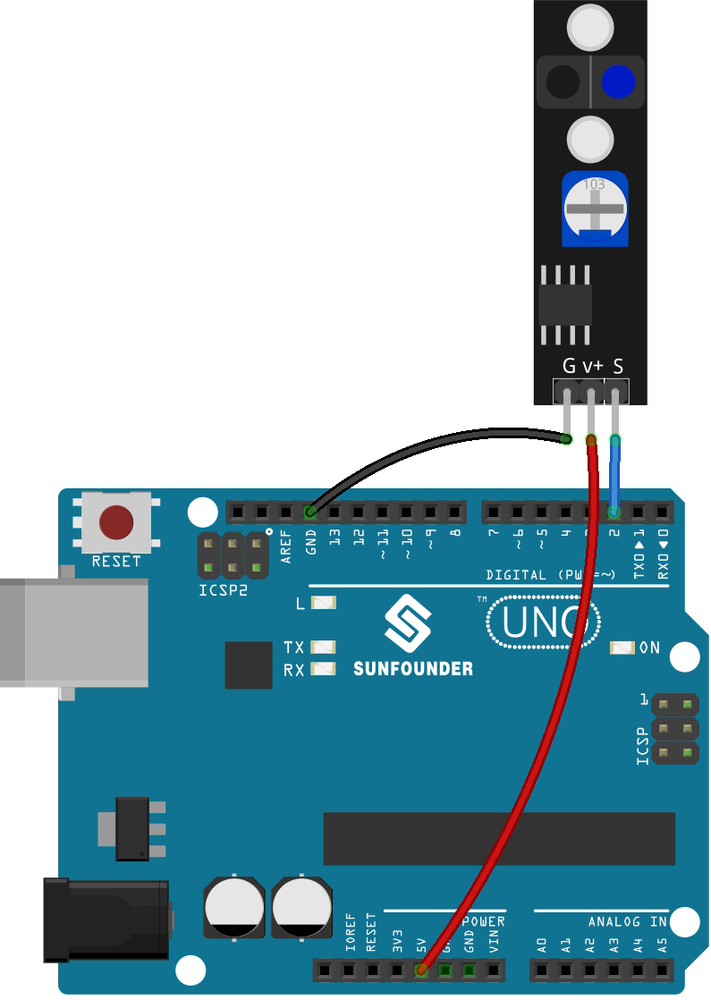

.. _ar_line_track:

5.4 Detect the Line
===================================

The line tracking module is used to detect whether there are black areas on the ground, such as black lines pasted with electrical tape.

One of its LEDs emits appropriate infrared light to the ground, and the black surface has a relatively strong ability to absorb light and a weaker reflection ability. White surfaces are the opposite.
If it detects reflected light, it means the ground is currently white. If not detected, it means black.

That's how it works.

**Schematic**

The digital pin 2 is used to read the
signal of line track module. We get the VCC of the module connected to 5V, 
GND to GND, OUT to digital pin 2.

**Wiring**

* :ref:`cpn_uno`
* :ref:`cpn_track`
* :ref:`cpn_wires`

**Code**

.. note::

   * You can open the file ``5.4_detect_the_line.ino`` under the path of ``esp32-ultimate-kit\c\codes\5.4_detect_the_line``. 
   * Or copy this code into **Arduino IDE**.
   
   

.. raw:: html

If the line tracking module detects a black line after the code has been uploaded successfully, "Black" will be shown in the Serial Monitor. Otherwise, "White" will be printed.
