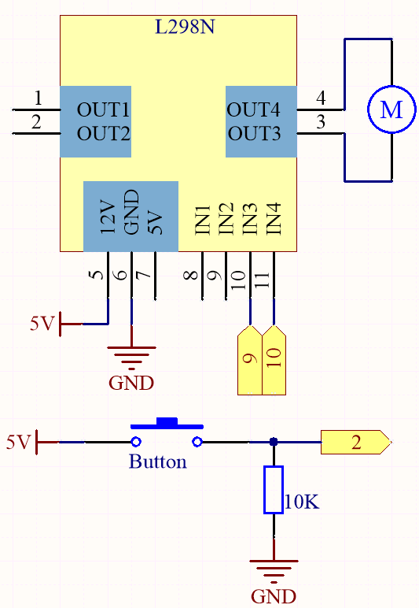
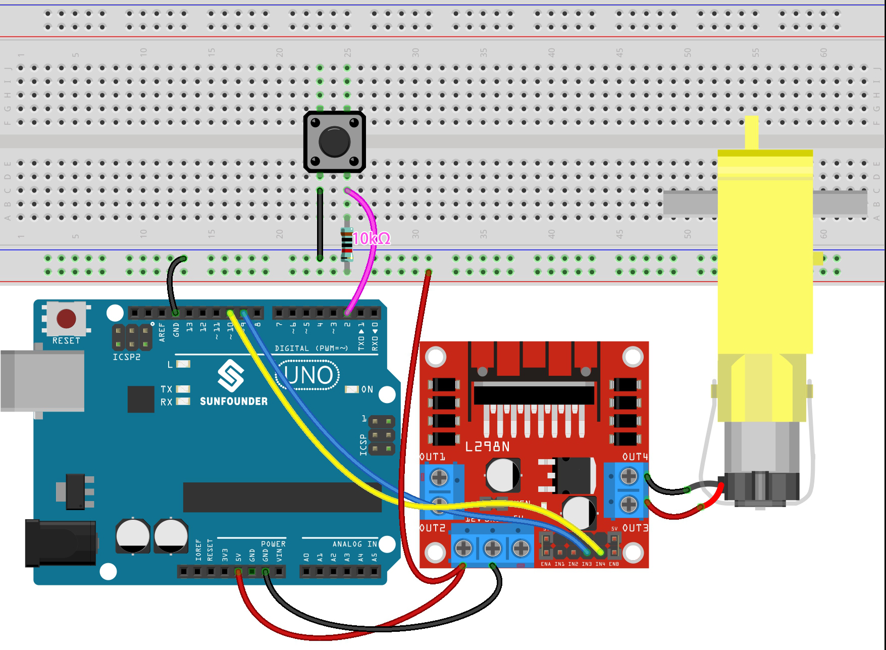

.. _ar_state_change:

4.1 Motor
===========================

When the button controls other devices, it can not only work when it is pressed, but stop when it is released.
It is also possible to switch the working state each time the button is pressed.

In order to achieve this effect, you need to know how to toggle the working state between off and on when the button is pressed,
That is "state change detection".

In this project, we will use the button to control the motor.

**Schematic**

**Wiring**

* :ref:`cpn_uno`
* :ref:`cpn_breadboard`
* :ref:`cpn_wires`
* :ref:`cpn_resistor`
* :ref:`cpn_button`
* :ref:`cpn_tt_motor`
* :ref:`cpn_l298n`

**Code**

.. note::

    * Open the ``4.1_motor.ino`` file under the path of ``esp32-ultimate-kit\c\codes\4.1_motor``.
    * Or copy this code into **Arduino IDE**.
    
    
.. raw:: html
    

Once the code is successfully uploaded, you will observe the motor rotating clockwise for one second, then counter-clockwise for one second, followed by a two-second pause. This sequence of actions will continue in an endless loop.

**Learn More**

In addition to simply making the motor rotate clockwise and counterclockwise, you can also control the speed of the motor's rotation by using pulse-width modulation (PWM) on the control pin, as shown below.

.. note::

    * Open the ``4.1_motor_pwm.ino`` file under the path of ``esp32-ultimate-kit\c\codes\4.1_motor_pwm``.
    * Or copy this code into **Arduino IDE**.
    
    
.. raw:: html

The previous code directly sets the two pins of the motor to high or low voltage levels to control the motor's rotation and stopping.

Here we use the |link_ledc| (LED control) peripheral to generate PWM signals to control the motor's speed. Through two ``for`` loops, the duty cycle of channel A is increased or decreased from 0 to 255 while keeping channel B at 0.

This way, you can observe the motor gradually increasing its speed to 255, then decreasing to 0, infinitely looping like this.

If you want the motor to rotate in the opposite direction, simply swap the values of channel A and channel B.
