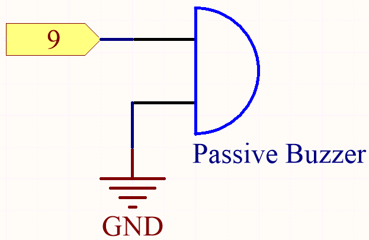
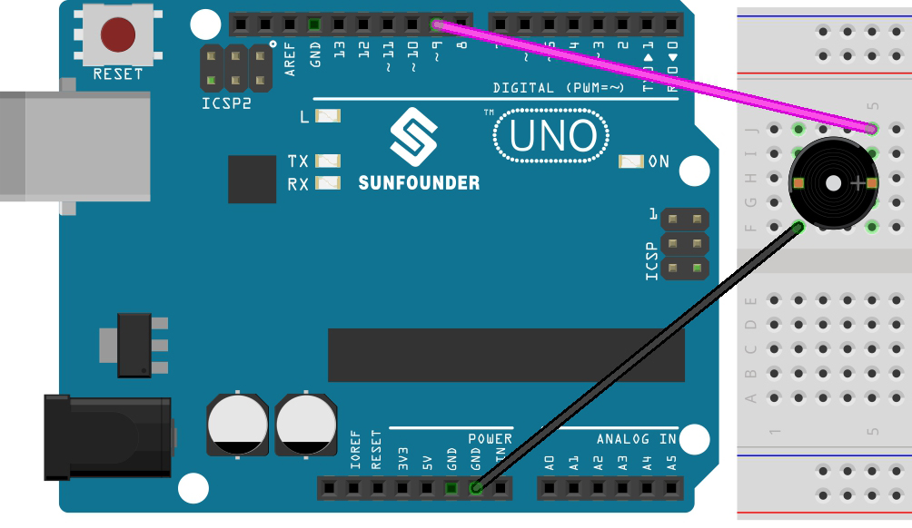

.. _ar_pa_buz:

3.2 Custom Tone
==========================================

We have used active buzzer in the previous project, this time we will use passive buzzer.

Like the active buzzer, the passive buzzer also uses the phenomenon of electromagnetic induction to work. The difference is that a passive buzzer does not have oscillating source, so it will not beep if DC signals are used.
But this allows the passive buzzer to adjust its own oscillation frequency and can emit different notes such as "doh, re, mi, fa, sol, la, ti".

Let the passive buzzer emit a melody!
**Schematic**

Connect the cathode of the Buzzer to GND, and the anode to the digital pin 9. 

**Wiring**

* :ref:`cpn_uno`
* :ref:`cpn_breadboard`
* :ref:`cpn_wires`
* :ref:`cpn_buzzer`

**Code**

.. note::

    * Open the ``3.2_custom_tone.ino`` file under the path of ``esp32-ultimate-kit\c\codes\3.2_custom_tone``.
    * Or copy this code into **Arduino IDE**.
    
.. raw:: html

After the code is successfully uploaded, you will hear the passive buzzer play a sequence of 7 musical notes.

**How it works?**

#. Define constants for the buzzer pin and PWM resolution.

    .. code-block:: arduino

        const int buzzerPin = 14; //buzzer pin
        const int resolution = 8; 

#. Define an array containing the frequencies of the 7 musical notes in Hz.

    .. code-block:: arduino

        int frequencies[] = {262, 294, 330, 349, 392, 440, 494};

#. Create a function to play a given frequency on the buzzer for a specified duration.

    .. code-block:: arduino

        void playFrequency(int frequency, int duration) {
            ledcWriteTone(0, frequency); // Start the tone
            delay(duration); // Wait for the specified duration
            ledcWriteTone(0, 0); // Stop the buzzer
        }
    
    * ``uint32_t ledcWriteTone(uint8_t chan, uint32_t freq);``: This function is used to setup the LEDC channel to 50 % PWM tone on selected frequency.

        * ``chan`` select LEDC channel.
        * ``freq`` select frequency of pwm signal.

    This function will return ``frequency`` set for channel. If ``0`` is returned, error occurs and ledc cahnnel was not configured.

#. Configure the PWM channel and attach the buzzer pin in the ``setup()`` function.

    .. code-block:: arduino

        void setup() {
            ledcSetup(0, 2000, resolution); // Set up the PWM channel
            ledcAttachPin(buzzerPin, 0); // Attach the buzzer pin to the PWM channel
        }

    * ``uint32_t ledcSetup(uint8_t channel, uint32_t freq, uint8_t resolution_bits);``: This function is used to setup the LEDC channel frequency and resolution. It will return ``frequency`` configured for LEDC channel. If 0 is returned, error occurs and ledc channel was not configured.
            
        * ``channel`` select LEDC channel to config.
        * ``freq`` select frequency of pwm.
        * ``resolution_bits`` select resolution for ledc channel. Range is 1-14 bits (1-20 bits for ESP32).

    * ``void ledcAttachPin(uint8_t pin, uint8_t chan);``: This function is used to attach the pin to the LEDC channel.

        * ``pin`` select GPIO pin.
        * ``chan`` select LEDC channel.

#. In the ``loop()`` function, play the sequence of 7 notes with a brief pause between each note and a 1-second pause before repeating the sequence.

    .. code-block:: arduino
        void loop() {
            for (int i = 0; i < 7; i++) {
                playFrequency(frequencies[i], 300); // Play each note for 300ms
                delay(50); // Add a brief pause between the notes
            }
            delay(1000); // Wait for 1 second before replaying the sequence
            }

