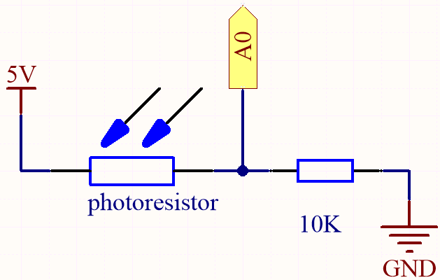
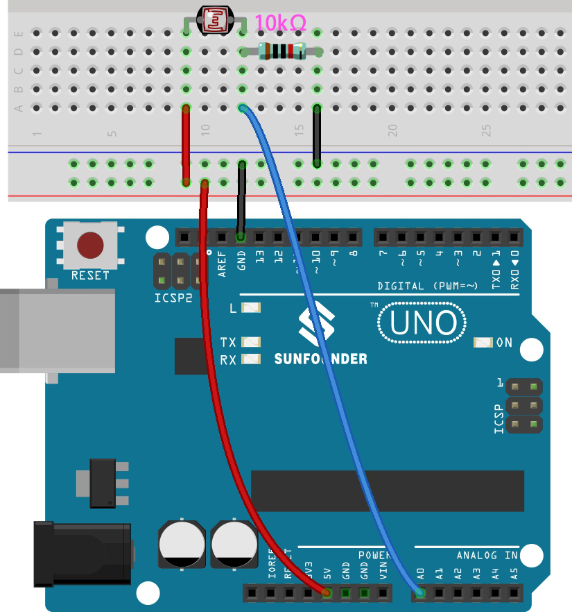

.. _ar_photoresistor:

5.7 Feel the Light
===========================

The photoresistor is a typical device for analog inputs and it is used in a very similar way to a potentiometer. Its resistance value depends on the intensity of the light, the stronger the irradiated light, the smaller its resistance value; conversely, it increases.

**Schematic**

In this circuit, the 10K resistor and the photoresistor are connected in series, and the current passing through them is the same. The 10K resistor acts as a protection, and the pin A0 reads the value after the voltage conversion of the photoresistor.

When the light is enhanced, the resistance of the photoresistor decreases, then its voltage decreases, so the value from pin A0 will increase; 
if the light is strong enough, the resistance of the photoresistor will be close to 0, and the value of pin A0 will be close to 1023. 
At this time, the 10K resistor plays a protective role, so that 5V and GND are not connected together, resulting in a short circuit.

If you place the photoresistor in a dark situation, the value of pin A0 will decrease. 
In a dark enough situation, the resistance of the photoresistor will be infinite, and its voltage will be close to 5V (the 10K resistor is negligible), and the value of pin A0 will be close to 0.

The calculation formula is shown below.

    (Vp/5V) x 1023 = Ap

**Wiring**

* :ref:`cpn_uno`
* :ref:`cpn_breadboard`
* :ref:`cpn_wires`
* :ref:`cpn_resistor`
* :ref:`cpn_photoresistor`

**Code**

.. note::

    * Open the ``5.7_feel_the_light.ino`` file under the path of ``esp32-ultimate-kit\c\codes\5.7_feel_the_light``.
    * Or copy this code into **Arduino IDE**.
    
    
.. raw:: html

After the code is uploaded successfully, the Serial Monitor prints out the photoresistor values from 0 ~ 4095. 
The stronger the current ambient brightness, the larger the value displayed on the serial monitor.

.. note::
    For the ESP32, the resolution is between 9 to 12 and it will change the ADC hardware resolution. Else value will be shifted.

    Default is 12 bits (range from 0 to 4096) for all chips except ESP32S3 where default is 13 bits (range from 0 to 8192).

    You can add ``analogReadResolution(10);`` to ``setup()`` function to set a different resolution, such as ``10``.

    
