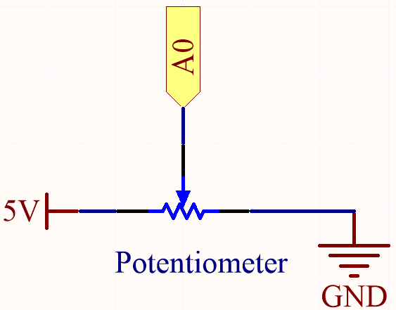
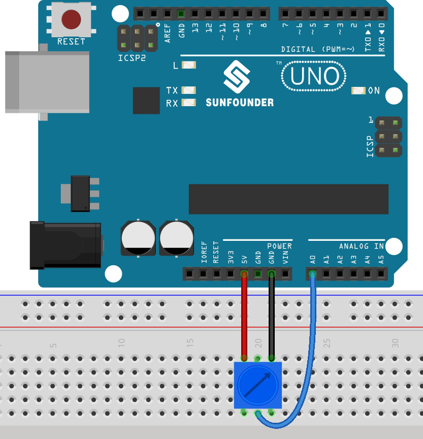

.. _ar_potentiometer:

5.8 Turn the Knob
===================

Potentiometer is a resistor component with 3 terminals and its resistance value can be
adjusted according to some regular variation.

**Schematic**

In this example, we use the analog pin (A0) to read the value
of the potentiometer. By rotating the axis of the potentiometer, you can
change the distribution of resistance among these three pins, changing
the voltage on the middle pin. When the resistance between the middle
and a outside pin connected to 5V is close to zero (and the resistance
between the middle and the other outside pin is close to 10kΩ), the
voltage at the middle pin is close to 5V. The reverse operation (the
resistance between the middle and a outside pin connected to 5V is close
to 10kΩ) will make the voltage at the middle pin be close to 0V.

**Wiring**

* :ref:`cpn_uno`
* :ref:`cpn_breadboard`
* :ref:`cpn_wires`
* :ref:`cpn_potentiometer`

**Code**

.. note::

   * You can open the file ``5.8_pot.ino`` under the path of ``esp32-ultimate-kit\c\codes\5.8_pot``. 
   * Or copy this code into **Arduino IDE**.
   
.. raw:: html

After the code is uploaded successfully, rotate the potentiometer and you will see the brightness of the LED change accordingly. At the same time you can see the analog and voltage values of the potentiometer in the serial monitor.

**How it works?**

#. Define constants for pin connections and PWM settings.

    .. code-block:: arduino

        const int potPin = 14; // Potentiometer connected to GPIO14
        const int ledPin = 26; // LED connected to GPIO26

        // PWM settings
        const int freq = 5000; // PWM frequency
        const int resolution = 12; // PWM resolution (bits)
        const int channel = 0; // PWM channel

    Here the PWM resolution is set to 12 bits and the range is 0-4095.

#. Configure the system in the ``setup()`` function.

    .. code-block:: arduino

        void setup() {
            Serial.begin(115200);

            // Configure PWM
            ledcSetup(channel, freq, resolution);
            ledcAttachPin(ledPin, channel);
        }

    * In the ``setup()`` function, the Serial communication is started at a baud rate of 115200. 
    * The ``ledcSetup()`` function is called to set up the PWM channel with the specified frequency and resolution, 
    and the ``ledcAttachPin()`` function is called to associate the specified LED pin with the PWM channel.

#. Main loop (executed repeatedly) in the loop() function.

    .. code-block:: arduino

        void loop() {

            int potValue = analogRead(potPin); // read the value of the potentiometer
            uint32_t voltage_mV = analogReadMilliVolts(potPin); // Read the voltage in millivolts
            
            ledcWrite(channel, potValue);
            
            Serial.print("Potentiometer Value: ");
            Serial.print(potValue);
            Serial.print(", Voltage: ");
            Serial.print(voltage_mV / 1000.0); // Convert millivolts to volts
            Serial.println(" V");
            
            delay(100);
        }

    * ``uint32_t analogReadMilliVolts(uint8_t pin);``: This function is used to get ADC value for a given pin/ADC channel in millivolts.

        * ``pin`` GPIO pin to read analog value.

    The potentiometer value is directly used as the PWM duty cycle for controlling the LED brightness via the ``ledcWrite()`` function, as the range of values is also from 0 to 4095.

