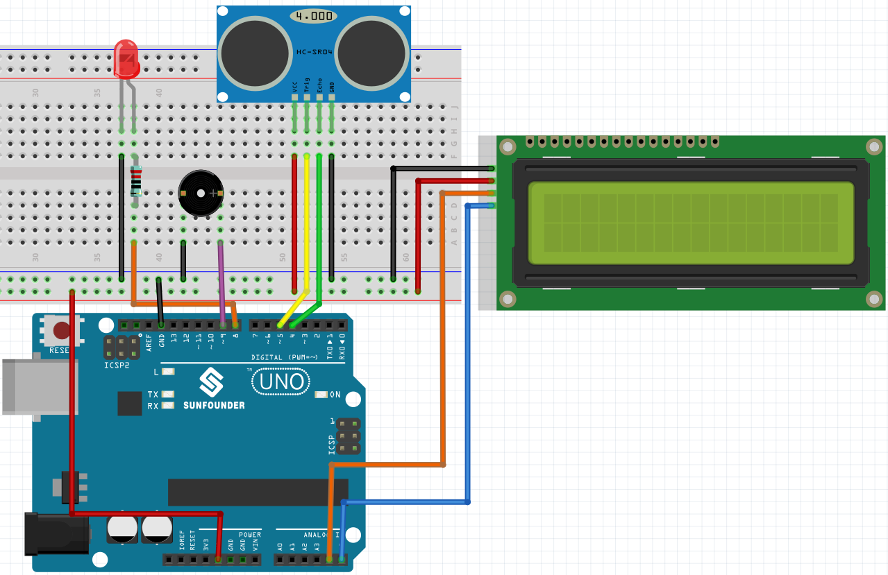

.. _ar_reversing_aid:

6.3 Reversing Aid
===================

As science and technology continue to advance, numerous high-tech features have been integrated into cars. One such feature is the reversing assist system. In this project, we utilize an ultrasonic module, LCD, and buzzer to create a simple yet effective ultrasonic reversing assist system.

**Schematic Diagram**

.. image:: img/image265.png
    :width: 800
    :align: center

The ultrasonic sensor emits high-frequency sound waves and measures the time it takes for the waves to bounce back after hitting an object. Using this information, the distance between the sensor and the object can be calculated. The buzzer is used to provide an audible signal when the object is too close, and the LCD screen displays the distance measurement.

**Fritzing Circuit**

* :ref:`cpn_uno`
* :ref:`cpn_breadboard`
* :ref:`cpn_wires`
* :ref:`cpn_buzzer`
* :ref:`cpn_i2c_lcd1602`
* :ref:`cpn_ultrasonic`

**Code**

.. note::

    * You can open the file ``6.3_reversing_aid.ino`` under the path of ``esp32-ultimate-kit\c\codes\6.3_reversing_aid`` directly.
    * Or copy this code into **Arduino IDE**.
    * The ``LiquidCrystal_I2C`` library is used here, refer to :ref:`install_libraries_ar` for a tutorial to install.

.. raw:: html

After the code is successfully uploaded, the current detected distance will be displayed on the LCD. Then the buzzer will change the sounding frequency according to different distances.

.. note:: 

    If the code and wiring are correct, but the LCD still fails to display any content, you can adjust the potentiometer on the back to increase the contrast.

**How it works?**

This code helps us create a simple distance measuring device that can measure the distance between objects and provide feedback through an LCD display and a buzzer.

The ``loop()`` function contains the main logic of the program and runs continuously. Let's take a closer look at the ``loop()`` function.

#. Loop to read distance and update parameters

    In the ``loop``, the code first reads the distance measured by the ultrasonic module and updates the interval parameter based on the distance. 

    .. code-block:: arduino

        // Update the distance
        distance = readDistance();

        // Update intervals based on distance
        if (distance <= 10) {
            intervals = 300;
        } else if (distance <= 20) {
            intervals = 500;
        } else if (distance <= 50) {
            intervals = 1000;
        } else {
            intervals = 2000;
        }

#. Check if it's time to beep

    The code calculates the difference between the current time and the previous beep time, and if the difference is greater than or equal to the interval time, it triggers the buzzer and updates the previous beep time.

    .. code-block:: arduino

        unsigned long currentMillis = millis();
        if (currentMillis - previousMillis >= intervals) {
            Serial.println("Beeping!");
            beep();
            previousMillis = currentMillis;
        }

#. Update LCD display

    The code clears the LCD display and then displays "Dis:" and the current distance in centimeters on the first line.

    .. code-block:: arduino

        lcd.clear();
        lcd.setCursor(0, 0);
        lcd.print("Dis: ");
        lcd.print(distance);
        lcd.print(" cm");

        delay(100);

