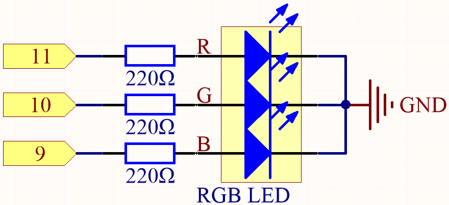
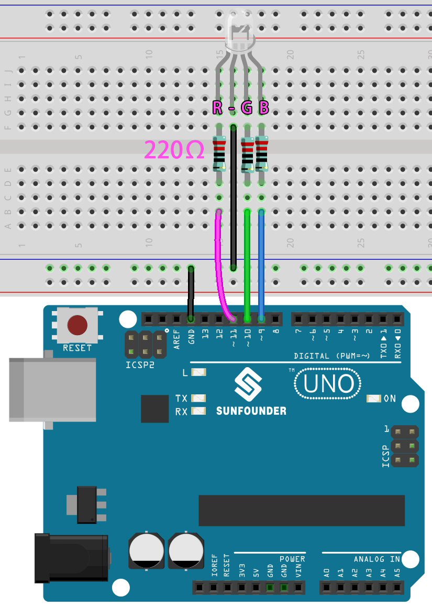

.. _ar_rgb:

2.3 Colorful Light
==============================================

As we know, light can be superimposed. For example, mix blue light and green light give cyan light, red light and green light give yellow light.
This is called "The additive method of color mixing".

* `Additive color - Wikipedia <https://en.wikipedia.org/wiki/Additive_color>`_

Based on this method, we can use the three primary colors to mix the visible light of any color according to different specific gravity. For example, orange can be produced by more red and less green.

In this chapter, we will use RGB LED to explore the mystery of additive color mixing!

RGB LED is equivalent to encapsulating Red LED, Green LED, Blue LED under one lamp cap, and the three LEDs share one cathode pin.
Since the electric signal is provided for each anode pin, the light of the corresponding color can be displayed. 
By changing the electrical signal intensity of each anode, it can be made to produce various colors.

**Schematic**

The PWM pins 11, 10 and 9 control the Red, Green and Blue pins of the RGB LED respectively, and connect the common cathode pin to GND. 
This allows the RGB LED to display a specific color by superimposing light on these pins with different PWM values.

**Wiring**

.. image:: img/rgb_led_sch.png

An RGB LED has 4 pins: the longest pin is the common cathode pin, which is usually connected to GND, 
the left pin next to the longest pin is Red, and the 2 pins on the right are Green and Blue.

* :ref:`cpn_uno`
* :ref:`cpn_breadboard`
* :ref:`cpn_wires`
* :ref:`cpn_rgb`

**Code**

Here, we can choose our favorite color in drawing software (such as paint) and display it with RGB LED.

.. note::

   * You can open the file ``2.3_rgb.ino`` under the path of ``esp32-ultimate-kit\c\codes\2.analogWrite\2.3_rgb``. 
   * Or copy this code into **Arduino IDE**.

.. raw:: html
    

.. image:: img/edit_colors.png

Write the RGB value into ``color_set()``, you will be able to see the RGB light up the colors you want.

**How it works?**

#. Define the GPIO pins, the PWM channels and the frequency (in Hz) and resolution (in bits).

    .. code-block:: arduino

        // Define RGB LED pins
        const int redPin = 27;
        const int greenPin = 26;
        const int bluePin = 25;

        // Define PWM channels
        const int redChannel = 0;
        const int greenChannel = 1;
        const int blueChannel = 2;

        // Define PWM frequency and resolution
        const int freq = 5000;
        const int resolution = 8;

#. The ``setup()`` function initializes the PWM channels with the specified frequency and resolution, and then attaches the LED pins to their corresponding PWM channels.

    .. code-block:: arduino

        void setup() {
            // Set up PWM channels
            ledcSetup(redChannel, freq, resolution);
            ledcSetup(greenChannel, freq, resolution);
            ledcSetup(blueChannel, freq, resolution);
            
            // Attach pins to corresponding PWM channels
            ledcAttachPin(redPin, redChannel);
            ledcAttachPin(greenPin, greenChannel);
            ledcAttachPin(bluePin, blueChannel);
        }
    
    Here we use the |link_ledc| (LED control) peripheral which is primarly designed to control the intensity of LEDs, although it can also be used to generate PWM signals for other purposes.

    * ``uint32_t ledcSetup(uint8_t channel, uint32_t freq, uint8_t resolution_bits);``: This function is used to setup the LEDC channel frequency and resolution. It will return ``frequency`` configured for LEDC channel. If 0 is returned, error occurs and ledc channel was not configured.
            
        * ``channel`` select LEDC channel to config.
        * ``freq`` select frequency of pwm.
        * ``resolution_bits`` select resolution for ledc channel. Range is 1-14 bits (1-20 bits for ESP32).

    * ``void ledcAttachPin(uint8_t pin, uint8_t chan);``: This function is used to attach the pin to the LEDC channel.

        * ``pin`` select GPIO pin.
        * ``chan`` select LEDC channel.

#. The ``loop()`` function cycles through various colors (red, green, blue, yellow, purple, and cyan) with one-second intervals between each color change.

    .. code-block:: arduino

        void loop() {
            setColor(255, 0, 0); // Red
            delay(1000);
            setColor(0, 255, 0); // Green
            delay(1000);
            setColor(0, 0, 255); // Blue
            delay(1000);
            setColor(255, 255, 0); // Yellow
            delay(1000);
            setColor(80, 0, 80); // Purple
            delay(1000);
            setColor(0, 255, 255); // Cyan
            delay(1000);
        }

#. The ``setColor()`` function sets the desired color by writing the appropriate duty cycle values to each PWM channel. The function takes in three integer arguments for red, green, and blue color values.

    .. code-block:: arduino

        void setColor(int red, int green, int blue) {
            // For common-anode RGB LEDs, use 255 minus the color value
            ledcWrite(redChannel, red);
            ledcWrite(greenChannel, green);
            ledcWrite(blueChannel, blue);
        }
    
    * ``void ledcWrite(uint8_t chan, uint32_t duty);``: This function is used to set duty for the LEDC channel.
        
        * ``chan`` select the LEDC channel for writing duty.
        * ``duty`` select duty to be set for selected channel.

