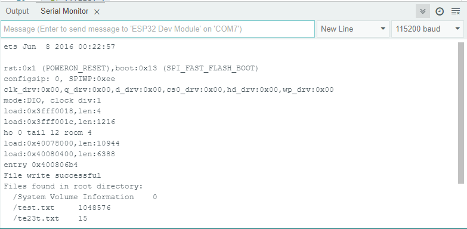

.. _ar_sd_write:

5.15 Write to the SD Card
=========================

In this project, you will learn to use IR Receiver. 

An infrared-receiver is a component which receives infrared signals and can independently receive infrared rays and output signals compatible with TTL level. 
It is similar with a normal plastic-packaged transistor in size and is suitable for all kinds of infrared remote control and infrared transmission.

**Schematic**

.. image:: img/circuit_7.2_receiver.png

**Wiring**

In this example, we wire up the left pin of IR Receiver to pin 11, 
the middle pin to GND, and the right pin to 5V.

.. image:: img/ir_remote_control_bb.jpg

* :ref:`cpn_uno`
* :ref:`cpn_breadboard`
* :ref:`cpn_wires`
* :ref:`cpn_receiver`

**Format the SD Card**

Before starting the tutorial, we need to create a drive letter for the blank SD card and format it. This step
requires a card reader and SD card. Please prepare them in advance. Below we will guide you to do it on
different computer systems. You can choose the guide that matches your computer.
Windows
Insert the SD card into the card reader, then insert the card reader into the computer.
In the Windows search box, enter "Disk Management" and select "Create and format hard disk partitions".

**Code**

.. note::

    * Open the ``5.15_sd_write_read.ino`` file under the path of ``esp32-ultimate-kit\c\codes\5.15_sd_write_read``.
    * Or copy this code into **Arduino IDE**.

.. raw:: html

After the code is uploaded successfully, a test.txt file containing the message "Test file write" will be written to your SD card.
打开串行监视器，你将看到以下信息，会有SD内的文件及size展示出来。如果打开串口监视器后没看到打印信息，那你需要按下EN（RST）按键来让代码重新运行下。

**How it works?**

This code is a simple example of using the ``SD_MMC`` library in an Arduino sketch to write data to a file on an SD card. 

Here's an analysis of the code:

#. Include the ``SD_MMC`` library, which provides functions for interacting with SD cards using the SD/MMC protocol.

    .. code-block:: arduino

        #include "SD_MMC.h"

#. Inside the ``setup()`` function, the following tasks are performed

    .. code-block:: arduino
    
        void setup() {
        
            Serial.begin(115200); // Initialize the serial interface    
            if(!SD_MMC.begin()) { // Attempt to mount the SD card
                Serial.println("Failed to mount card"); // If mount fails, print to serial and exit setup
                return;
            }    
            File file = SD_MMC.open("/test.txt", FILE_WRITE); // Create or open the test.txt file for writing    
            if(!file) { // If file open fails, print to serial and exit setup
                Serial.println("Opening file failed"); 
                return;
            }    
            if(file.print("Test file write")) { // Write the message to the file
                Serial.println("File write success"); // If write succeeds, print to serial
            } else {
                Serial.println("File write failed"); // If write fails, print to serial
            }    
                file.close(); // Close the file
          }

    Here are the steps for writing data to an SD card.

    * Initialize the SD card: 

    The ``SD_MMC.begin()`` function is called to initialize the SD card. If this fails, an error message is printed to the Serial Monitor, and the program returns without doing anything further.
    
    .. code-block:: arduino
        
        if(!SD_MMC.begin()) { // Attempt to mount the SD card
            Serial.println("Failed to mount card"); // If mount fails, print to serial and exit setup
            return;
        } 
      
    * Open the file: 

    The ``SD_MMC.open()`` function is called to open a file named ``test.txt`` on the SD card in write mode. 
    If the file cannot be opened, an error message is printed to the Serial Monitor, and the program returns without doing anything further.
    
    .. code-block:: arduino

        File file = SD_MMC.open("/test.txt", FILE_WRITE); // Create or open the test.txt file for writing    
        if(!file) { // If file open fails, print to serial and exit setup
            Serial.println("Opening file failed"); 
            return;
        } 

    * Write data to the file: 

    The ``file.print()`` function is called to write the string ``Test file write`` to the opened file.  
    If the write operation is successful, a success message is printed to the Serial Monitor; otherwise, an error message is printed.
    
    .. code-block:: arduino

        if(file.print("Test file write")) { // Write the message to the file
            Serial.println("File write success"); // If write succeeds, print to serial
        } else {
            Serial.println("File write failed"); // If write fails, print to serial
        } 

    * Close the file: 
        
    The ``file.close()`` function is called to close the opened file. This ensures that any buffered data is written to the file and the file is properly closed.

    .. code-block:: arduino

        file.close(); // Close the file