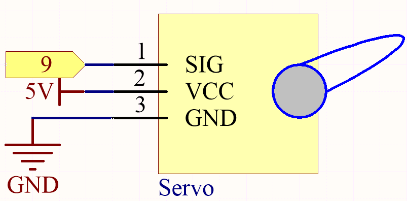
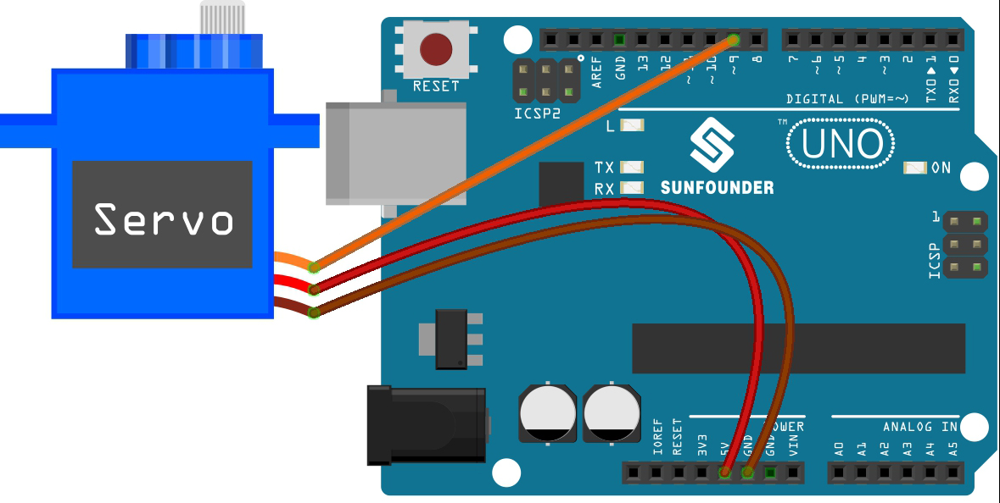

.. _ar_servo:

4.3 Use Internal Library
=======================================

In the Arduino IDE, you can use many built-in libraries by adding the corresponding ``.h`` file directly to your code.

This project uses the ``Servo`` library to drive the Servo, so that it can rotate between 0° and 180°.

**Schematic**

In this project, we use PWM pin 9 to drive the Servo, and get the orange
wire of the servo connected to the PWM pin 9, the red one to 5V, and the
brown one to GND.

**Wiring**

* :ref:`cpn_uno`
* :ref:`cpn_wires`
* :ref:`cpn_servo`

**Code**

.. note::

    * Open the ``4.3_servo.ino`` file under the path of ``esp32-ultimate-kit\c\codes\4.3_servo``.
    * Or copy this code into **Arduino IDE**.
    * The ``ESP32Servo`` library is used here, refer to :ref:`install_libraries_ar` for a tutorial to install.

    
.. raw:: html

Once you finish uploading the code, you can see the servo arm rotating in the range 0°~180°.

**How it works?**

#. Include the |link_esp32servo| library: This line imports the ESP32Servo library, which is required to control the servo motor.

.. code-block:: arduino

    #include <ESP32Servo.h>

#. Define the servo and the pin it is connected to: This section declares a Servo object (``myServo``) and a constant integer (``servoPin``) to represent the pin that the servo motor is connected to (pin 25).

    .. code-block:: arduino

        // Define the servo and the pin it is connected to
        Servo myServo;
        const int servoPin = 25;

#. Define the minimum and maximum pulse widths for the servo: This section sets the minimum and maximum pulse widths for the servo motor (0.5 ms and 2.5 ms, respectively).

    .. code-block:: arduino

        // Define the minimum and maximum pulse widths for the servo
        const int ``minPulseWidth`` = 500; // 0.5 ms
        const int maxPulseWidth = 2500; // 2.5 ms

#. The ``setup`` function initializes the servo motor by attaching it to the specified pin and setting its pulse width range. It also sets the PWM frequency for the servo to the standard 50Hz.

    .. code-block:: arduino

        void setup() {
            // Attach the servo to the specified pin and set its pulse width range
            myServo.attach(servoPin, minPulseWidth, maxPulseWidth);

            // Set the PWM frequency for the servo
            myServo.setPeriodHertz(50); // Standard 50Hz servo
        }
    
    * ``attach (int pin, int min, int max)``: This function attaches the servo motor to the specified GPIO pin and sets the minimum and maximum pulse widths for the servo.

        * ``pin``: The GPIO pin number that the servo is connected to. 
        * The ``min`` and ``max``: the minimum and maximum pulse widths, respectively, in microseconds. These values define the range of motion of the servo motor.

    * ``setPeriodHertz(int hertz)``: This function sets the PWM frequency for the servo motor in hertz.

        * ``hertz``: The desired PWM frequency in hertz. The default PWM frequency for servos is 50Hz, which is suitable for most applications. 

#. The ``loop`` function is the main part of the code that continuously runs. It rotates the servo motor from 0 to 180 degrees, then back to 0 degrees. This is done by mapping the angle to the corresponding pulse width and updating the servo motor with the new pulse width value.

    .. code-block:: arduino

        void loop() {
            // Rotate the servo from 0 to 180 degrees
            for (int angle = 0; angle <= 180; angle++) {
                int pulseWidth = map(angle, 0, 180, minPulseWidth, maxPulseWidth);
                myServo.writeMicroseconds(pulseWidth);
                delay(15);
            }
    
            // Rotate the servo from 180 to 0 degrees
            for (int angle = 180; angle >= 0; angle--) {
                int pulseWidth = map(angle, 0, 180, minPulseWidth, maxPulseWidth);
                myServo.writeMicroseconds(pulseWidth);
                delay(15);
            }
        }

    * ``writeMicroseconds(int value)``: This function sets the pulse width of the servo motor in microseconds. 
    
        * ``value``: The desired pulse width in microseconds. 
        
        The ``writeMicroseconds(int value)`` function takes an integer value as its argument, representing the desired pulse width in microseconds. This value should typically fall within the range specified by the minimum and maximum pulse widths (``minPulseWidth`` and ``maxPulseWidth``) defined earlier in the code. The function then sets the pulse width for the servo motor, causing it to move to the corresponding position.
        