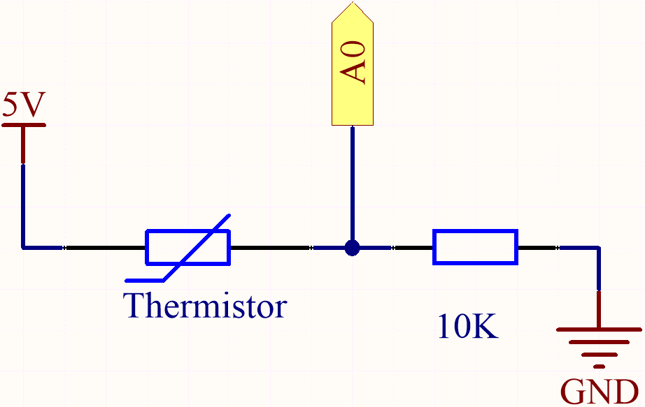
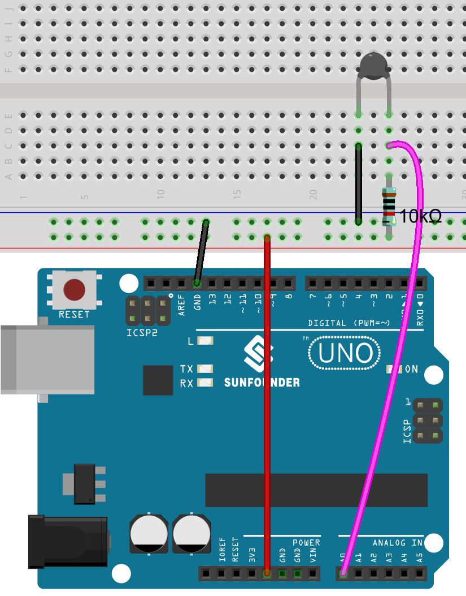

.. _ar_temp:

5.10 Thermometer
===========================

A thermometer is a device that measures temperature or a temperature gradient (the degree of hotness or coldness of an object). 
A thermometer has two important elements: (1) a temperature sensor (e.g. the bulb of a mercury-in-glass thermometer or the pyrometric sensor in an infrared thermometer) in which some change occurs with a change in temperature; 
and (2) some means of converting this change into a numerical value (e.g. the visible scale that is marked on a mercury-in-glass thermometer or the digital readout on an infrared model). 
Thermometers are widely used in technology and industry to monitor processes, in meteorology, in medicine, and in scientific research.

A thermistor is a type of temperature sensor whose resistance is strongly dependent on temperature, and it has two types: 
Negative Temperature Coefficient (NTC) and Positive Temperature Coefficient (PTC), 
also known as NTC and PTC. The resistance of PTC thermistor increases with temperature, while the condition of NTC is opposite to the former.

In this experiment we use an **NTC thermistor** to make a thermometer.

**Schematic**

**Wiring**

热敏电阻接GND, 10K电阻接3.3v

.. note::
    * The thermistor is black or green and marked 103.

* :ref:`cpn_uno`
* :ref:`cpn_breadboard`
* :ref:`cpn_wires`
* :ref:`cpn_resistor`
* :ref:`cpn_thermistor`

**Code**

.. note::

    * You can open the file ``5.10_thermistor.ino`` under the path of ``euler-kit/arduino/5.10_thermistor``. 
    * Or copy this code into **Arduino IDE**.

.. raw:: html

After the code is successfully uploaded, the Serial Monitor will print out the Celsius and Fahrenheit temperatures.

**How it works?**

Each thermistor has a normal resistance. Here it is 10k ohm, which is measured under 25 degree Celsius. 

When the temperature gets higher, the resistance of the thermistor decreases. Then the voltage data is converted to digital quantities by the A/D adapter. 

The temperature in Celsius or Fahrenheit is output via programming. 

Here is the relation between the resistance and temperature: 

    **RT =RN expB(1/TK – 1/TN)** 

    * **RT** is the resistance of the NTC thermistor when the temperature is **TK**. 
    * **RN** is the resistance of the NTC thermistor under the rated temperature TN. Here, the numerical value of RN is 10k. 
    * **TK** is a Kelvin temperature and the unit is K. Here, the numerical value of **TK** is ``273.15 + degree Celsius``. 
    * **TN** is a rated Kelvin temperature; the unit is K too. Here, the numerical value of TN is ``273.15+25``.
    * And **B(beta)**, the material constant of NTC thermistor, is also called heat sensitivity index with a numerical value ``3950``. 
    * **exp** is the abbreviation of exponential, and the base number ``e`` is a natural number and equals 2.7 approximately. 

    Convert this formula ``TK=1/(ln(RT/RN)/B+1/TN)`` to get Kelvin temperature that minus 273.15 equals degree Celsius. 

    This relation is an empirical formula. It is accurate only when the temperature and resistance are within the effective range.

**Learn More**

You can also display the calculated Celsius and Fahrenheit temperatures on the I2C LCD1602.

.. note::

    * You can open the file ``5.10_thermistor_lcd.ino`` under the path of ``euler-kit/arduino/5.10_thermistor_lcd``. 
    * Or copy this code into **Arduino IDE**.
    * The ``LiquidCrystal_I2C`` library is used here, refer to :ref:`install_libraries_ar` for a tutorial to install.

.. raw:: html

