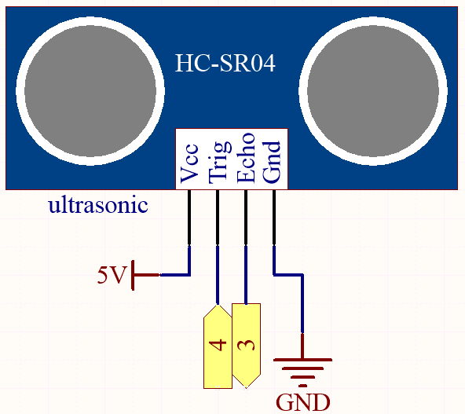
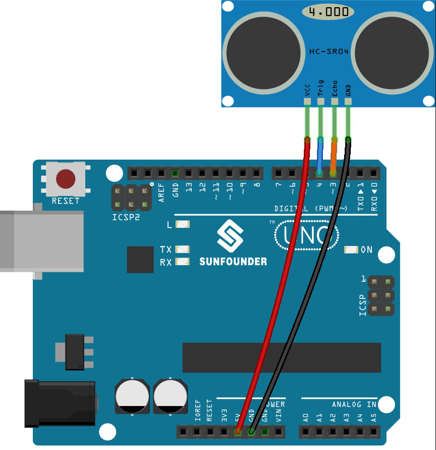

.. _ar_ultrasonic:

5.12 User-defined Function
======================================

In c, we can divide a large program into the basic building blocks known as function. 
The function contains the set of programming statements enclosed by {}. 
A function can be called multiple times to provide reusability and modularity to the C program. 
In other words, we can say that the collection of functions creates a program. 
The function is also known as procedureor subroutinein other programming languages.

There are the following advantages of functions.

* By using functions, we can avoid rewriting same logic/code again and again in a program.
* We can call C functions any number of times in a program and from any place in a program.
* We can track a large C program easily when it is divided into multiple functions.
* Reusability is the main achievement of C functions.
* However, Function calling is always a overhead in a C program.

There are two types of functions in C programming:

* **Library Functions**: the functions which are declared in the C header files.
* **User-defined functions**: the functions which are created by the C programmer, so that he/she can use it many times. It reduces the complexity of a big program and optimizes the code.

In this project, define a function to read the value of the ultrasonic module.

**Schematic**

**Wiring**

* :ref:`cpn_uno`
* :ref:`cpn_wires`
* :ref:`cpn_ultrasonic`

**Code**

.. note::

    * Open the ``5.12_ultrasonic.ino`` file under the path of ``esp32-ultimate-kit\c\codes\5.12_ultrasonic``.
    * Or copy this code into **Arduino IDE**.
    
.. raw:: html
    

After the code is successfully uploaded, the serial monitor will print out the distance between the ultrasonic sensor and the obstacle ahead.

**How it works?**

About the application of ultrasonic sensor, we can directly check the subfunction.

.. code-block:: arduino

    float readSensorData(){// ...}

* The ``trigPin`` of the ultrasonic module transmits a 10us square wave signal every 2us.

    .. code-block:: arduino

        // Trigger a low signal before sending a high signal
        digitalWrite(trigPin, LOW); 
        delayMicroseconds(2);
        // Send a 10-microsecond high signal to the trigPin
        digitalWrite(trigPin, HIGH); 
        delayMicroseconds(10);
        // Return to low signal
        digitalWrite(trigPin, LOW);

* The ``echoPin`` receives a high level signal if there is an obstacle within the range and use the ``pulseIn()`` function to record the time from sending to receiving.

    .. code-block:: arduino

        unsigned long microsecond = pulseIn(echoPin, HIGH);

* The speed of sound is 340 meters per second, which is equivalent to 29 microseconds per centimeter. By measuring the time it takes for a square wave to travel to an obstacle and return, we can calculate the distance traveled by dividing the total time by 2. This gives us the distance of the obstacle from the source of the sound wave.

    .. code-block:: arduino

        float distance = microsecond / 29.00 / 2;  

Note that the ultrasonic sensor will pause the program when it is working, which may cause some lagging when writing complex projects.
