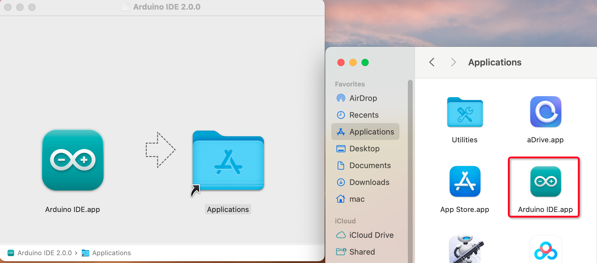

.. note::

    Hallo und willkommen in der SunFounder Raspberry Pi & Arduino & ESP32 Enthusiasten-Gemeinschaft auf Facebook! Tauchen Sie tiefer ein in die Welt von Raspberry Pi, Arduino und ESP32 mit anderen Enthusiasten.

    **Warum beitreten?**

    - **Expertenunterstützung**: Lösen Sie Nachverkaufsprobleme und technische Herausforderungen mit Hilfe unserer Gemeinschaft und unseres Teams.
    - **Lernen & Teilen**: Tauschen Sie Tipps und Anleitungen aus, um Ihre Fähigkeiten zu verbessern.
    - **Exklusive Vorschauen**: Erhalten Sie frühzeitigen Zugang zu neuen Produktankündigungen und exklusiven Einblicken.
    - **Spezialrabatte**: Genießen Sie exklusive Rabatte auf unsere neuesten Produkte.
    - **Festliche Aktionen und Gewinnspiele**: Nehmen Sie an Gewinnspielen und Feiertagsaktionen teil.

    👉 Sind Sie bereit, mit uns zu erkunden und zu erschaffen? Klicken Sie auf [|link_sf_facebook|] und treten Sie heute bei!

.. _install_arduino:

1.1 Arduino IDE installieren (Wichtig)
=========================================

Die Arduino-IDE, bekannt als Arduino Integrated Development Environment, bietet alle Softwareunterstützung, die für die Durchführung eines Arduino-Projekts erforderlich ist. Es handelt sich um eine speziell für Arduino entwickelte Programmiersoftware, die vom Arduino-Team bereitgestellt wird und es uns ermöglicht, Programme zu schreiben und sie auf das Arduino-Board hochzuladen.

Die Arduino-IDE 2.0 ist ein Open-Source-Projekt. Sie ist ein großer Schritt von ihrem robusten Vorgänger Arduino IDE 1.x entfernt und bietet eine überarbeitete Benutzeroberfläche, einen verbesserten Board- und Bibliotheksmanager, einen Debugger, eine Autovervollständigungsfunktion und vieles mehr.

In diesem Tutorial zeigen wir, wie Sie die Arduino-IDE 2.0 auf Ihrem Windows-, Mac- oder Linux-Computer herunterladen und installieren können.

Anforderungen
-------------------

* Windows - Win 10 und neuer, 64 Bit
* Linux - 64 Bit
* Mac OS X - Version 10.14: "Mojave" oder neuer, 64 Bit

Arduino-IDE 2.0 herunterladen
-------------------------------

#. Besuchen Sie |link_download_arduino|.

#. Laden Sie die IDE für Ihre Betriebssystemversion herunter.

    .. image:: img/sp_001.png

Installation
------------------------------

Windows
^^^^^^^^^^^^^

#. Doppelklicken Sie auf die Datei ``arduino-ide_xxxx.exe``, um die heruntergeladene Datei auszuführen.

#. Lesen Sie die Lizenzvereinbarung und stimmen Sie ihr zu.

    .. image:: img/sp_002.png

#. Wählen Sie die Installationsoptionen aus.

    .. image:: img/sp_003.png

#. Wählen Sie den Installationsort. Es wird empfohlen, die Software auf einem Laufwerk außerhalb des Systemlaufwerks zu installieren.

    .. image:: img/sp_004.png

#. Klicken Sie dann auf "Fertig".

    .. image:: img/sp_005.png

macOS
^^^^^^^^^^^^^^^^

Doppelklicken Sie auf die heruntergeladene Datei ``arduino_ide_xxxx.dmg`` und folgen Sie den Anweisungen, um die **Arduino IDE.app** in den **Applications**-Ordner zu kopieren. Nach einigen Sekunden wird die Arduino-IDE erfolgreich installiert.

Linux
^^^^^^^^^^^^

Für das Tutorial zur Installation der Arduino-IDE 2.0 auf einem Linux-System verweisen Sie bitte auf: https://docs.arduino.cc/software/ide-v2/tutorials/getting-started/ide-v2-downloading-and-installing#linux

Öffnen Sie die IDE
---------------------

#. Wenn Sie die Arduino-IDE 2.0 zum ersten Mal öffnen, werden automatisch die Arduino AVR Boards, integrierte Bibliotheken und andere erforderliche Dateien installiert.

    .. image:: img/sp_901.png

#. Darüber hinaus kann Ihre Firewall oder Ihr Sicherheitscenter mehrmals Pop-ups anzeigen und Sie fragen, ob Sie einige Gerätetreiber installieren möchten. Installieren Sie bitte alle.

    .. image:: img/sp_104.png

#. Jetzt ist Ihre Arduino-IDE bereit!

    .. note::
        Falls einige Installationen aufgrund von Netzwerkproblemen oder anderen Gründen nicht funktionierten, können Sie die Arduino-IDE erneut öffnen und sie wird den Rest der Installation abschließen. Das Ausgabefenster wird sich erst öffnen, nachdem alle Installationen abgeschlossen sind, es sei denn, Sie klicken auf "Verify" oder "Upload".