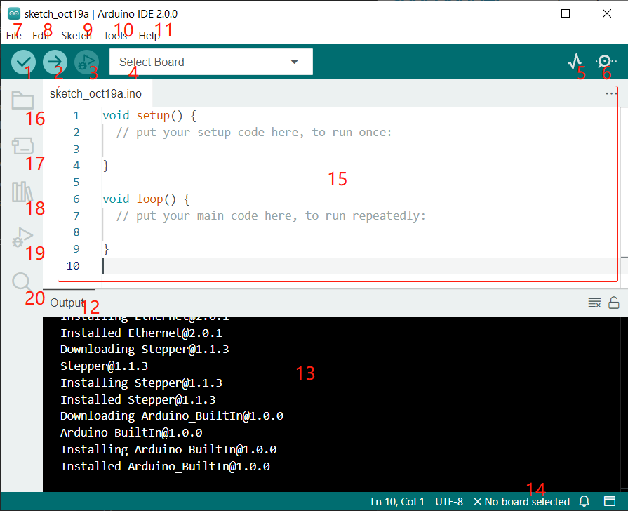

.. note::

    Bonjour, bienvenue dans la communauté des passionnés de SunFounder Raspberry Pi & Arduino & ESP32 sur Facebook ! Plongez plus profondément dans Raspberry Pi, Arduino et ESP32 avec d'autres passionnés.

    **Pourquoi nous rejoindre ?**

    - **Support d'experts** : Résolvez les problèmes après-vente et les défis techniques avec l'aide de notre communauté et de notre équipe.
    - **Apprendre & Partager** : Échangez des astuces et des tutoriels pour améliorer vos compétences.
    - **Aperçus exclusifs** : Accédez en avant-première aux annonces de nouveaux produits et aux avant-premières.
    - **Réductions spéciales** : Profitez de réductions exclusives sur nos derniers produits.
    - **Promotions festives et cadeaux** : Participez à des cadeaux et des promotions de fêtes.

    👉 Prêt à explorer et créer avec nous ? Cliquez sur [|link_sf_facebook|] et rejoignez-nous dès aujourd'hui !

1.2 Présentation de l'IDE Arduino
======================================

1. **Vérifier** : Compilez votre code. Tout problème de syntaxe sera signalé par des erreurs.

2. **Téléverser** : Téléversez le code sur votre carte. Lorsque vous cliquez sur le bouton, les LED RX et TX sur la carte clignotent rapidement et ne s'arrêtent pas avant la fin du téléversement.

3. **Déboguer** : Pour vérifier les erreurs ligne par ligne.

4. **Sélectionner la carte** : Configuration rapide de la carte et du port.

5. **Traceur série** : Vérifiez la variation de la valeur de lecture.

6. **Moniteur série** : Cliquez sur le bouton et une fenêtre apparaîtra. Elle reçoit les données envoyées par votre carte de contrôle. Il est très utile pour le débogage.

7. **Fichier** : Cliquez sur le menu et une liste déroulante apparaîtra, incluant la création, l'ouverture, l'enregistrement, la fermeture de fichiers, la configuration de certains paramètres, etc.

8. **Éditer** : Cliquez sur le menu. Dans la liste déroulante, il y a des opérations d'édition comme **Couper**, **Copier**, **Coller**, **Trouver**, etc., avec leurs raccourcis correspondants.

9. **Croquis** : Inclut des opérations comme **Vérifier**, **Téléverser**, **Ajouter** des fichiers, etc. Une fonction plus importante est **Inclure une bibliothèque** - où vous pouvez ajouter des bibliothèques.

10. **Outil** : Comprend certains outils - les plus fréquemment utilisés sont la carte (la carte que vous utilisez) et le port (le port où se trouve votre carte). Chaque fois que vous souhaitez téléverser le code, vous devez les sélectionner ou les vérifier.

11. **Aide** : Si vous êtes débutant, vous pouvez consulter les options sous le menu et obtenir l'aide dont vous avez besoin, y compris les opérations dans l'IDE, les informations d'introduction, le dépannage, l'explication du code, etc.

12. **Barre de sortie** : Basculez l'onglet de sortie ici.

13. **Fenêtre de sortie** : Imprimez les informations.

14. **Carte et Port** : Ici, vous pouvez prévisualiser la carte et le port sélectionnés pour le téléversement du code. Vous pouvez les sélectionner à nouveau via **Outils** -> **Carte** / **Port** si l'un d'eux est incorrect.

15. La zone d'édition de l'IDE. Vous pouvez écrire du code ici.

16. **Cahier de croquis** : Pour gérer les fichiers de croquis.

17. **Gestionnaire de cartes** : Pour gérer le pilote de la carte.

18. **Gestionnaire de bibliothèques** : Pour gérer vos fichiers de bibliothèque.

19. **Déboguer** : Aide au débogage du code.

20. **Rechercher** : Recherchez les codes dans vos croquis.
