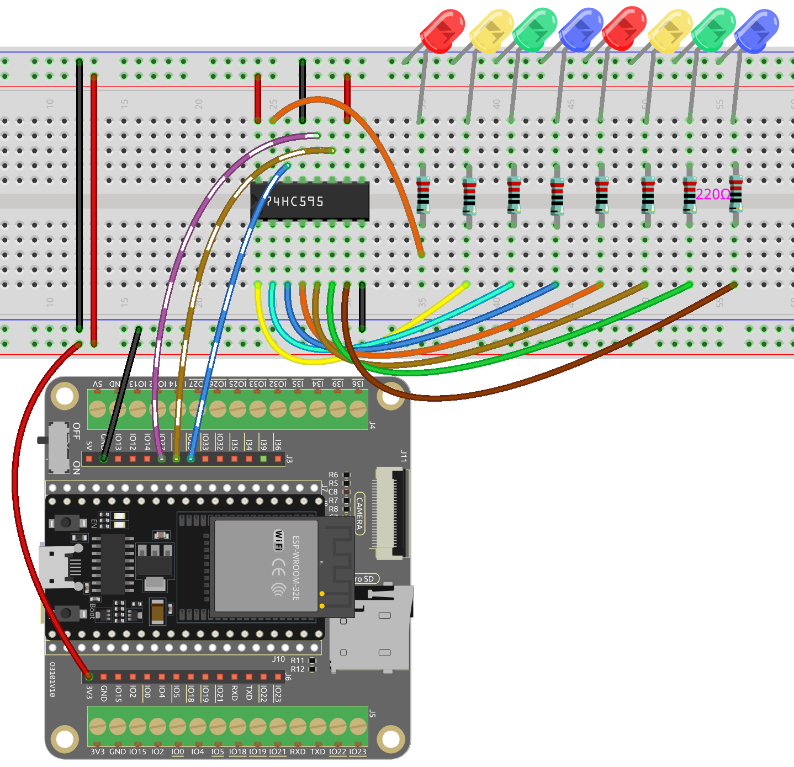

.. note::

    Hello, welcome to the SunFounder Raspberry Pi & Arduino & ESP32 Enthusiasts Community on Facebook! Dive deeper into Raspberry Pi, Arduino, and ESP32 with fellow enthusiasts.

    **Why Join?**

    - **Expert Support**: Solve post-sale issues and technical challenges with help from our community and team.
    - **Learn & Share**: Exchange tips and tutorials to enhance your skills.
    - **Exclusive Previews**: Get early access to new product announcements and sneak peeks.
    - **Special Discounts**: Enjoy exclusive discounts on our newest products.
    - **Festive Promotions and Giveaways**: Take part in giveaways and holiday promotions.

    👉 Ready to explore and create with us? Click [|link_sf_facebook|] and join today!

.. _ar_74hc595:

2.4 Microchip - 74HC595
===========================

Welcome to this exciting project! In this project, we will be using the 74HC595 chip to control a flowing display of 8 LEDs.

Imagine triggering this project and witnessing a mesmerizing flow of light, as if a sparkling rainbow is jumping between the 8 LEDs. Each LED will light up one by one and quickly fade away, while the next LED continues to shine, creating a gorgeous and dynamic effect.

By cleverly utilizing the 74HC595 chip, we can control the on and off states of multiple LEDs to achieve the flowing effect. This chip has multiple output pins that can be connected in series to control the sequence of LED illumination. Moreover, thanks to the chip's expandability, we can easily add more LEDs to the flowing display, creating even more spectacular effects.

**Required Components**

In this project, we need the following components. 

It's definitely convenient to buy a whole kit, here's the link: 

.. list-table::
    :widths: 20 20 20
    :header-rows: 1

    *   - Name	
        - ITEMS IN THIS KIT
        - LINK
    *   - ESP32 Starter Kit
        - 320+
        - |link_esp32_starter_kit|

You can also buy them separately from the links below.

.. list-table::
    :widths: 30 20
    :header-rows: 1

    *   - COMPONENT INTRODUCTION
        - PURCHASE LINK

    *   - :ref:`cpn_esp32_wroom_32e`
        - |link_esp32_wroom_32e_buy|
    *   - :ref:`cpn_esp32_camera_extension`
        - |link_esp32_extension_board|
    *   - :ref:`cpn_breadboard`
        - |link_breadboard_buy|
    *   - :ref:`cpn_wires`
        - |link_wires_buy|
    *   - :ref:`cpn_resistor`
        - |link_resistor_buy|
    *   - :ref:`cpn_led`
        - |link_led_buy|
    *   - :ref:`cpn_74hc595`
        - |link_74hc595_buy|

**Available Pins**

Here is a list of available pins on the ESP32 board for this project.

.. list-table::
    :widths: 5 20 

    * - Available Pins
      - IO13, IO12, IO14, IO27, IO26, IO25, IO33, IO32, IO15, IO2, IO0, IO4, IO5, IO18, IO19, IO21, IO22, IO23

**Schematic**

.. image:: ../../img/circuit/circuit_2.4_74hc595_led.png
    :width: 600

* When MR (pin10) is high level and CE (pin13) is low level, data is input in the rising edge of SHcp and goes to the memory register through the rising edge of SHcp. 
* If the two clocks are connected together, the shift register is always one pulse earlier than the memory register. 
* There is a serial shift input pin (DS), a serial output pin (Q7') and an asynchronous reset button (low level) in the memory register. 
* The memory register outputs a Bus with a parallel 8-bit and in three states. 
* When OE is enabled (low level), the data in memory register is output to the bus(Q0 ~ Q7).

**Wiring**

**Code**

.. note::

    * Open the ``2.4_74hc595.ino`` file under the path of ``esp32-starter-kit-main\c\codes\2.4_74hc595``.
    * After selecting the board (ESP32 Dev Module) and the appropriate port, click the **Upload** button.
    * :ref:`unknown_com_port`
    
.. raw:: html

    <iframe src=https://create.arduino.cc/editor/sunfounder01/024e20bb-f9c6-4baf-bb27-cdf49eb91e9e/preview?embed style="height:510px;width:100%;margin:10px 0" frameborder=0></iframe>

When you finish uploading the codes to the ESP32 board, you can see the LEDs turning on one after another.

**How it works?**

#. Declare an array, store several 8 bit binary numbers that are used to change the working state of the eight LEDs controlled by 74HC595. 

    .. code-block:: arduino

        int datArray[] = {B00000000, B00000001, B00000011, B00000111, B00001111, B00011111, B00111111, B01111111, B11111111};

#. ``loop()`` function.

    .. code-block:: arduino

        void loop()
            {
                for(int num = 0; num <10; num++)
                {
                    digitalWrite(STcp,LOW); //Set ST_CP and hold low for as long as you are transmitting
                    shiftOut(DS,SHcp,MSBFIRST,datArray[num]);
                    digitalWrite(STcp,HIGH); //pull the ST_CPST_CP to save the data
                    delay(1000);
                }
            }

    * Iterates through the ``datArray[]``, sequentially sending the binary values to the shift register.
    * The ``digitalWrite(STcp, LOW)`` and ``digitalWrite(STcp, HIGH)`` commands latch the data into the storage register.
    * ``shiftOut()`` function sends the binary values from ``datArray[]`` to the shift register using the data pin (DS) and shift register clock pin (SHcp). ``MSBFIRST`` means to move from high bits.
    * Then create a 1-second pause between each LED pattern update.
