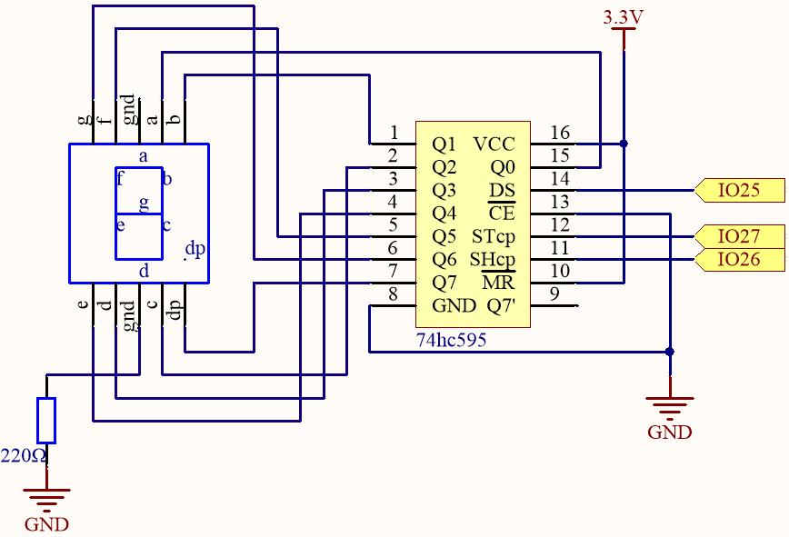
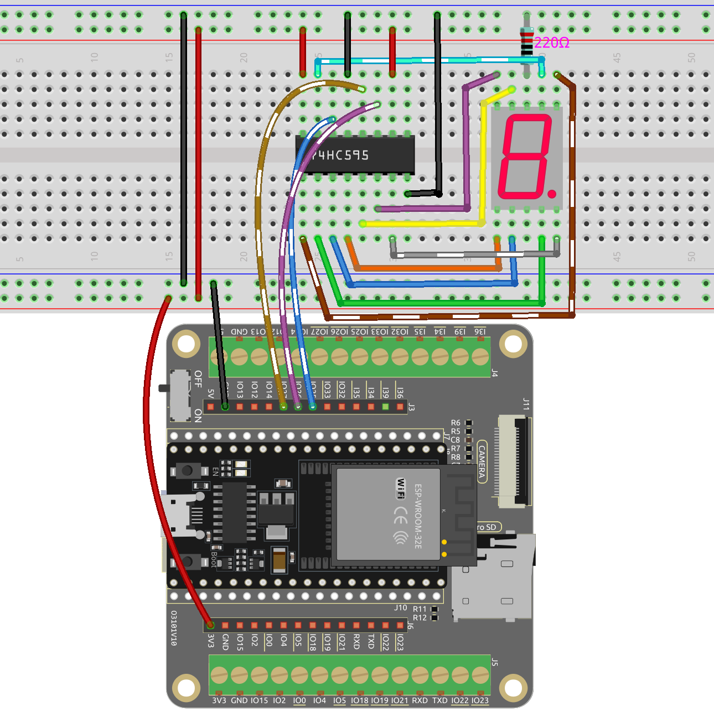

.. _ar_segment:

1.5 7 Segment Display
===================================

Welcome to this fascinating project! In this project, we will explore the enchanting world of displaying numbers from 0 to 9 on a seven-segment display.

Imagine triggering this project and witnessing a small, compact display glowing brightly with each number from 0 to 9. It's like having a miniature screen that showcases the digits in a captivating way. By controlling the signal pins, you can effortlessly change the displayed number and create various engaging effects.

Through simple circuit connections and programming, you will learn how to interact with the seven-segment display and bring your desired numbers to life. Whether it's a counter, a clock, or any other intriguing application, the seven-segment display will be your reliable companion, adding a touch of brilliance to your projects.

**Available Pins**

Here is a list of available pins on the ESP32 board for this project.

.. list-table::
    :widths: 5 20 

    * - Available Pins
      - IO13, IO12, IO14, IO27, IO26, IO25, IO33, IO32, IO15, IO2, IO0, IO4, IO5, IO18, IO19, IO21, IO22, IO23

**Schematic**

Here the wiring principle is basically the same as :ref:`py_74hc_led`, the only difference is that Q0-Q7 are connected to the a ~ g pins of the 7 Segment Display.

.. list-table:: Wiring
    :widths: 15 25
    :header-rows: 1

    *   - 74HC595
        - LED Segment Display
    *   - Q0
        - a
    *   - Q1
        - b
    *   - Q2
        - c
    *   - Q3
        - d
    *   - Q4
        - e
    *   - Q5
        - f
    *   - Q6
        - g
    *   - Q7
        - dp

**Wiring**

* :ref:`cpn_esp32_extension`
* :ref:`cpn_breadboard`
* :ref:`cpn_wires`
* :ref:`cpn_resistor`
* :ref:`cpn_7_segment`
* :ref:`cpn_74hc595`

**Code**

.. note::

    * Open the ``1.5_7segment.ino`` file under the path of ``esp32-ultimate-kit-main\c\codes\1.5_7segment``.
    * Or copy this code into **Arduino IDE**.
    
.. raw:: html

    <iframe src=https://create.arduino.cc/editor/sunfounder01/937f5e3f-2d9e-4c75-8331-ace3c0876182/preview?embed style="height:510px;width:100%;margin:10px 0" frameborder=0></iframe>

After the code is uploaded successfully, you will be able to see the LED Segment Display display 0~9 in sequence.

**How it works?**

In this project, we are using the ``shiftOut()`` function to write the binary number to the shift register. 

Suppose that the 7-segment Display display the number "2". This bit pattern corresponds to the segments **f**, **c** and **dp** being turned off (low), while the segments **a**, **b**, **d**, **e** and **g** are turned on (high). This is "01011011" in binary and "0x5b" in hexadecimal notation. 

Therefore, you would need to call ``shiftOut(DS,SHcp,MSBFIRST,0x5b)`` to display the number "2" on the 7-segment display.

.. image:: img/7_segment2.png

* `Hexadecimal <https://en.wikipedia.org/wiki/Hexadecimal>`_

* `BinaryHex Converter <https://www.binaryhexconverter.com/binary-to-hex-converter>`_

The following table shows the hexadecimal patterns that need to be written to the shift register to display the numbers 0 to 9 on a 7-segment display.

.. list-table:: Glyph Code
    :widths: 20 20 20
    :header-rows: 1

    *   - Numbers	
        - Binary Code
        - Hex Code  
    *   - 0	
        - 00111111	
        - 0x3f
    *   - 1	
        - 00000110	
        - 0x06
    *   - 2	
        - 01011011	
        - 0x5b
    *   - 3	
        - 01001111	
        - 0x4f
    *   - 4	
        - 01100110	
        - 0x66
    *   - 5	
        - 01101101	
        - 0x6d
    *   - 6	
        - 01111101	
        - 0x7d
    *   - 7	
        - 00000111	
        - 0x07
    *   - 8	
        - 01111111	
        - 0x7f
    *   - 9	
        - 01101111	
        - 0x6f

Write these codes into ``shiftOut()`` to make the LED Segment Display display the corresponding numbers.