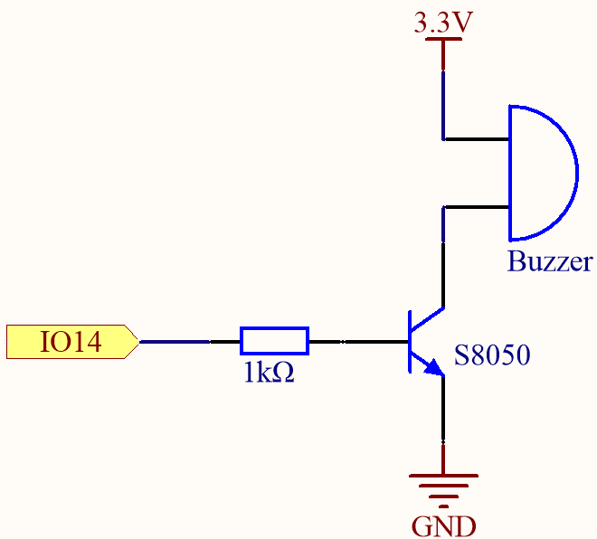

.. _ar_ac_buz:

3.1 Piepser
==================
Dies ist ein einfaches Projekt, um einen aktiven Summer jede Sekunde schnell viermal piepen zu lassen.

**Benötigte Komponenten**

Für dieses Projekt benötigen wir die folgenden Komponenten.

Es ist definitiv praktisch, ein ganzes Kit zu kaufen, hier ist der Link:

.. list-table::
    :widths: 20 20 20
    :header-rows: 1

    *   - Name
        - ARTIKEL IN DIESEM KIT
        - LINK
    *   - ESP32 Starter Kit
        - 320+
        - |link_esp32_starter_kit|

Sie können sie auch separat über die untenstehenden Links kaufen.

.. list-table::
    :widths: 30 20
    :header-rows: 1

    *   - KOMPONENTENVORSTELLUNG
        - KAUF-LINK

    *   - :ref:`cpn_esp32_wroom_32e`
        - |link_esp32_wroom_32e_buy|
    *   - :ref:`cpn_esp32_camera_extension`
        - \-
    *   - :ref:`cpn_breadboard`
        - |link_breadboard_buy|
    *   - :ref:`cpn_wires`
        - |link_wires_buy|
    *   - :ref:`cpn_resistor`
        - |link_resistor_buy|
    *   - :ref:`cpn_buzzer`
        - \-
    *   - :ref:`cpn_transistor`
        - |link_transistor_buy|

**Verfügbare Pins**

Hier ist eine Liste der verfügbaren Pins auf dem ESP32-Board für dieses Projekt.

.. list-table::
    :widths: 5 20 

    * - Verfügbare Pins
      - IO13, IO12, IO14, IO27, IO26, IO25, IO33, IO32, IO15, IO2, IO0, IO4, IO5, IO18, IO19, IO21, IO22, IO23

**Schaltplan**

Wenn der IO14-Ausgang hoch ist, wird nach dem 1K-Strombegrenzungswiderstand (zum Schutz des Transistors) der S8050 (NPN-Transistor) leiten, so dass der Summer ertönt.

Die Rolle des S8050 (NPN-Transistor) besteht darin, den Strom zu verstärken und den Summer lauter klingen zu lassen. Tatsächlich können Sie den Summer auch direkt an IO14 anschließen, aber Sie werden feststellen, dass der Summer leiser klingt.

**Verdrahtung**

Im Kit sind zwei Arten von Summern enthalten.
Wir müssen den aktiven Summer verwenden. Drehen Sie sie um, die versiegelte Rückseite (nicht die freiliegende PCB) ist die, die wir wollen.

.. image:: ../../components/img/buzzer.png
    :width: 500
    :align: center

Der Summer benötigt beim Arbeiten einen Transistor, hier verwenden wir S8050 (NPN-Transistor).

.. image:: ../../img/wiring/3.1_buzzer_bb.png

**Code**

.. note::

    * Sie können die Datei ``3.1_beep.ino`` unter dem Pfad ``esp32-starter-kit-main\c\codes\3.1_beep`` öffnen.
    * Nachdem Sie das Board (ESP32 Dev Module) und den entsprechenden Port ausgewählt haben, klicken Sie auf den **Upload**-Knopf.
    * :ref:`unknown_com_port`
   
.. raw:: html
    
    <iframe src=https://create.arduino.cc/editor/sunfounder01/f17a663c-2941-407e-9137-6f6eacd28c23/preview?embed style="height:510px;width:100%;margin:10px 0" frameborder=0></iframe>

Nachdem der Code erfolgreich hochgeladen wurde, hören Sie jede Sekunde einen Piepton.
