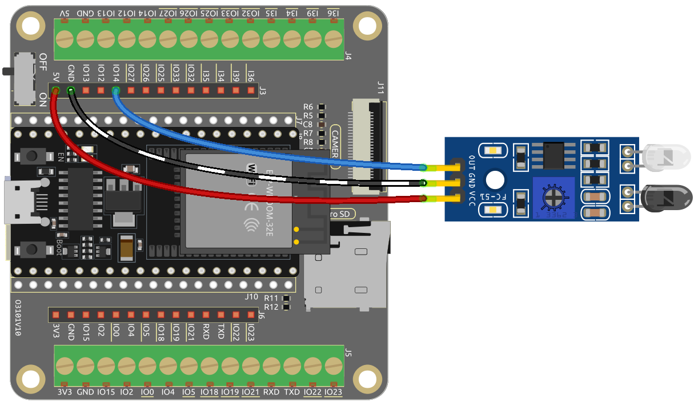

.. _ar_ir_obstacle:

5.3 Hindernis Erkennen
===================================

Dieses Modul wird häufig auf Autos und Robotern installiert, um die Existenz von Hindernissen voraus zu beurteilen. Es wird auch weit verbreitet in Handheld-Geräten, Wasserhähnen und so weiter eingesetzt.

**Benötigte Komponenten**

Für dieses Projekt benötigen wir die folgenden Komponenten.

Es ist definitiv praktisch, ein ganzes Kit zu kaufen, hier ist der Link:

.. list-table::
    :widths: 20 20 20
    :header-rows: 1

    *   - Name
        - ARTIKEL IN DIESEM KIT
        - LINK
    *   - ESP32 Starter Kit
        - 320+
        - |link_esp32_starter_kit|

Sie können sie auch separat über die untenstehenden Links kaufen.

.. list-table::
    :widths: 30 20
    :header-rows: 1

    *   - KOMPONENTENVORSTELLUNG
        - KAUF-LINK

    *   - :ref:`cpn_esp32_wroom_32e`
        - |link_esp32_wroom_32e_buy|
    *   - :ref:`cpn_esp32_camera_extension`
        - \-
    *   - :ref:`cpn_wires`
        - |link_wires_buy|
    *   - :ref:`cpn_avoid`
        - |link_avoid_buy|

**Verfügbare Pins**

* **Verfügbare Pins**

    Hier ist eine Liste der verfügbaren Pins auf dem ESP32-Board für dieses Projekt.

    .. list-table::
        :widths: 5 20

        *   - Verfügbare Pins
            - IO13, IO14, IO27, IO26, IO25, IO33, I35, I34, I39, I36, IO4, IO18, IO19, IO21, IO22, IO23

* **Strapping Pins (Eingang)**

    Strapping-Pins sind eine spezielle Gruppe von Pins, die verwendet werden, um bestimmte Boot-Modi während des Gerätestarts 
    (d.h., Einschalt-Reset) zu bestimmen.
        
    .. list-table::
        :widths: 5 15

        *   - Strapping Pins
            - IO5, IO0, IO2, IO12, IO15 
    
    Generell wird **nicht empfohlen, sie als Eingangspins zu verwenden**. Wenn Sie diese Pins verwenden möchten, berücksichtigen Sie den potenziellen Einfluss auf den Boot-Vorgang. Weitere Details finden Sie im Abschnitt :ref:`esp32_strapping`.

**Schaltplan**

.. image:: ../../img/circuit/circuit_5.3_avoid.png

Wenn das Hindernisvermeidungsmodul keine Hindernisse erkennt, gibt IO14 ein hohes Niveau zurück. Wenn es jedoch ein Hindernis erkennt, gibt es ein niedriges Niveau zurück. Sie können das blaue Potentiometer einstellen, um die Erkennungsdistanz dieses Moduls zu ändern.

**Verdrahtung**

**Code**

.. note::

    * Sie können die Datei ``5.3.detect_the_obstacle.ino`` unter dem Pfad ``esp32-starter-kit-main\c\codes\5.3.detect_the_obstacle`` öffnen. 
    * Nachdem Sie das Board (ESP32 Dev Module) und den entsprechenden Port ausgewählt haben, klicken Sie auf den **Upload**-Knopf.
    * :ref:`unknown_com_port`
   
.. raw:: html

    <iframe src=https://create.arduino.cc/editor/sunfounder01/b0f22caa-3c77-4dc1-9a33-20ff23d04a5e/preview?embed style="height:510px;width:100%;margin:10px 0" frameborder=0></iframe>
    

Nachdem der Code erfolgreich hochgeladen wurde, wird auf dem seriellen Monitor "0" angezeigt, wenn das IR-Hindernisvermeidungsmodul etwas in seinem Weg erkennt, andernfalls wird "1" angezeigt.
