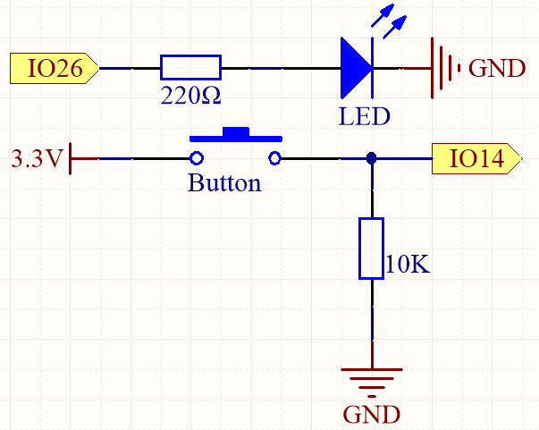
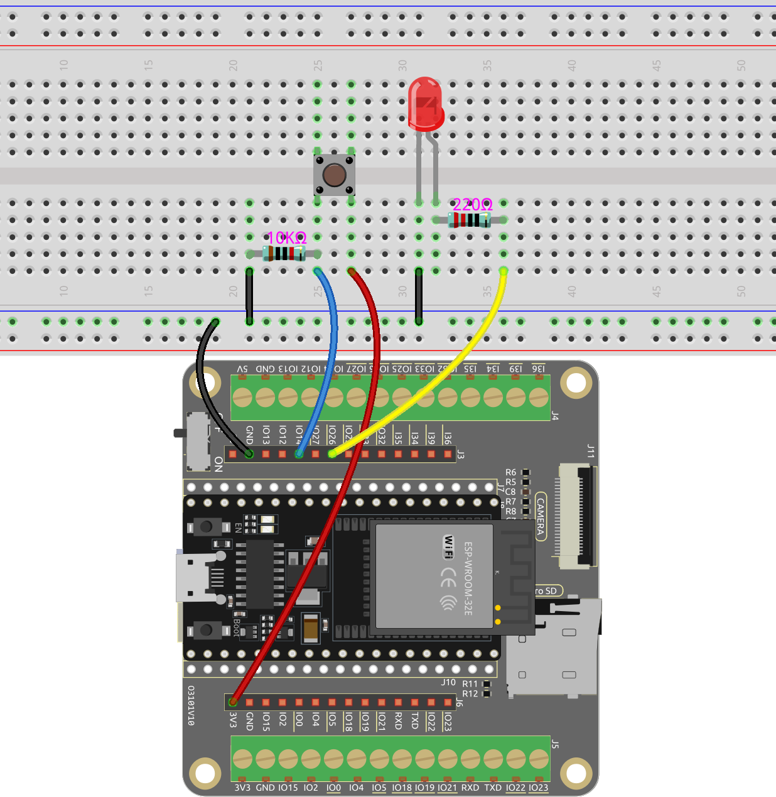

.. note::

    Bonjour, bienvenue dans la communauté des passionnés de SunFounder Raspberry Pi, Arduino et ESP32 sur Facebook ! Plongez plus profondément dans le monde du Raspberry Pi, Arduino et ESP32 avec d'autres passionnés.

    **Pourquoi nous rejoindre ?**

    - **Support d'experts** : Résolvez les problèmes après-vente et les défis techniques avec l'aide de notre communauté et de notre équipe.
    - **Apprendre et partager** : Échangez des astuces et des tutoriels pour améliorer vos compétences.
    - **Aperçus exclusifs** : Accédez en avant-première aux annonces de nouveaux produits et aux avant-goûts.
    - **Réductions spéciales** : Profitez de réductions exclusives sur nos nouveaux produits.
    - **Promotions festives et cadeaux** : Participez à des cadeaux et à des promotions de vacances.

    👉 Prêt à explorer et à créer avec nous ? Cliquez sur [|link_sf_facebook|] et rejoignez-nous dès aujourd'hui !

.. _ar_button:

5.1 Lecture de la valeur du bouton
==============================================

Dans ce projet interactif, nous allons explorer le domaine des contrôles de boutons et de la manipulation des LED.

Le concept est simple mais efficace. Nous allons lire l'état d'un bouton. Lorsque le bouton est enfoncé, il enregistre un niveau de tension élevé, ou "état haut". Cette action déclenchera ensuite l'allumage d'une LED.

**Composants nécessaires**

Dans ce projet, nous avons besoin des composants suivants. 

Il est certainement pratique d'acheter un kit complet, voici le lien :

.. list-table::
    :widths: 20 20 20
    :header-rows: 1

    *   - Nom	
        - ARTICLES DANS CE KIT
        - LIEN
    *   - Kit de démarrage ESP32
        - 320+
        - |link_esp32_starter_kit|

Vous pouvez également les acheter séparément à partir des liens ci-dessous.

.. list-table::
    :widths: 30 20
    :header-rows: 1

    *   - INTRODUCTION AUX COMPOSANTS
        - LIEN D'ACHAT

    *   - :ref:`cpn_esp32_wroom_32e`
        - |link_esp32_wroom_32e_buy|
    *   - :ref:`cpn_esp32_camera_extension`
        - |link_esp32_extension_board|
    *   - :ref:`cpn_breadboard`
        - |link_breadboard_buy|
    *   - :ref:`cpn_wires`
        - |link_wires_buy|
    *   - :ref:`cpn_resistor`
        - |link_resistor_buy|
    *   - :ref:`cpn_led`
        - |link_led_buy|
    *   - :ref:`cpn_button`
        - |link_button_buy|

**Broches disponibles**

* **Broches disponibles**

    Voici une liste des broches disponibles sur la carte ESP32 pour ce projet.

    .. list-table::
        :widths: 5 20

        *   - Pour entrée
            - IO14, IO25, I35, I34, I39, I36, IO18, IO19, IO21, IO22, IO23
        *   - Pour sortie
            - IO13, IO12, IO14, IO27, IO26, IO25, IO33, IO32, IO15, IO2, IO0, IO4, IO5, IO18, IO19, IO21, IO22, IO23
    
* **Broches à usage conditionnel (entrée)**

    Les broches suivantes ont des résistances pull-up ou pull-down intégrées, donc des résistances externes ne sont pas nécessaires lorsque **vous les utilisez comme broches d'entrée** :

    .. list-table::
        :widths: 5 15
        :header-rows: 1

        *   - Broches à usage conditionnel
            - Description
        *   - IO13, IO15, IO2, IO4
            - Tirer vers le haut avec une résistance de 47K par défaut au niveau haut.
        *   - IO27, IO26, IO33
            - Tirer vers le haut avec une résistance de 4.7K par défaut au niveau haut.
        *   - IO32
            - Tirer vers le bas avec une résistance de 1K par défaut au niveau bas.

* **Broches de démarrage (entrée)**

    Les broches de démarrage sont un ensemble spécial de broches utilisées pour déterminer des modes de démarrage spécifiques lors du démarrage de l'appareil 
    (c'est-à-dire, reset à la mise sous tension).
     
    .. list-table::
        :widths: 5 15

        *   - Broches de démarrage
            - IO5, IO0, IO2, IO12, IO15 
    
    En général, il est **non recommandé de les utiliser comme broches d'entrée**. Si vous souhaitez utiliser ces broches, considérez l'impact potentiel sur le processus de démarrage. Pour plus de détails, veuillez vous référer à la section :ref:`esp32_strapping`.

**Schéma**

Pour assurer un bon fonctionnement, connectez un côté de la broche du bouton à 3,3V et l'autre côté à IO14. Lorsque le bouton est enfoncé, IO14 sera mis à l'état haut, ce qui fera s'allumer la LED. Lorsque le bouton est relâché, IO14 reviendra à son état de repos, qui peut être soit haut soit bas. Pour garantir un niveau bas stable lorsque le bouton n'est pas enfoncé, IO14 doit être connecté à la masse (GND) via une résistance de tirage vers le bas de 10K.

**Câblage**

.. note::
    
    Un bouton à quatre broches est conçu en forme de H. Lorsque le bouton n'est pas enfoncé, les broches gauche et droite sont déconnectées, et le courant ne peut pas circuler entre elles. Cependant, lorsque le bouton est enfoncé, les broches gauche et droite sont connectées, créant un chemin pour que le courant puisse circuler.

**Code**

.. note::

    * Vous pouvez ouvrir le fichier ``5.1_button.ino`` sous le chemin ``esp32-starter-kit-main\c\codes\5.1_button``.
    * Après avoir sélectionné la carte (ESP32 Dev Module) et le port approprié, cliquez sur le bouton **Upload**.
    * :ref:`unknown_com_port`
   
.. raw:: html

    <iframe src=https://create.arduino.cc/editor/sunfounder01/702c5a70-78e7-4a8b-a0c7-10c0acebfc12/preview?embed style="height:510px;width:100%;margin:10px 0" frameborder=0></iframe>

N'oubliez pas de définir le débit de communication série à 115200.

Une fois le code téléchargé avec succès, la LED s'allume lorsque vous appuyez sur le bouton et s'éteint lorsque vous le relâchez.

En même temps, vous pouvez ouvrir le Moniteur Série dans le coin supérieur droit pour observer la valeur du bouton. Lorsque le bouton est enfoncé, "1" sera imprimé, sinon "0" sera imprimé.

.. image:: img/button_serial.png

**Comment ça marche**

Les projets précédents impliquaient tous la sortie de signaux, soit sous forme de signaux numériques ou PWM.

Ce projet consiste à recevoir des signaux d'entrée d'un composant externe vers la carte ESP32. Vous pouvez visualiser le signal d'entrée via le Moniteur Série dans l'IDE Arduino.

#. Dans la fonction ``setup()``, la broche du bouton est initialisée en tant qu'``input`` et la broche de la LED est initialisée en tant qu'``output``. La communication série est également lancée avec un débit de 115200.

    .. code-block:: arduino

        void setup() {
            Serial.begin(115200);
            // initialise la broche du bouton comme entrée
            pinMode(buttonPin, INPUT);
            // initialise la broche de la LED comme sortie
            pinMode(ledPin, OUTPUT);
        }
    
    * ``Serial.begin(speed)`` : Définit le débit en bits par seconde (baud) pour la transmission de données série.

        * ``speed`` : en bits par seconde (baud). Types de données autorisés : ``long``.

#. Dans la fonction ``loop()``, l'état du bouton est lu et stocké dans la variable ``buttonState``. La valeur de ``buttonState`` est imprimée sur le Moniteur Série à l'aide de ``Serial.println()``.

    .. code-block:: arduino

        void loop() {
            // lire l'état de la valeur du bouton
            buttonState = digitalRead(buttonPin);
            Serial.println(buttonState);
            delay(100);
            // si le bouton est enfoncé, l'état du bouton est HAUT
            if (buttonState == HIGH) {
                // allumer la LED
                digitalWrite(ledPin, HIGH);

            } else {
                // éteindre la LED
                digitalWrite(ledPin, LOW);
            }
        }

    Si le bouton est enfoncé et que l'``buttonState`` est HAUT, la LED est allumée en mettant la broche ``ledPin`` à HAUT. Sinon, la LED est éteinte.

    * ``int digitalRead(uint8_t pin);`` : Pour lire l'état d'une broche donnée configurée comme INPUT, on utilise la fonction digitalRead. Cette fonction renverra l'état logique de la broche sélectionnée comme ``HIGH`` ou ``LOW``.

        * ``pin`` : sélectionne le GPIO.

    * ``Serial.println()`` : Imprime des données sur le port série sous forme de texte ASCII lisible par l'homme, suivi d'un caractère de retour chariot (ASCII 13, ou '\r') et d'un caractère de nouvelle ligne (ASCII 10, ou '\n').
