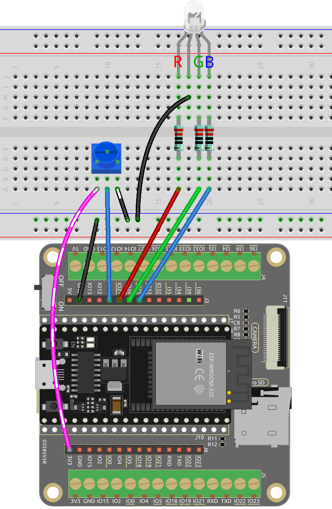

.. _ar_color_gradient:

6.5 Farbverlauf
==============================================
Sind Sie bereit, eine Welt voller Farben zu erleben? Dieses Projekt nimmt Sie mit auf eine magische Reise, auf der Sie eine RGB-LED steuern und sanfte Farbübergänge erzielen können. Egal, ob Sie Ihrer Wohnkultur etwas Farbe verleihen oder ein unterhaltsames Programmierprojekt suchen, dieses Projekt bietet Ihnen genau das. Tauchen wir gemeinsam in diese farbenfrohe Welt ein!

**Benötigte Komponenten**

Für dieses Projekt benötigen wir folgende Komponenten.

Es ist definitiv praktisch, ein ganzes Set zu kaufen. Hier ist der Link:

.. list-table::
    :widths: 20 20 20
    :header-rows: 1

    *   - Name	
        - ARTIKEL IN DIESEM KIT
        - LINK
    *   - ESP32 Starter Kit
        - 320+
        - |link_esp32_starter_kit|

Sie können sie auch einzeln über die untenstehenden Links kaufen.

.. list-table::
    :widths: 30 20
    :header-rows: 1

    *   - KOMPONENTENVORSTELLUNG
        - KAUF-LINK

    *   - :ref:`cpn_esp32_wroom_32e`
        - |link_esp32_wroom_32e_buy|
    *   - :ref:`cpn_esp32_camera_extension`
        - \-
    *   - :ref:`cpn_breadboard`
        - |link_breadboard_buy|
    *   - :ref:`cpn_wires`
        - |link_wires_buy|
    *   - :ref:`cpn_pot`
        - |link_potentiometer_buy|
    *   - :ref:`cpn_rgb`
        - |link_rgb_led_buy|

**Schaltplan**

**Verdrahtung**

.. image:: ../../components/img/rgb_pin.jpg
    :width: 200
    :align: center

Die RGB-LED hat 4 Pins: Der lange Pin ist der gemeinsame Kathodenpin, der normalerweise mit GND verbunden wird; der linke Pin neben dem längsten Pin ist Rot; und die beiden Pins rechts sind Grün und Blau.

**Code**

.. note::

    * Sie können die Datei ``6.5_color_gradient.ino`` direkt unter dem Pfad ``esp32-starter-kit-main\c\codes\6.5_color_gradient`` öffnen.
    * Nachdem Sie das Board (ESP32 Dev Module) und den entsprechenden Port ausgewählt haben, klicken Sie auf den **Upload**-Knopf.
    * :ref:`unknown_com_port`

.. raw:: html
    
    <iframe src=https://create.arduino.cc/editor/sunfounder01/a8402b92-8884-4ba0-b09c-e596e97e0af8/preview?embed style="height:510px;width:100%;margin:10px 0" frameborder=0></iframe>
    
Dieses Projekt verwendet eine RGB-LED und ein Potentiometer, um einen Farbmischeffekt zu erzeugen. Das Potentiometer wird verwendet, um den Farbtonwert der LED anzupassen, der dann mit einer Farbkonvertierungsfunktion in RGB-Werte umgewandelt wird. Die RGB-Werte werden dann verwendet, um die Farbe der LED zu aktualisieren.

**Wie funktioniert das?**

Dieses Projekt baut auf dem :ref:`ar_rgb` Projekt auf, indem ein Potentiometer hinzugefügt wird, um den Farbtonwert der LED anzupassen. Der Farbtonwert wird dann mit einer Farbkonvertierungsfunktion in RGB-Werte umgewandelt.

#. In der Schleifenfunktion wird der Wert des Potentiometers gelesen und in einen Farbtonwert (0-360) umgewandelt.

    .. code-block:: arduino

        int knobValue = analogRead(KNOB_PIN);
        float hueValue = (float) knobValue / 4095.0;
        int hue = (int) (hueValue * 360);

#. Der Farbtonwert wird mit der Funktion ``HUEtoRGB()`` in RGB-Werte umgewandelt und die LED mit den neuen Farbwerten aktualisiert.

    .. code-block:: arduino

        int red, green, blue;
        HUEtoRGB(hue, &red, &green, &blue);
        setColor(red, green, blue);

#. Die Funktion ``setColor()`` setzt den Wert der roten, grünen und blauen Kanäle mit der Bibliothek ``LEDC``.

    .. code-block:: arduino

        void setColor(int red, int green, int blue) {
            ledcWrite(redChannel, red);
            ledcWrite(greenChannel, green);
            ledcWrite(blueChannel, blue);
        }
    
#. Die Funktion ``HUEtoRGB`` wandelt einen Farbtonwert mit dem HSL-Farbmodell in RGB-Werte um.

    .. code-block:: arduino

        void HUEtoRGB(int hue, int* red, int* green, int* blue) {
            float h = (float) hue / 60.0;
            float c = 1.0;
            float x = c * (1.0 - fabs(fmod(h, 2.0) - 1.0));
            float r, g, b;
            if (h < 1.0) {
                r = c;
                g = x;
                b = 0;
        ...

