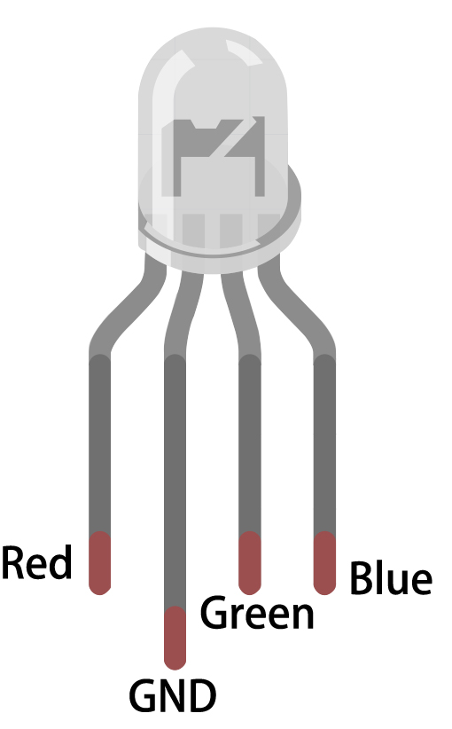

.. _ar_color_gradient:

6.5 Color Gradient
==============================================
Are you ready to experience a world of color? This project will take you on a magical journey where you can control an 
RGB LED and achieve smooth color transitions. Whether you're looking to add some color to your home decor or 
seeking a fun programming project, this project has got you covered. Let's dive into this colorful world together!

**Schematic**

.. image:: ../../img/circuit/circuit_6.5_color_gradient_ar.png

**Wiring**

The RGB LED has 4 pins: the long pin is the common cathode pin, which is usually connected to GND; the left pin next to the longest pin is Red; and the two pins on the right are Green and Blue.

.. image:: ../../img/wiring/6.5_color_rgb_bb.png

* :ref:`cpn_esp32_wroom_32e`
* :ref:`cpn_esp32_camera_extension`
* :ref:`cpn_breadboard`
* :ref:`cpn_wires`
* :ref:`cpn_pot`
* :ref:`cpn_rgb`

**Code**

.. note::

   * You can open the file ``6.5_color_gradient.ino`` under the path of ``esp32-ultimate-kit-main\c\codes\6.5_color_gradient``. 
   * After selecting the board (ESP32 Dev Module) and the appropriate port, click the **Upload** button.

.. raw:: html
    
    <iframe src=https://create.arduino.cc/editor/sunfounder01/a8402b92-8884-4ba0-b09c-e596e97e0af8/preview?embed style="height:510px;width:100%;margin:10px 0" frameborder=0></iframe>
    
This project uses an RGB LED and a potentiometer to create a color mixing effect. The potentiometer is used to adjust the hue value of the LED, which is then converted into RGB values using a color conversion function. The RGB values are then used to update the color of the LED.

**How it works?**

This project builds upon the :ref:`ar_rgb` project by adding a potentiometer to adjust the hue value of the LED. The hue value is then converted to RGB values using a color conversion function.

#. In the loop function, read the value of the potentiometer and convert it to a hue value (0-360).

    .. code-block:: arduino

        int knobValue = analogRead(KNOB_PIN);
        float hueValue = (float) knobValue / 4095.0;
        int hue = (int) (hueValue * 360);

#. Convert the hue value to RGB values using the ``HUEtoRGB()`` function, and update the LED with the new color values.

    .. code-block:: arduino

        int red, green, blue;
        HUEtoRGB(hue, &red, &green, &blue);
        setColor(red, green, blue);

#. The ``setColor()`` function sets the value of the red, green, and blue channels using the ``LEDC`` library.

    .. code-block:: arduino

        void setColor(int red, int green, int blue) {
            ledcWrite(redChannel, red);
            ledcWrite(greenChannel, green);
            ledcWrite(blueChannel, blue);
        }
    
#. The ``HUEtoRGB`` function converts a hue value to RGB values using the HSL color model.

    .. code-block:: arduino

        void HUEtoRGB(int hue, int* red, int* green, int* blue) {
            float h = (float) hue / 60.0;
            float c = 1.0;
            float x = c * (1.0 - fabs(fmod(h, 2.0) - 1.0));
            float r, g, b;
            if (h < 1.0) {
                r = c;
                g = x;
                b = 0;
        ...

