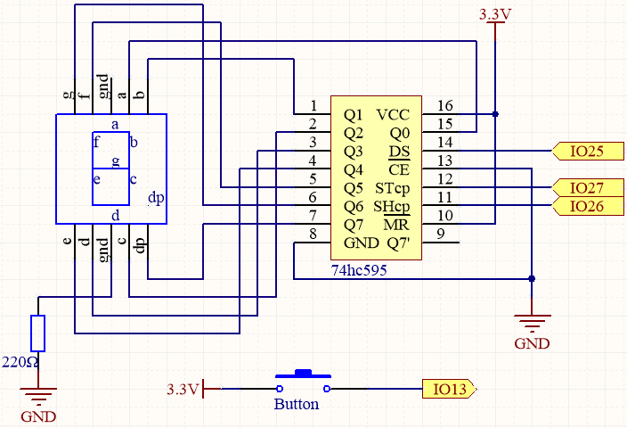
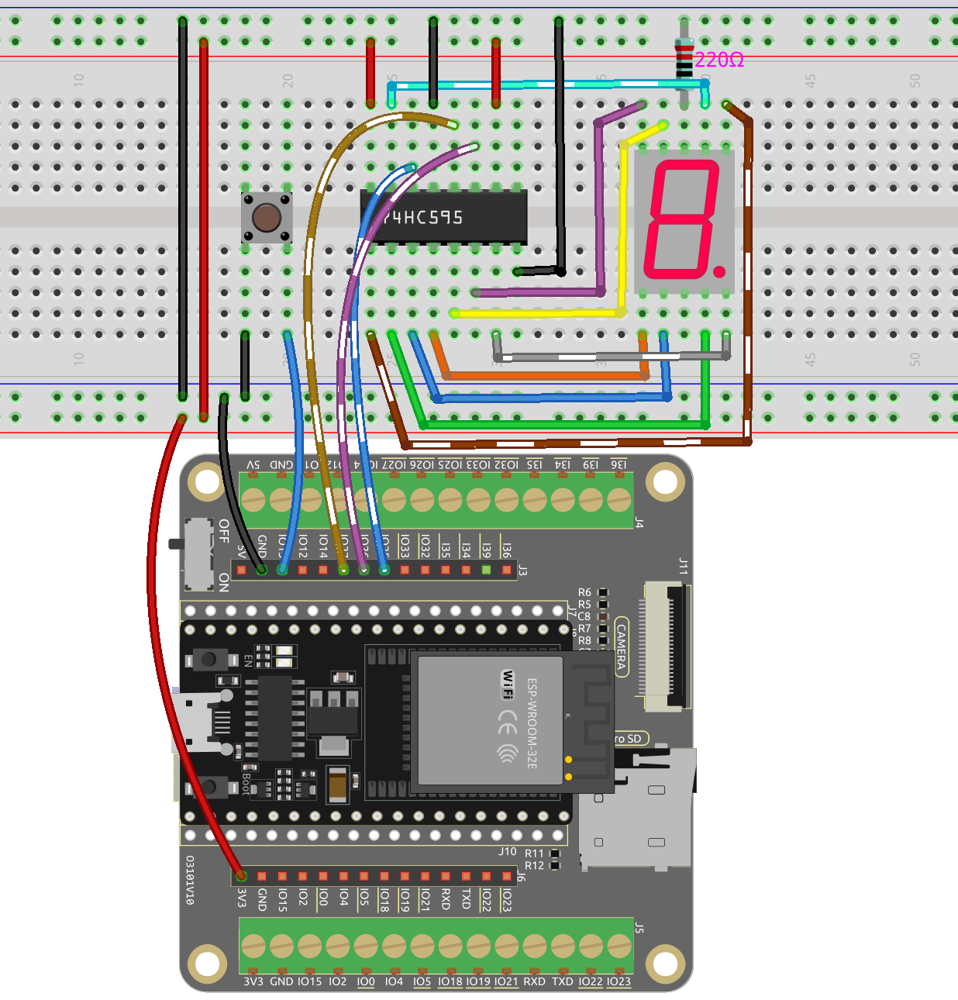

.. _ar_dice:

6.4 デジタルダイス
=============================

このプロジェクトは :ref:`py_7_segment` のプロジェクトをベースに、7セグメント表示器に表示される数字を制御するボタンを追加しています。

このプロジェクトでは、ランダムな数字を生成し、7セグメント表示器に表示して、サイコロを振る動作をシミュレートします。ボタンを押すと、1から6までの安定した数字（ランダムに選ばれた）が7セグメント表示器に表示されます。ボタンを再度押すと、以前と同様にランダムな数字を生成するサイコロの振るシミュレーションが始まります。このサイクルは、ボタンが押されるたびに続きます。

**必要な部品**

このプロジェクトには、以下のコンポーネントが必要です。

キット全体を購入するのが確かに便利です。こちらがリンクです:

.. list-table::
    :widths: 20 20 20
    :header-rows: 1

    *   - 名前
        - このキットのアイテム
        - リンク
    *   - ESP32 Starter Kit
        - 320+
        - |link_esp32_starter_kit|

下記のリンクから個別に購入することも可能です。

.. list-table::
    :widths: 30 20
    :header-rows: 1

    *   - コンポーネントの紹介
        - 購入リンク

    *   - :ref:`cpn_esp32_wroom_32e`
        - |link_esp32_wroom_32e_buy|
    *   - :ref:`cpn_esp32_camera_extension`
        - \-
    *   - :ref:`cpn_breadboard`
        - |link_breadboard_buy|
    *   - :ref:`cpn_wires`
        - |link_wires_buy|
    *   - :ref:`cpn_resistor`
        - |link_resistor_buy|
    *   - :ref:`cpn_74hc595`
        - |link_74hc595_buy|
    *   - :ref:`cpn_7_segment`
        - |link_7segment_buy|
    *   - :ref:`cpn_button`
        - |link_button_buy|

**回路図**

このプロジェクトは :ref:`ar_7_segment` をベースにしており、7セグメント表示器に表示される数字を制御するボタンが追加されています。

IO13には内部に47Kのプルアップ抵抗があるため、外部のプルアップ抵抗またはプルダウン抵抗を直接接続する必要はなく、追加の外部抵抗は不要です。

**配線図**

**コード**

.. note::

    * ファイル ``6.4_digital_dice.ino`` をパス ``esp32-starter-kit-main\c\codes\6.4_digital_dice`` から開きます。
    * ボード（ESP32 Dev Module）と適切なポートを選択した後、 **アップロード** ボタンをクリックします。
    * :ref:`unknown_com_port`
    
    
.. raw:: html
    
    <iframe src=https://create.arduino.cc/editor/sunfounder01/ad904f48-cd24-49ce-ad92-91b1fb76364d/preview?embed style="height:510px;width:100%;margin:10px 0" frameborder=0></iframe>
    
このプロジェクトは :ref:`ar_7_segment` をベースにしており、7セグメントディスプレイのスクロール表示を開始/一時停止するボタンが追加されています。

ボタンを押すと、7セグメントディスプレイは1から6までの数字をスクロールし、ボタンを放すと、ランダムな数字が表示されます。
