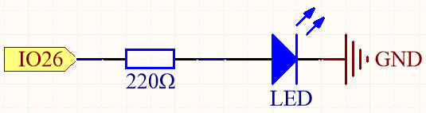

.. note::

    Bonjour, bienvenue dans la communauté des passionnés de SunFounder Raspberry Pi & Arduino & ESP32 sur Facebook ! Plongez plus profondément dans Raspberry Pi, Arduino et ESP32 avec d'autres passionnés.

    **Pourquoi nous rejoindre ?**

    - **Support d'experts** : Résolvez les problèmes après-vente et les défis techniques avec l'aide de notre communauté et de notre équipe.
    - **Apprendre et partager** : Échangez des conseils et des tutoriels pour améliorer vos compétences.
    - **Aperçus exclusifs** : Accédez en avant-première aux annonces de nouveaux produits et aux avant-goûts.
    - **Réductions spéciales** : Profitez de réductions exclusives sur nos derniers produits.
    - **Promotions festives et concours** : Participez à des concours et à des promotions spéciales pour les fêtes.

    👉 Prêt à explorer et créer avec nous ? Cliquez sur [|link_sf_facebook|] et rejoignez-nous dès aujourd'hui !

.. _ar_fading:

2.2 Variation de la luminosité
==================================

Dans le projet précédent, nous avons contrôlé la LED en l'allumant et l'éteignant en utilisant une sortie numérique. Dans ce projet, nous allons créer un effet de respiration sur la LED en utilisant la modulation de largeur d'impulsion (PWM). Le PWM est une technique qui permet de contrôler la luminosité d'une LED ou la vitesse d'un moteur en faisant varier le cycle de travail d'un signal carré.

Avec le PWM, au lieu de simplement allumer ou éteindre la LED, nous ajusterons la durée pendant laquelle la LED est allumée par rapport à la durée pendant laquelle elle est éteinte dans chaque cycle. En allumant et éteignant rapidement la LED à des intervalles variés, nous pouvons créer l'illusion que la LED s'éclaire et s'assombrit progressivement, simulant un effet de respiration.

En utilisant les capacités PWM de l'ESP32 carte, nous pouvons obtenir un contrôle fluide et précis de la luminosité de la LED. Cet effet de respiration ajoute un élément dynamique et visuellement attrayant à vos projets, créant un affichage accrocheur ou une ambiance agréable.

**Composants nécessaires**

Pour ce projet, nous avons besoin des composants suivants. 

Il est définitivement pratique d'acheter un kit complet, voici le lien :

.. list-table::
    :widths: 20 20 20
    :header-rows: 1

    *   - Nom	
        - ÉLÉMENTS DANS CE KIT
        - LIEN
    *   - Kit de démarrage ESP32
        - 320+
        - |link_esp32_starter_kit|

Vous pouvez également les acheter séparément via les liens ci-dessous.

.. list-table::
    :widths: 30 20
    :header-rows: 1

    *   - INTRODUCTION AUX COMPOSANTS
        - LIEN D'ACHAT

    *   - :ref:`cpn_esp32_wroom_32e`
        - |link_esp32_wroom_32e_buy|
    *   - :ref:`cpn_esp32_camera_extension`
        - |link_esp32_extension_board|
    *   - :ref:`cpn_breadboard`
        - |link_breadboard_buy|
    *   - :ref:`cpn_wires`
        - |link_wires_buy|
    *   - :ref:`cpn_resistor`
        - |link_resistor_buy|
    *   - :ref:`cpn_led`
        - |link_led_buy|

**Pins disponibles**

Voici une liste des pins disponibles sur la carte ESP32 pour ce projet.

.. list-table::
    :widths: 5 20 

    * - Pins disponibles
      - IO13, IO12, IO14, IO27, IO26, IO25, IO33, IO32, IO15, IO2, IO0, IO4, IO5, IO18, IO19, IO21, IO22, IO23

**Schéma**

Ce projet utilise le même circuit que le premier projet :ref:`ar_blink`, mais le type de signal est différent. Le premier projet consistait à envoyer directement des niveaux numériques hauts et bas (0&1) à partir du pin 26 pour allumer ou éteindre la LED, ce projet utilise un signal PWM sur le pin 26 pour contrôler la luminosité de la LED.

**Câblage**

.. image:: ../../img/wiring/2.1_hello_led_bb.png

**Code**

.. note::

    * Vous pouvez ouvrir le fichier ``2.2_fading_led.ino`` sous le chemin ``esp32-starter-kit-main\c\codes\2.2_fading_led``.
    * Après avoir sélectionné la carte (ESP32 Dev Module) et le port approprié, cliquez sur le bouton **Upload**.
    * :ref:`unknown_com_port`
   
.. raw:: html

    <iframe src=https://create.arduino.cc/editor/sunfounder01/aa898b09-be86-473b-9bfe-317556c696bb/preview?embed style="height:510px;width:100%;margin:10px 0" frameborder=0></iframe>

Après avoir téléversé le code avec succès, vous pouvez voir la LED respirer.

**Comment ça marche ?**

#. Définir les constantes et les variables.

    .. code-block:: arduino

        const int ledPin = 26; // Le pin GPIO pour la LED
        int brightness = 0;
        int fadeAmount = 5;
   
    * ``ledPin``: Le numéro du pin GPIO où la LED est connectée (dans ce cas, GPIO 26).
    * ``brightness``: Le niveau de luminosité actuel de la LED (initialement défini à 0).
    * ``fadeAmount``: Le montant par lequel la luminosité de la LED changera à chaque étape (défini à 5).

#. Initialiser le canal PWM et configurer le pin de la LED.

    .. code-block:: arduino

        void setup() {
          ledcAttach(ledPin, 5000, 8);  // Attacher le pin LED
        }

    Ici, nous utilisons le périphérique |link_ledc| (contrôle de LED) qui est principalement conçu pour contrôler l'intensité des LED, bien qu'il puisse également être utilisé pour générer des signaux PWM à d'autres fins.

    * ``bool ledcAttach(uint8_t pin, uint32_t freq, uint8_t resolution);``: Cette fonction est utilisée pour configurer le pin LEDC avec une fréquence et une résolution données. Le canal LEDC sera sélectionné automatiquement.
            
        * ``pin`` sélectionner le pin GPIO.
        * ``freq`` sélectionner la fréquence du PWM.
        * ``resolution_bits`` sélectionner la résolution pour le canal LEDC. La plage est de 1 à 14 bits (1-20 bits pour l'ESP32).

#. La fonction ``loop()`` contient la logique principale du programme et s'exécute en continu. Elle met à jour la luminosité de la LED, inverse la quantité de déclin lorsque la luminosité atteint la valeur minimale ou maximale, et introduit un délai.

    .. code-block:: arduino

        void loop() {
            ledcWrite(ledPin, brightness);  // Écrire la nouvelle valeur de luminosité sur le pin PWM
            brightness = brightness + fadeAmount;

            if (brightness <= 0 || brightness >= 255) {
                fadeAmount = -fadeAmount;
            }
            
            delay(50); // Attendre 50 millisecondes
        }

    * ``bool ledcWrite(uint8_t pin, uint32_t duty);``: Cette fonction est utilisée pour définir le cycle de service pour le pin LEDC.
        
        * ``pin`` sélectionner le pin LEDC.
        * ``duty`` sélectionner le cycle de service à définir pour le canal sélectionné.

