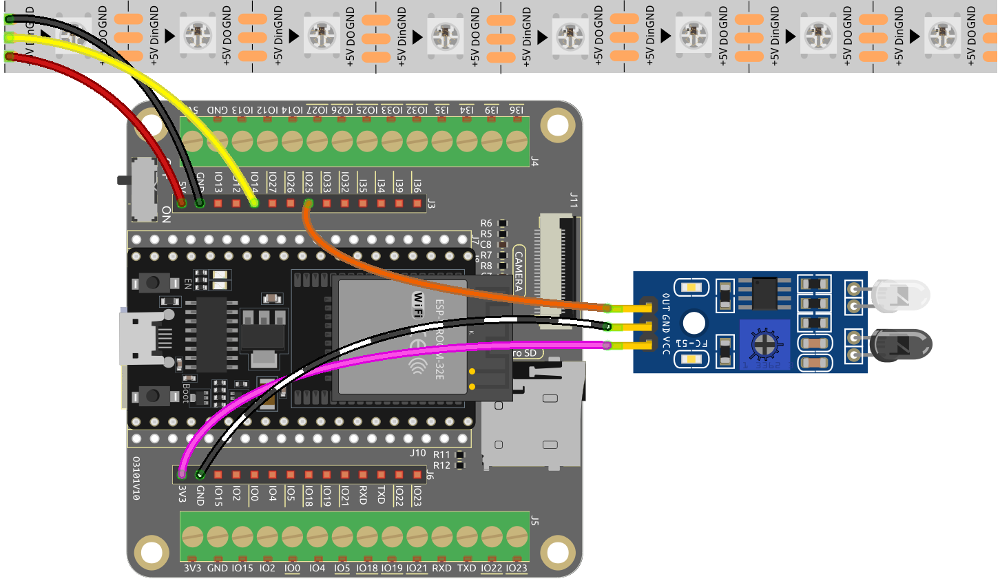

.. note::

    Hallo und willkommen in der SunFounder Raspberry Pi & Arduino & ESP32 Enthusiasten-Gemeinschaft auf Facebook! Tauchen Sie tiefer ein in die Welt von Raspberry Pi, Arduino und ESP32 mit anderen Enthusiasten.

    **Warum beitreten?**

    - **Expertenunterstützung**: Lösen Sie Nachverkaufsprobleme und technische Herausforderungen mit Hilfe unserer Gemeinschaft und unseres Teams.
    - **Lernen & Teilen**: Tauschen Sie Tipps und Anleitungen aus, um Ihre Fähigkeiten zu verbessern.
    - **Exklusive Vorschauen**: Erhalten Sie frühzeitigen Zugang zu neuen Produktankündigungen und exklusiven Einblicken.
    - **Spezialrabatte**: Genießen Sie exklusive Rabatte auf unsere neuesten Produkte.
    - **Festliche Aktionen und Gewinnspiele**: Nehmen Sie an Gewinnspielen und Feiertagsaktionen teil.

    👉 Sind Sie bereit, mit uns zu erkunden und zu erschaffen? Klicken Sie auf [|link_sf_facebook|] und treten Sie heute bei!

.. _ar_flowing_light:

6.2 Fließendes Licht
=======================

Haben Sie schon einmal daran gedacht, Ihrer Wohnfläche ein unterhaltsames und interaktives Element hinzuzufügen? 
Dieses Projekt beinhaltet die Erstellung eines fließenden Lichts mit einem WS2812 LED-Streifen und einem Hindernisvermeidungsmodul. 
Das fließende Licht ändert die Richtung, sobald ein Hindernis erkannt wird, was es zu einer spannenden Ergänzung für Ihre Wohn- oder Bürodekoration macht.

**Benötigte Komponenten**

Für dieses Projekt benötigen wir folgende Komponenten.

Es ist definitiv praktisch, ein ganzes Set zu kaufen. Hier ist der Link:

.. list-table::
    :widths: 20 20 20
    :header-rows: 1

    *   - Name	
        - ARTIKEL IN DIESEM KIT
        - LINK
    *   - ESP32 Starter Kit
        - 320+
        - |link_esp32_starter_kit|

Sie können sie auch einzeln über die untenstehenden Links kaufen.

.. list-table::
    :widths: 30 20
    :header-rows: 1

    *   - KOMPONENTENVORSTELLUNG
        - KAUF-LINK

    *   - :ref:`cpn_esp32_wroom_32e`
        - |link_esp32_wroom_32e_buy|
    *   - :ref:`cpn_esp32_camera_extension`
        - \-
    *   - :ref:`cpn_wires`
        - |link_wires_buy|
    *   - :ref:`cpn_avoid`
        - |link_avoid_buy|
    *   - :ref:`cpn_ws2812`
        - |link_ws2812_buy|

**Schaltplan**

.. image:: ../../img/circuit/circuit_6.2_flowing_led.png
    :align: center

Der WS2812 LED-Streifen besteht aus einer Reihe von einzelnen LEDs, die so programmiert werden können, dass sie verschiedene Farben und Muster anzeigen. 
In diesem Projekt ist der Streifen so eingestellt, dass er ein fließendes Licht zeigt, das in eine bestimmte Richtung läuft und 
die Richtung ändert, wenn ein Hindernis vom Hindernisvermeidungsmodul erkannt wird.

**Verdrahtung**

    

**Code**

.. note::

    * Sie können die Datei ``6.2_flowing_led.ino`` direkt unter dem Pfad ``esp32-starter-kit-main\c\codes\6.2_flowing_led`` öffnen.
    * Oder kopieren Sie diesen Code in die Arduino IDE.

.. raw:: html

    <iframe src=https://create.arduino.cc/editor/sunfounder01/ff625cb6-2efd-436a-9b59-5dd967191338/preview?embed style="height:510px;width:100%;margin:10px 0" frameborder=0></iframe>

Dieses Projekt erweitert die Funktionalität des :ref:`ar_rgb_strip` Projekts, indem es die Möglichkeit hinzufügt, zufällige Farben auf dem LED-Streifen anzuzeigen. 
Zusätzlich wurde ein Hindernisvermeidungsmodul integriert, um die Laufrichtung des fließenden Lichts dynamisch zu ändern.

