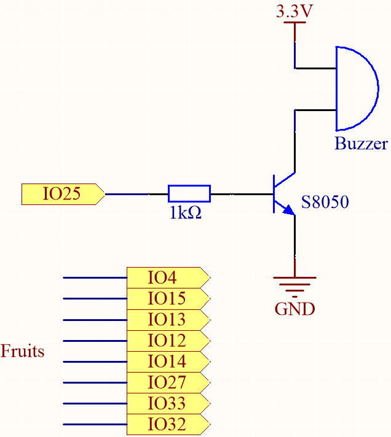
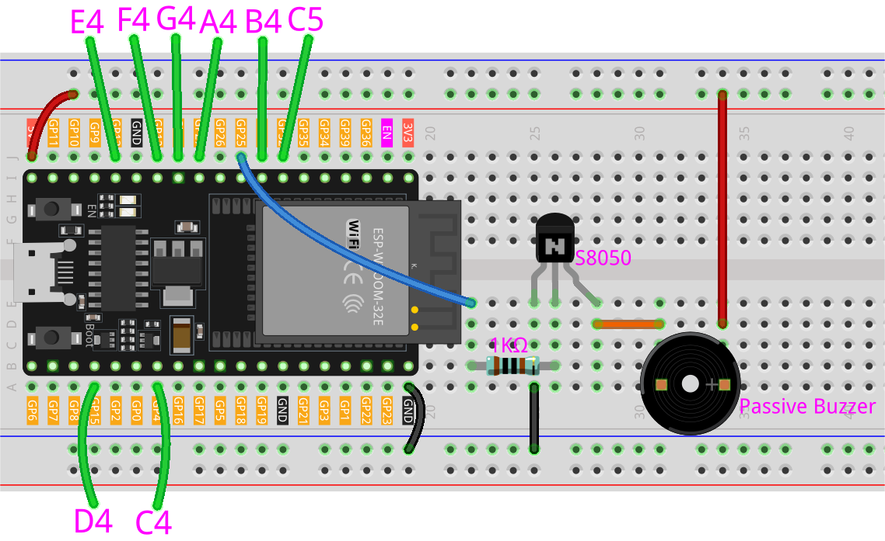

.. note::

    Bonjour, bienvenue dans la communauté des passionnés de SunFounder Raspberry Pi & Arduino & ESP32 sur Facebook ! Plongez plus profondément dans Raspberry Pi, Arduino et ESP32 avec d'autres passionnés.

    **Pourquoi nous rejoindre ?**

    - **Support d'experts** : Résolvez les problèmes après-vente et les défis techniques avec l'aide de notre communauté et de notre équipe.
    - **Apprendre et partager** : Échangez des conseils et des tutoriels pour améliorer vos compétences.
    - **Aperçus exclusifs** : Accédez en avant-première aux annonces de nouveaux produits et aux avant-goûts.
    - **Réductions spéciales** : Profitez de réductions exclusives sur nos derniers produits.
    - **Promotions festives et concours** : Participez à des concours et à des promotions spéciales pour les fêtes.

    👉 Prêt à explorer et créer avec nous ? Cliquez sur [|link_sf_facebook|] et rejoignez-nous dès aujourd'hui !

.. _ar_fruit_piano:

6.1 Piano de Fruits
========================

Avez-vous déjà voulu jouer du piano mais n'en avez pas les moyens ? Ou peut-être voulez-vous simplement vous amuser avec un piano en fruits DIY ? Eh bien, ce projet est fait pour vous !

Avec seulement quelques capteurs tactiles sur la carte ESP32, vous pouvez maintenant jouer vos airs préférés et profiter de l'expérience de jouer du piano sans vous ruiner.

**Composants nécessaires**

Pour ce projet, nous avons besoin des composants suivants.

Il est définitivement pratique d'acheter un kit complet, voici le lien :

.. list-table::
    :widths: 20 20 20
    :header-rows: 1

    *   - Nom	
        - ÉLÉMENTS DANS CE KIT
        - LIEN
    *   - Kit de démarrage ESP32
        - 320+
        - |link_esp32_starter_kit|

Vous pouvez également les acheter séparément via les liens ci-dessous.

.. list-table::
    :widths: 30 20
    :header-rows: 1

    *   - INTRODUCTION AUX COMPOSANTS
        - LIEN D'ACHAT

    *   - :ref:`cpn_esp32_wroom_32e`
        - |link_esp32_wroom_32e_buy|
    *   - :ref:`cpn_esp32_camera_extension`
        - |link_esp32_extension_board|
    *   - :ref:`cpn_wires`
        - |link_wires_buy|
    *   - :ref:`cpn_resistor`
        - |link_resistor_buy|
    *   - :ref:`cpn_buzzer`
        - |link_passive_buzzer_buy|
    *   - :ref:`cpn_transistor`
        - |link_transistor_buy|

**À propos des broches tactiles**

Le microcontrôleur ESP32 dispose de fonctionnalités de capteur tactile intégrées, qui vous permettent d'utiliser certaines broches de la carte comme entrées tactiles. Le capteur tactile fonctionne en mesurant les changements de capacité sur les broches tactiles, causés par les propriétés électriques du corps humain.

Voici quelques caractéristiques clés du capteur tactile sur l'ESP32 :

* **Nombre de broches tactiles**

    L'ESP32 dispose de jusqu'à 10 broches tactiles, selon la carte spécifique. Les broches tactiles sont généralement étiquetées avec un "T" suivi d'un numéro.

    * GPIO4: TOUCH0
    * GPIO0：TOUCH1
    * GPIO2: TOUCH2
    * GPIO15: TOUCH3
    * GPIO13: TOUCH4
    * GPIO12: TOUCH5
    * GPIO14: TOUCH6
    * GPIO27: TOUCH7
    * GPIO33: TOUCH8
    * GPIO32: TOUCH9

    .. note::
        Les broches GPIO0 et GPIO2 sont utilisées pour le bootstrap et le flashage du firmware sur l'ESP32, respectivement. Ces broches sont également connectées à la LED et au bouton intégrés. Par conséquent, il n'est généralement pas recommandé d'utiliser ces broches à d'autres fins, car cela pourrait interférer avec le fonctionnement normal de la carte.

* **Sensibilité**

    Le capteur tactile de l'ESP32 est très sensible et peut détecter même de petits changements de capacité. La sensibilité peut être ajustée à l'aide de paramètres logiciels.

* **Protection ESD**

    Les broches tactiles de l'ESP32 disposent d'une protection ESD (décharge électrostatique) intégrée, qui aide à prévenir les dommages à la carte causés par l'électricité statique.

* **Multitouch**

    Le capteur tactile de l'ESP32 prend en charge le multitouch, ce qui signifie que vous pouvez détecter plusieurs événements tactiles simultanément.

**Schéma**

L'idée derrière ce projet est d'utiliser des capteurs tactiles pour détecter quand un utilisateur touche une broche spécifique. 
Chaque broche tactile est associée à une note spécifique, et lorsque l'utilisateur touche une broche, 
la note correspondante est jouée sur le buzzer passif. 
Le résultat est une façon simple et abordable de profiter de l'expérience de jouer du piano.

**Câblage**

Dans ce projet, vous devez retirer l'ESP32 board de la carte d'extension puis l'insérer dans la plaque de montage. 
C'est parce que certaines broches sur la carte d'extension sont connectées à des résistances, 
ce qui affectera la capacité des broches.

**Code**

.. note::

    * Vous pouvez ouvrir le fichier ``6.1_fruit_piano.ino`` sous le chemin ``esp32-starter-kit-main\c\codes\6.1_fruit_piano`` directement.
    * Ou copiez ce code dans l'IDE Arduino.

.. raw:: html

    <iframe src=https://create.arduino.cc/editor/sunfounder01/3e06ce6c-268a-4fdc-99d0-6d74f68265e2/preview?embed style="height:510px;width:100%;margin:10px 0" frameborder=0></iframe>

Vous pouvez connecter des fruits à ces broches ESP32 : 4, 15, 13, 12, 14, 27, 33, 32.

Lorsque le script s'exécute, toucher ces fruits jouera les notes C, D, E, F, G, A, B et C5.

**Comment ça marche ?**

* ``touchRead(uint8_t pin);``

    Cette fonction obtient les données du capteur tactile. Chaque capteur tactile a un compteur pour compter le nombre de cycles de charge/décharge. 
    Lorsque le pad est **touché**, la valeur dans le compteur changera en raison de la capacité équivalente plus grande. 
    Le changement des données détermine si le pad a été touché ou non.

    * ``pin`` GPIO à lire la valeur TOUCH

    Cette fonction renvoie une valeur entre 0 et 4095, une valeur plus basse indiquant une entrée tactile plus forte.

.. note::
    Le ``seuil`` doit être ajusté en fonction de la conductivité des différents fruits.

    Vous pouvez d'abord exécuter le script pour voir les valeurs imprimées par la console.

    .. code-block::

      0 : 60
      1 : 62
      2 : 71
      3 : 74
      4 : 73
      5 : 78
      6 : 80
      7 : 82

    Après avoir touché les fruits sur les broches 12, 14 et 27, les valeurs imprimées sont les suivantes. Par conséquent, j'ai réglé le ``seuil`` à 30, ce qui signifie que lorsqu'une valeur inférieure à 30 est détectée, elle est considérée comme touchée et le buzzer émettra différentes notes.

    .. code-block::

      0 : 60
      1 : 62
      2 : 71
      3 : 9
      4 : 12
      5 : 14
      6 : 75
      7 : 78
