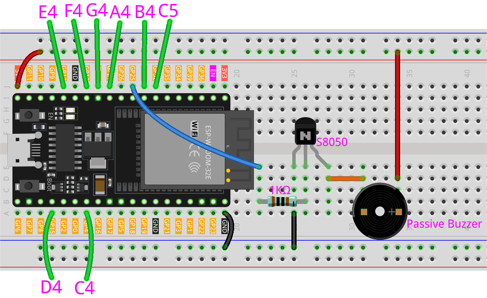

.. _ar_fruit_piano:

6.1 フルーツピアノ
====================

ピアノを弾いてみたいけど手が出ない、あるいはDIYでフルーツピアノを楽しみたいと思ったことはありませんか？ そんなあなたにぴったりのプロジェクトです！

ESP32ボードにいくつかのタッチセンサーを取り付けるだけで、お気に入りの曲を演奏し、銀行を壊さずにピアノの演奏体験を楽しむことができます。

**必要な部品**

このプロジェクトには、以下のコンポーネントが必要です。

全てのキットを一つに買うのは非常に便利です。こちらがリンクです:

.. list-table::
    :widths: 20 20 20
    :header-rows: 1

    *   - 名前
        - このキットのアイテム
        - リンク
    *   - ESP32 Starter Kit
        - 320+
        - |link_esp32_starter_kit|

以下のリンクから個別に購入することもできます。

.. list-table::
    :widths: 30 20
    :header-rows: 1

    *   - コンポーネントの紹介
        - 購入リンク

    *   - :ref:`cpn_esp32_wroom_32e`
        - |link_esp32_wroom_32e_buy|
    *   - :ref:`cpn_esp32_camera_extension`
        - \-
    *   - :ref:`cpn_wires`
        - |link_wires_buy|
    *   - :ref:`cpn_resistor`
        - |link_resistor_buy|
    *   - :ref:`cpn_buzzer`
        - |link_passive_buzzer_buy|
    *   - :ref:`cpn_transistor`
        - |link_transistor_buy|

**タッチピンについて**

ESP32マイクロコントローラーには内蔵のタッチセンサー機能があり、ボード上の特定のピンをタッチ感度のある入力として使用できます。タッチセンサーは、人体の電気的特性によって引き起こされるタッチピン上の静電容量の変化を測定することで動作します。

ESP32のタッチセンサーの主な特徴は以下の通りです：

* **タッチピンの数**

    ESP32には、ボードによって最大10個のタッチピンがあります。タッチピンは通常、「T」に続く数字でラベル付けされます。

    * GPIO4: TOUCH0
    * GPIO0：TOUCH1
    * GPIO2: TOUCH2
    * GPIO15: TOUCH3
    * GPIO13: TOUCH4
    * GPIO12: TOUCH5
    * GPIO14: TOUCH6
    * GPIO27: TOUCH7
    * GPIO33: TOUCH8
    * GPIO32: TOUCH9

    .. note::
        GPIO0ピンとGPIO2ピンは、それぞれESP32にブートストラッピングとファームウェアのフラッシングに使用されます。これらのピンはオンボードのLEDとボタンにも接続されています。そのため、これらのピンを他の目的で使用することは通常お勧めできません。なぜなら、ボードの通常の操作に干渉する可能性があるからです。

* **感度**

    ESP32のタッチセンサーは非常に敏感で、小さな静電容量の変化も検出できます。感度はソフトウェア設定で調整することができます。

* **ESD保護**

    ESP32のタッチピンには内蔵のESD（静電気放電）保護機能があり、静電気からボードを保護するのに役立ちます。

* **マルチタッチ**

    ESP32のタッチセンサーはマルチタッチをサポートしており、同時に複数のタッチイベントを検出できます。

**回路図**

.. image:: ../../img/circuit/circuit_6.1_fruit_piano.png

このプロジェクトのアイデアは、タッチセンサーを使用してユーザーが特定のピンに触れたときを検出することです。
各タッチピンは特定の音符に関連付けられており、ユーザーがピンに触れると、
対応する音符がパッシブブザーで鳴ります。
これにより、ピアノ演奏の体験を手軽でお手頃な方法で楽しむことができます。

**配線図**

このプロジェクトでは、ESP32 WROOM 32Eを拡張ボードから取り外し、その後ブレッドボードに挿入する必要があります。これは、拡張ボード上の一部のピンが抵抗に接続されており、ピンの容量に影響を与えるためです。

**コード**

.. note::

    * ``esp32-starter-kit-main\c\codes\6.1_fruit_piano`` のパスの下にあるファイル ``6.1_fruit_piano.ino`` を直接開くことができます。
    * または、このコードをArduino IDEにコピーしてください。

.. raw:: html

    <iframe src=https://create.arduino.cc/editor/sunfounder01/3e06ce6c-268a-4fdc-99d0-6d74f68265e2/preview?embed style="height:510px;width:100%;margin:10px 0" frameborder=0></iframe>
    

これらのESP32のピンにフルーツを接続できます: 4, 15, 13, 12, 14, 27, 33, 32。

スクリプトが実行されると、これらのフルーツに触れると、ド、レ、ミ、ファ、ソ、ラ、シ、ド（C5）の音が鳴ります。

**どのように動作するのか？**

* ``touchRead(uint8_t pin);``

    この関数はタッチセンサーのデータを取得します。各タッチセンサーには、充放電サイクルの数を数えるカウンターがあります。
    パッドが **触れられた** 場合、相当する静電容量が大きくなるため、カウンター内の値が変わります。
    データの変化によって、パッドが触れられたかどうかが決まります。

    * ``pin`` TOUCH値を読み取るGPIOピン

    この関数は0から4095の値を返し、値が低いほど強いタッチ入力を示します。

.. note::
    ``threshold`` は異なるフルーツの導電性に基づいて調整する必要があります。
    
    最初にスクリプトを実行して、シェルによって印刷される値を確認できます。

    .. code-block::

      0: 60
      1: 62
      2: 71
      3: 74
      4: 73
      5: 78
      6: 80
      7: 82

    12、14、27番のピンにあるフルーツに触れた後、印刷される値は以下の通りです。そのため、 ``threshold`` を30に設定しました。これは、30未満の値が検出されたときに触れたと見なされ、ブザーが異なる音符を発することを意味します。
    
    .. code-block::

      0: 60
      1: 62
      2: 71
      3: 9
      4: 12
      5: 14
      6: 75
      7: 78

