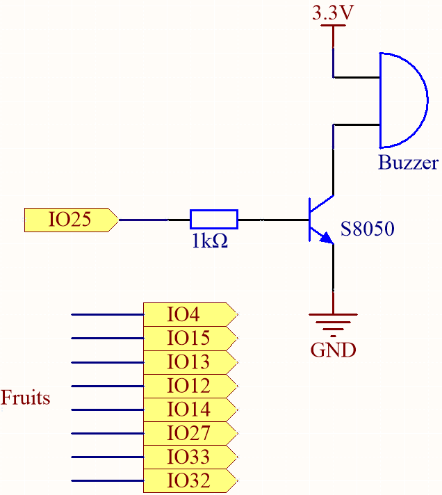

.. _ar_fruit_piano:

6.1 Piano de Frutas
====================

¿Alguna vez has querido tocar el piano pero no podías permitírtelo? ¿O tal vez solo quieres divertirte haciendo un piano de frutas tú mismo? Bueno, ¡este proyecto es para ti!

Con solo unos pocos sensores táctiles en la placa ESP32, ahora puedes tocar tus melodías favoritas y disfrutar de la experiencia de tocar el piano sin gastar mucho.

**Componentes Necesarios**

Para este proyecto, necesitamos los siguientes componentes.

Es definitivamente conveniente comprar un kit completo, aquí está el enlace:

.. list-table::
    :widths: 20 20 20
    :header-rows: 1

    *   - Nombre	
        - ELEMENTOS EN ESTE KIT
        - ENLACE
    *   - Kit de Inicio ESP32
        - 320+
        - |link_esp32_starter_kit|

También puedes comprarlos por separado en los enlaces a continuación.

.. list-table::
    :widths: 30 20
    :header-rows: 1

    *   - INTRODUCCIÓN DE COMPONENTES
        - ENLACE DE COMPRA

    *   - :ref:`cpn_esp32_wroom_32e`
        - |link_esp32_wroom_32e_buy|
    *   - :ref:`cpn_esp32_camera_extension`
        - \-
    *   - :ref:`cpn_wires`
        - |link_wires_buy|
    *   - :ref:`cpn_resistor`
        - |link_resistor_buy|
    *   - :ref:`cpn_buzzer`
        - |link_passive_buzzer_buy|
    *   - :ref:`cpn_transistor`
        - |link_transistor_buy|

**Acerca de los Pines Táctiles**

El microcontrolador ESP32 tiene funcionalidad de sensor táctil incorporada, lo que te permite usar ciertos pines en la placa
como entradas sensibles al tacto. El sensor táctil funciona midiendo cambios en la capacitancia en los pines táctiles,
que son causados por las propiedades eléctricas del cuerpo humano.

Aquí hay algunas características clave del sensor táctil en el ESP32:

* **Número de pines táctiles**

    El ESP32 tiene hasta 10 pines táctiles, dependiendo de la placa específica. Los pines táctiles suelen estar etiquetados con una "T" seguida de un número.

    * GPIO4: TOUCH0
    * GPIO0: TOUCH1
    * GPIO2: TOUCH2
    * GPIO15: TOUCH3
    * GPIO13: TOUCH4
    * GPIO12: TOUCH5
    * GPIO14: TOUCH6
    * GPIO27: TOUCH7
    * GPIO33: TOUCH8
    * GPIO32: TOUCH9

    .. note::
        Los pines GPIO0 y GPIO2 se utilizan para el arranque y la carga del firmware en el ESP32, respectivamente. Estos pines también están conectados al LED y botón integrados. Por lo tanto, generalmente no se recomienda usar estos pines para otros propósitos, ya que podría interferir con el funcionamiento normal de la placa.

* **Sensibilidad**

    El sensor táctil en el ESP32 es muy sensible y puede detectar incluso pequeños cambios en la capacitancia. La sensibilidad se puede ajustar usando configuraciones de software.

* **Protección ESD**

    Los pines táctiles en el ESP32 tienen protección ESD (Descarga Electroestática) incorporada, lo que ayuda a prevenir daños en la placa por electricidad estática.

* **Multitáctil**

    El sensor táctil en el ESP32 admite multitáctil, lo que significa que puedes detectar varios eventos táctiles simultáneamente.

**Esquemático**

La idea detrás de este proyecto es usar sensores táctiles para detectar cuando un usuario toca un pin específico.
Cada pin táctil está asociado con una nota específica, y cuando el usuario toca un pin,
la nota correspondiente se reproduce en el zumbador pasivo.
El resultado es una forma simple y asequible de disfrutar de la experiencia de tocar el piano.

**Cableado**

.. image:: ../../img/wiring/6.1_fruit_piano_bb.png

En este proyecto, necesitas quitar el ESP32 WROOM 32E de la placa de expansión y luego insertarlo en el protoboard. Esto se debe a que algunos pines en la placa de expansión están conectados a resistencias, lo que afectará la capacitancia de los pines.

**Código**

.. note::

    * Puedes abrir el archivo ``6.1_fruit_piano.ino`` bajo la ruta de ``esp32-starter-kit-main\c\codes\6.1_fruit_piano`` directamente.
    * O copia este código en el IDE de Arduino.

.. raw:: html

    <iframe src=https://create.arduino.cc/editor/sunfounder01/3e06ce6c-268a-4fdc-99d0-6d74f68265e2/preview?embed style="height:510px;width:100%;margin:10px 0" frameborder=0></iframe>
    

Puedes conectar frutas a estos pines del ESP32: 4, 15, 13, 12, 14, 27, 33, 32.

Cuando el script se ejecuta, tocar estas frutas reproducirá las notas C, D, E, F, G, A, B y C5.

**¿Cómo funciona?**

* ``touchRead(uint8_t pin);``

    Esta función obtiene los datos del sensor táctil. Cada sensor táctil tiene un contador para contar el número de ciclos de carga/descarga.
    Cuando el pad es **tocado**, el valor en el contador cambiará debido a la mayor capacitancia equivalente.
    El cambio de los datos determina si el pad ha sido tocado o no.

    * ``pin`` pin GPIO para leer el valor TOUCH

    Esta función devuelve un valor entre 0 y 4095, con un valor más bajo indicando una entrada táctil más fuerte.

.. note::
    ``threshold`` necesita ser ajustado basado en la conductividad de diferentes frutas.
    
    Puedes ejecutar el script primero para ver los valores impresos por el shell.

    .. code-block::

      0: 60
      1: 62
      2: 71
      3: 74
      4: 73
      5: 78
      6: 80
      7: 82

    Después de tocar las frutas en los pines 12, 14 y 27, los valores impresos son los siguientes. Por lo tanto, establecí el ``threshold`` en 30, lo que significa que cuando se detecta un valor menor a 30, se considera tocado, y el zumbador emitirá diferentes notas.
    
    .. code-block::

      0: 60
      1: 62
      2: 71
      3: 9
      4: 12
      5: 14
      6: 75
      7: 78
