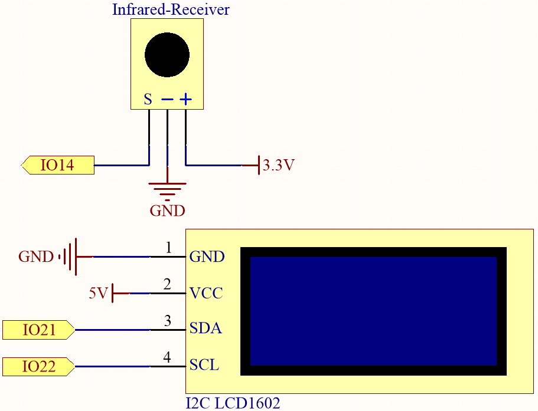
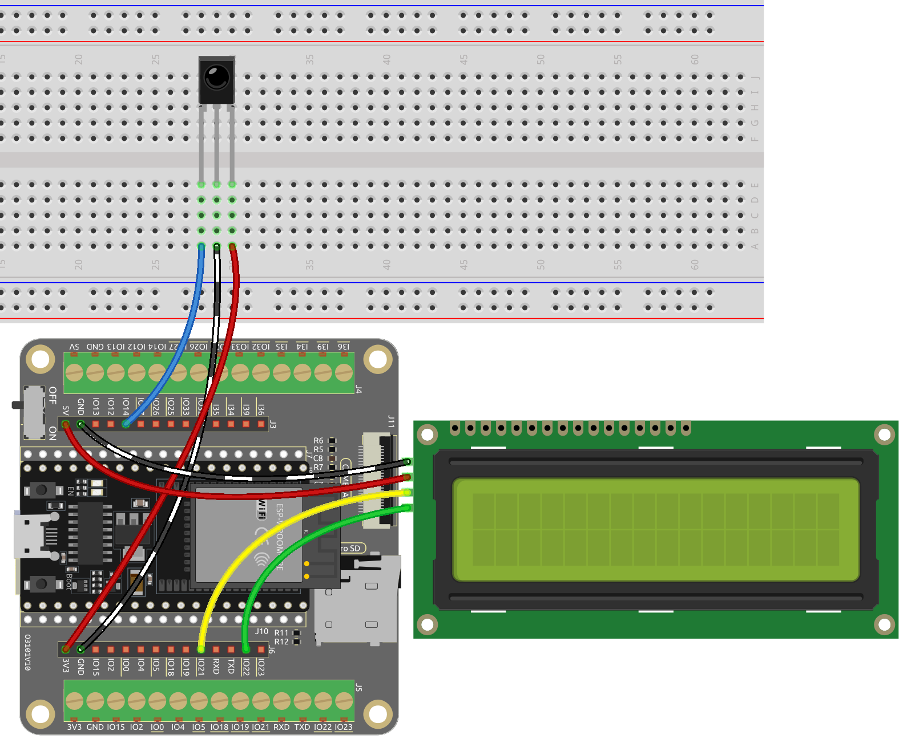

.. note::

    Bonjour, bienvenue dans la communauté des passionnés de SunFounder Raspberry Pi & Arduino & ESP32 sur Facebook ! Plongez plus profondément dans Raspberry Pi, Arduino et ESP32 avec d'autres passionnés.

    **Pourquoi nous rejoindre ?**

    - **Support d'experts** : Résolvez les problèmes après-vente et les défis techniques avec l'aide de notre communauté et de notre équipe.
    - **Apprendre et partager** : Échangez des conseils et des tutoriels pour améliorer vos compétences.
    - **Aperçus exclusifs** : Accédez en avant-première aux annonces de nouveaux produits et aux avant-goûts.
    - **Réductions spéciales** : Profitez de réductions exclusives sur nos derniers produits.
    - **Promotions festives et concours** : Participez à des concours et à des promotions spéciales pour les fêtes.

    👉 Prêt à explorer et créer avec nous ? Cliquez sur [|link_sf_facebook|] et rejoignez-nous dès aujourd'hui !

.. _ar_guess_number:

6.7 Devinez le Nombre
===========================
Vous vous sentez chanceux ? Vous voulez tester votre intuition et voir si vous pouvez deviner le bon numéro ? Ne cherchez pas plus loin que le jeu Devinez le Nombre !

Avec ce projet, vous pouvez jouer à un jeu amusant et excitant de hasard.

En utilisant une télécommande IR, les joueurs saisissent des nombres entre 0 et 99 pour essayer de deviner le numéro chanceux généré aléatoirement.
Le système affiche le nombre saisi par le joueur sur un écran LCD, ainsi que des indications de limite supérieure et inférieure pour aider le joueur à se rapprocher de la bonne réponse. Avec chaque tentative, les joueurs se rapprochent du numéro chanceux, jusqu'à ce que finalement, quelqu'un trouve le bon numéro et gagne le jeu !

**Composants nécessaires**

Pour ce projet, nous avons besoin des composants suivants.

Il est définitivement pratique d'acheter un kit complet, voici le lien :

.. list-table::
    :widths: 20 20 20
    :header-rows: 1

    *   - Nom	
        - ÉLÉMENTS DANS CE KIT
        - LIEN
    *   - Kit de démarrage ESP32
        - 320+
        - |link_esp32_starter_kit|

Vous pouvez également les acheter séparément via les liens ci-dessous.

.. list-table::
    :widths: 30 20
    :header-rows: 1

    *   - INTRODUCTION AUX COMPOSANTS
        - LIEN D'ACHAT

    *   - :ref:`cpn_esp32_wroom_32e`
        - |link_esp32_wroom_32e_buy|
    *   - :ref:`cpn_esp32_camera_extension`
        - |link_esp32_extension_board|
    *   - :ref:`cpn_breadboard`
        - |link_breadboard_buy|
    *   - :ref:`cpn_wires`
        - |link_wires_buy|
    *   - :ref:`cpn_receiver`
        - |link_receiver_buy|
    *   - :ref:`cpn_lcd`
        - |link_i2clcd1602_buy|

**Schéma**

**Câblage**

**Code**

.. note::

    * Vous pouvez ouvrir le fichier ``6.7_guess_number.ino`` sous le chemin ``esp32-starter-kit-main\c\codes\6.7_guess_number`` directement.
    * Les bibliothèques ``LiquidCrystal_I2C`` et ``IRremoteESP8266`` sont utilisées ici, référez-vous à :ref:`install_lib_man` pour un tutoriel d'installation.

.. raw:: html

    <iframe src=https://create.arduino.cc/editor/sunfounder01/2e4217f5-c1b7-4859-a34d-d791bbc5e57a/preview?embed style="height:510px;width:100%;margin:10px 0" frameborder=0></iframe>

    
* Après avoir téléchargé le code avec succès, appuyez sur n'importe quel bouton numérique de la télécommande pour démarrer le jeu.
* Saisissez un numéro en utilisant les boutons numériques de la télécommande. Pour saisir un chiffre, vous devez appuyer sur la touche **cycle** pour confirmer.
* Le système affichera le numéro saisi et les indications de limite supérieure et inférieure sur l'écran LCD.
* Continuez à deviner jusqu'à ce que vous trouviez le bon numéro chanceux.
* Après avoir trouvé le bon numéro, le système affichera un message de succès et générera un nouveau numéro chanceux.

.. note:: 

    Si le code et le câblage sont corrects, mais que l'écran LCD n'affiche toujours aucun contenu, vous pouvez ajuster le potentiomètre à l'arrière pour augmenter le contraste.

**Comment ça marche ?**

#. Dans la fonction ``setup()``, l'écran LCD I2C et le récepteur IR sont initialisés. Ensuite, appelez la fonction ``initNewValue()`` pour générer un nouveau numéro chanceux aléatoire, et un message de bienvenue est affiché sur l'écran LCD.

    .. code-block:: arduino

        void setup() {
            // Initialiser l'écran LCD
            lcd.init();
            lcd.backlight();

            // Démarrer la communication série
            Serial.begin(9600);

            // Activer le récepteur IR
            irrecv.enableIRIn();

            // Initialiser une nouvelle valeur chanceuse
            initNewValue();
        }

#. Dans la fonction ``loop``, le code attend un signal du récepteur IR. Lorsqu'un signal est reçu, la fonction ``decodeKeyValue`` est appelée pour décoder le signal et obtenir la valeur du bouton correspondant.

    .. code-block:: arduino

        void loop() {
        // Si un signal est reçu du récepteur IR
        if (irrecv.decode(&results)) {
            bool result = 0;
            String num = decodeKeyValue(results.value);

            // Si le bouton POWER est appuyé
            if (num == "POWER") {
                initNewValue(); // Initialiser une nouvelle valeur chanceuse
            }

            // Si le bouton CYCLE est appuyé
            else if (num == "CYCLE") {
                result = detectPoint(); // Détecter le numéro saisi
                lcdShowInput(result); // Afficher le résultat sur l'écran LCD
            }

            // Si un bouton numérique (0-9) est appuyé, 
            // ajouter le chiffre au numéro saisi 
            // et détecter le numéro s'il est supérieur ou égal à 10
            else if (num >= "0" && num <= "9") {
                count = count * 10;
                count += num.toInt();
                if (count >= 10) {
                    result = detectPoint();
                }
                lcdShowInput(result);
            }
            irrecv.resume();
        }
        }

    * Selon la valeur du bouton, la fonction appropriée est appelée. Si un bouton numérique est appuyé, la variable ``count`` est mise à jour, et la fonction ``detectPoint`` est appelée pour vérifier si le numéro saisi est correct. La fonction ``lcdShowInput`` est appelée pour afficher le numéro saisi et les indications de limite supérieure et inférieure sur l'écran LCD.
    * Si le bouton ``POWER`` est appuyé, la fonction ``initNewValue`` est appelée pour générer un nouveau numéro chanceux et afficher le message de bienvenue sur l'écran LCD.
    * Si le bouton ``CYCLE`` est appuyé, la fonction ``detectPoint`` est appelée pour vérifier si le numéro saisi est correct. La fonction ``lcdShowInput`` est appelée pour afficher le numéro saisi et les indications de limite supérieure et inférieure sur l'écran LCD.
