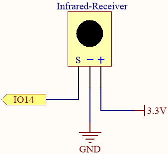
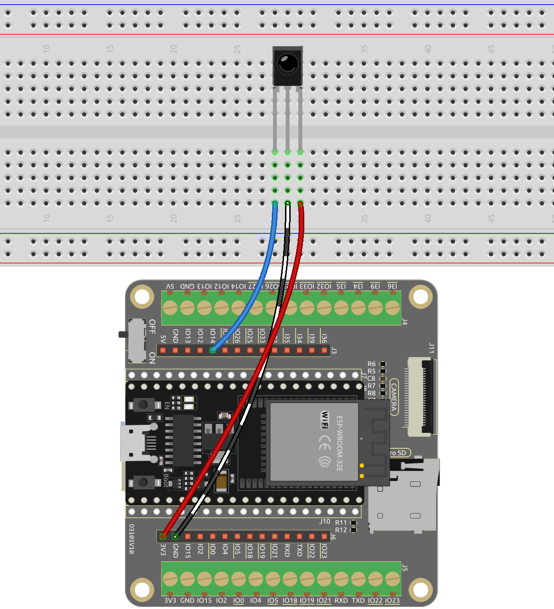

.. note::

    Hallo und willkommen in der SunFounder Raspberry Pi & Arduino & ESP32 Enthusiasten-Gemeinschaft auf Facebook! Tauchen Sie tiefer ein in die Welt von Raspberry Pi, Arduino und ESP32 mit anderen Enthusiasten.

    **Warum beitreten?**

    - **Expertenunterstützung**: Lösen Sie Nachverkaufsprobleme und technische Herausforderungen mit Hilfe unserer Gemeinschaft und unseres Teams.
    - **Lernen & Teilen**: Tauschen Sie Tipps und Anleitungen aus, um Ihre Fähigkeiten zu verbessern.
    - **Exklusive Vorschauen**: Erhalten Sie frühzeitigen Zugang zu neuen Produktankündigungen und exklusiven Einblicken.
    - **Spezialrabatte**: Genießen Sie exklusive Rabatte auf unsere neuesten Produkte.
    - **Festliche Aktionen und Gewinnspiele**: Nehmen Sie an Gewinnspielen und Feiertagsaktionen teil.

    👉 Sind Sie bereit, mit uns zu erkunden und zu erschaffen? Klicken Sie auf [|link_sf_facebook|] und treten Sie heute bei!

.. _ar_receiver:

5.14 IR-Empfänger
=========================
Ein Infrarotempfänger ist eine Komponente, die Infrarotsignale empfängt und in der Lage ist, unabhängig Signale zu erkennen und auszugeben, die mit dem TTL-Pegel kompatibel sind. Er ist ähnlich groß wie ein regulärer kunststoffverpackter Transistor und wird häufig in verschiedenen Anwendungen wie Infrarotfernsteuerung und Infrarotübertragung verwendet.

In diesem Projekt werden wir einen Infrarotempfänger verwenden, um Signale von einer Fernbedienung zu erkennen. Wenn ein Knopf auf der Fernbedienung gedrückt wird und der Infrarotempfänger das entsprechende Signal empfängt, kann er das Signal dekodieren, um zu bestimmen, welcher Knopf gedrückt wurde. Durch das Dekodieren des empfangenen Signals können wir den spezifischen Schlüssel oder Befehl identifizieren, der damit verbunden ist.

Der Infrarotempfänger ermöglicht es uns, Fernsteuerungsfunktionalität in unser Projekt zu integrieren, sodass wir Geräte mit Infrarotsignalen interagieren und steuern können.

**Benötigte Komponenten**

Für dieses Projekt benötigen wir die folgenden Komponenten.

Es ist definitiv praktisch, ein ganzes Kit zu kaufen, hier ist der Link:

.. list-table::
    :widths: 20 20 20
    :header-rows: 1

    *   - Name	
        - ARTIKEL IN DIESEM KIT
        - LINK
    *   - ESP32 Starter Kit
        - 320+
        - |link_esp32_starter_kit|

Sie können sie auch einzeln über die untenstehenden Links kaufen.

.. list-table::
    :widths: 30 20
    :header-rows: 1

    *   - KOMPONENTENVORSTELLUNG
        - KAUF-LINK

    *   - :ref:`cpn_esp32_wroom_32e`
        - |link_esp32_wroom_32e_buy|
    *   - :ref:`cpn_esp32_camera_extension`
        - |link_esp32_extension_board|
    *   - :ref:`cpn_breadboard`
        - |link_breadboard_buy|
    *   - :ref:`cpn_wires`
        - |link_wires_buy|
    *   - :ref:`cpn_receiver`
        - |link_receiver_buy|

**Verfügbare Pins**

    Hier ist eine Liste der verfügbaren Pins auf dem ESP32-Board für dieses Projekt.

    .. list-table::
        :widths: 5 20

        *   - Verfügbare Pins
            - IO13, IO12, IO14, IO27, IO26, IO25, IO15, IO0, IO5, IO18, IO19, IO21, IO22, IO23

**Schaltplan**

Wenn Sie einen Knopf auf der Fernbedienung drücken, erkennt der Infrarotempfänger das Signal, und Sie können eine Infrarotbibliothek verwenden, um es zu dekodieren. Dieser Dekodierungsprozess ermöglicht es Ihnen, den Schlüsselwert zu erhalten, der mit dem Tastendruck verbunden ist.

**Verdrahtung**

**Code**

.. note::

    * Öffnen Sie die Datei ``5.14_ir_receiver.ino`` unter dem Pfad ``esp32-starter-kit-main\c\codes\5.14_ir_receiver``.
    * Nachdem Sie das Board (ESP32 Dev Module) und den passenden Port ausgewählt haben, klicken Sie auf den **Upload**-Button.
    * :ref:`unknown_com_port`
    * Hier wird die Bibliothek ``IRremoteESP8266`` verwendet, die Sie aus dem **Library Manager** installieren können.

        .. image:: img/receiver_lib.png

.. warning::

    Wenn Sie ein ESP32-Entwicklungsboard Version 3.0.0 oder höher verwenden, können während des Kompilierungsprozesses Fehler auftreten.
    Dieses Problem tritt normalerweise auf, weil neuere Versionen des Boards die ``IRremoteESP8266``-Bibliothek nicht mehr unterstützen.
    Um dieses Beispiel ordnungsgemäß auszuführen, wird empfohlen, die Firmware-Version Ihres ESP32-Boards auf 2.0.17 herunterzustufen.
    Nachdem Sie dieses Beispiel abgeschlossen haben, aktualisieren Sie wieder auf die neueste Version.

    .. image:: ../../faq/img/version_2.0.17.png

.. raw:: html

    <iframe src=https://create.arduino.cc/editor/sunfounder01/463c8894-00bd-4035-a81c-cad99a7f3731/preview?embed style="height:510px;width:100%;margin:10px 0" frameborder=0></iframe>

Denken Sie daran, die serielle Kommunikationsgeschwindigkeit auf 115200 einzustellen.

Nachdem der Code erfolgreich hochgeladen wurde, drücken Sie die verschiedenen Tasten auf der Fernbedienung und Sie werden die Namen dieser Tasten im seriellen Monitor sehen.

.. note::
    * Die Bibliothek ``IRremoteESP8266`` umfasst Implementierungen für viele verschiedene Infrarotprotokolle und -geräte, daher ist die Größe der Bibliothek relativ groß. Wenn der Compiler mehr Code verarbeiten muss, wird auch die Kompilierungszeit entsprechend zunehmen. Bitte haben Sie Geduld und warten Sie, bis die Kompilierung abgeschlossen ist.
    * Die neue Fernbedienung verfügt über eine Plastiklasche am Ende, um die Batterie im Inneren zu isolieren. Um die Fernbedienung bei Gebrauch mit Strom zu versorgen, entfernen Sie einfach dieses Plastikstück.

**Wie funktioniert das?**

#. Dieser Code verwendet die Bibliothek ``IRremoteESP8266``, um Infrarot (IR) Signale mit einem IR-Empfängermodul zu empfangen.

    .. code-block:: arduino

        #include <IRremoteESP8266.h>
        #include <IRrecv.h>

        // Define the IR receiver pin
        const uint16_t IR_RECEIVE_PIN = 14;

        // Create an IRrecv object
        IRrecv irrecv(IR_RECEIVE_PIN);

        // Create a decode_results object
        decode_results results;
    
#. In der Funktion ``setup()`` wird die serielle Kommunikation mit einer Baudrate von 115200 gestartet und der IR-Empfänger mit ``irrecv.enableIRIn()`` aktiviert.

    .. code-block:: arduino

        void setup() {
            // Start serial communication
            Serial.begin(115200);
            
            // Start the IR receiver
            irrecv.enableIRIn();
        }

#. Wenn Sie eine Taste auf der Fernbedienung drücken, wird der Tastenname im seriellen Monitor ausgegeben, falls er vom IR-Empfänger empfangen wird.

    .. code-block:: arduino

        void loop() {
            // If an IR signal is received
            if (irrecv.decode(&results)) {
                String key = decodeKeyValue(results.value);
                if (key != "ERROR") {
                    // Print the value of the signal to the serial monitor
                    Serial.println(key);
                }
                irrecv.resume(); // Continue to receive the next signal
            }
        }

    * Überprüfen Sie zunächst, ob ein IR-Signal mit der Funktion ``irrecv.decode()`` empfangen wurde. 
    * Wenn ein Signal empfangen wird, rufen Sie die Funktion ``decodeKeyValue()`` auf, um den Wert des Signals zu dekodieren. 
    * Wenn das Signal erfolgreich dekodiert wird, wird der dekodierte Wert mit ``Serial.println()`` auf dem seriellen Monitor ausgegeben.
    * Schließlich wird ``irrecv.resume()`` aufgerufen, um das nächste Signal weiterhin zu empfangen.

#. Die Funktion ``decodeKeyValue()`` nimmt den dekodierten Wert des IR-Signals als Argument und gibt einen String zurück, der den auf der Fernbedienung gedrückten Schlüssel repräsentiert. 

    .. code-block:: arduino

        String decodeKeyValue(long result)
        {
            switch(result){
                case 0xFF6897:
                return "0";
                case 0xFF30CF:
                return "1"; 
                case 0xFF18E7:
                return "2"; 
                case 0xFF7A85:
                ...

    * Die Funktion verwendet eine switch-Anweisung, um den dekodierten Wert mit dem entsprechenden Schlüssel abzugleichen und gibt die String-Darstellung des Schlüssels zurück. 
    * Wenn der dekodierte Wert keinem bekannten Schlüssel entspricht, gibt die Funktion den String "ERROR" zurück.
