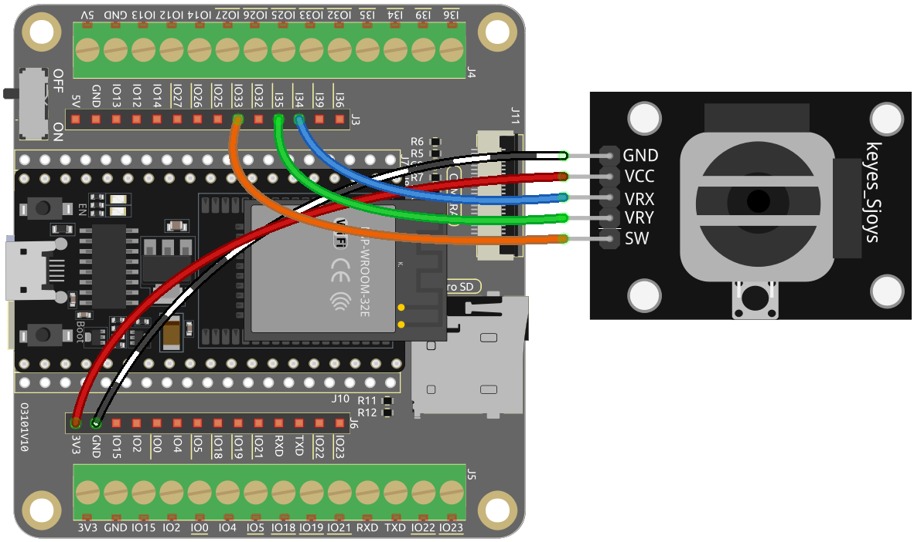

.. _ar_joystick:

5.11 Den Joystick umschalten
================================
Wenn Sie viele Videospiele spielen, sollten Sie mit dem Joystick sehr vertraut sein.
Er wird üblicherweise verwendet, um die Spielfigur zu bewegen, den Bildschirm zu drehen usw.

Das Prinzip hinter der Fähigkeit des Joysticks, dem Computer unsere Aktionen mitzuteilen, ist sehr einfach.
Man kann sich diesen als aus zwei Potentiometern bestehend vorstellen, die senkrecht zueinander stehen.
Diese beiden Potentiometer messen den analogen Wert des Joysticks vertikal und horizontal, was in einem Wert (x,y) in einem ebenen rechtwinkligen Koordinatensystem resultiert.

Der Joystick dieses Kits hat auch einen digitalen Eingang, der aktiviert wird, wenn der Joystick gedrückt wird.

**Benötigte Komponenten**

Für dieses Projekt benötigen wir die folgenden Komponenten.

Es ist definitiv praktisch, ein ganzes Kit zu kaufen, hier ist der Link:

.. list-table::
    :widths: 20 20 20
    :header-rows: 1

    *   - Name	
        - ARTIKEL IN DIESEM KIT
        - LINK
    *   - ESP32 Starter Kit
        - 320+
        - |link_esp32_starter_kit|

Sie können sie auch einzeln über die untenstehenden Links kaufen.

.. list-table::
    :widths: 30 20
    :header-rows: 1

    *   - KOMPONENTENVORSTELLUNG
        - KAUF-LINK

    *   - :ref:`cpn_esp32_wroom_32e`
        - |link_esp32_wroom_32e_buy|
    *   - :ref:`cpn_esp32_camera_extension`
        - \-
    *   - :ref:`cpn_wires`
        - |link_wires_buy|
    *   - :ref:`cpn_joystick`
        - |link_joystick_buy|

* **Verfügbare Pins**

    Hier ist eine Liste der verfügbaren Pins auf dem ESP32-Board für dieses Projekt.

    .. list-table::
        :widths: 5 15

        *   - Für analogen Eingang
            - IO14, IO25, I35, I34, I39, I36
        *   - Für digitalen Eingang
            - IO13, IO12, IO14, IO27, IO26, IO25, IO33, IO15, IO2, IO0, IO4, IO5, IO18, IO19, IO21, IO22, IO23
            
**Schaltplan**

.. image:: ../../img/circuit/circuit_5.11_joystick.png

Der SW (Z-Achse)-Pin ist mit IO33 verbunden, der einen eingebauten 4,7K-Pull-up-Widerstand hat. Daher wird, wenn der SW-Knopf nicht gedrückt ist, ein hoher Pegel ausgegeben. Wenn der Knopf gedrückt wird, wird ein niedriger Pegel ausgegeben.

I34 und I35 ändern ihre Werte, wenn Sie den Joystick bedienen. Der Wertebereich reicht von 0 bis 4095.

**Verdrahtung**

**Code**

.. note::

    * Öffnen Sie die Datei ``5.11_joystick.ino`` unter dem Pfad ``esp32-starter-kit-main\c\codes\5.11_joystick``.
    * Nachdem Sie das Board (ESP32 Dev Module) und den passenden Port ausgewählt haben, klicken Sie auf den **Upload**-Button.
    * :ref:`unknown_com_port`
    
    
.. raw:: html
    
    <iframe src=https://create.arduino.cc/editor/sunfounder01/a2065d70-d207-4e51-b03e-ffd2a26597ef/preview?embed style="height:510px;width:100%;margin:10px 0" frameborder=0></iframe>

Öffnen Sie den seriellen Monitor, nachdem der Code erfolgreich hochgeladen wurde, um die x-, y- und z-Werte des Joysticks zu sehen.

* Die x- und y-Achsenwerte sind analoge Werte, die von 0 bis 4095 variieren.
* Die Z-Achse ist ein digitaler Wert mit einem Status von 1 oder 0 (wenn gedrückt, ist er 0).
