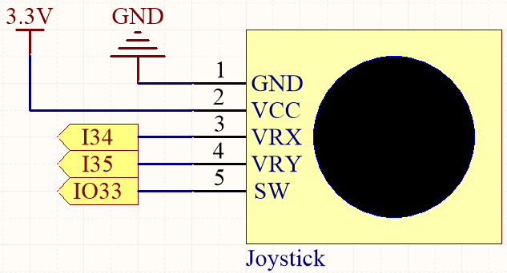

.. note::

    Ciao, benvenuto nella Community di SunFounder Raspberry Pi & Arduino & ESP32 Enthusiasts su Facebook! Approfondisci le tue conoscenze su Raspberry Pi, Arduino e ESP32 insieme ad altri appassionati.

    **Perché unirti a noi?**

    - **Supporto Esperto**: Risolvi i problemi post-vendita e le sfide tecniche con l'aiuto della nostra community e del nostro team.
    - **Impara e Condividi**: Scambia consigli e tutorial per migliorare le tue competenze.
    - **Anteprime Esclusive**: Ottieni accesso anticipato ai nuovi annunci di prodotti e alle anteprime.
    - **Sconti Speciali**: Goditi sconti esclusivi sui nostri prodotti più recenti.
    - **Promozioni Festive e Giveaway**: Partecipa a giveaway e promozioni festive.

    👉 Pronto a esplorare e creare con noi? Clicca su [|link_sf_facebook|] e unisciti oggi!

.. _ar_joystick:

5.11 Controlla il Joystick
================================
Se giochi molto ai videogiochi, dovresti essere molto familiare con il joystick.
Viene solitamente utilizzato per muovere il personaggio, ruotare lo schermo, ecc.

Il principio alla base del funzionamento del joystick, che permette al computer di leggere le nostre azioni, è molto semplice.
Può essere considerato come costituito da due potenziometri perpendicolari tra loro.
Questi due potenziometri misurano il valore analogico del joystick verticalmente e orizzontalmente, risultando in un valore (x,y) in un sistema di coordinate rettangolari piane.

Il joystick di questo kit ha anche un input digitale, che si attiva quando il joystick viene premuto.

**Componenti Necessari**

In questo progetto, avremo bisogno dei seguenti componenti. 

È sicuramente conveniente acquistare un kit completo, ecco il link: 

.. list-table::
    :widths: 20 20 20
    :header-rows: 1

    *   - Nome	
        - ELEMENTI IN QUESTO KIT
        - LINK
    *   - ESP32 Starter Kit
        - 320+
        - |link_esp32_starter_kit|

Puoi anche acquistarli separatamente dai link sottostanti.

.. list-table::
    :widths: 30 20
    :header-rows: 1

    *   - INTRODUZIONE AI COMPONENTI
        - LINK PER L'ACQUISTO

    *   - :ref:`cpn_esp32_wroom_32e`
        - |link_esp32_wroom_32e_buy|
    *   - :ref:`cpn_esp32_camera_extension`
        - |link_esp32_extension_board|
    *   - :ref:`cpn_wires`
        - |link_wires_buy|
    *   - :ref:`cpn_joystick`
        - |link_joystick_buy|

* **Pin Disponibili**

    Ecco un elenco di pin disponibili sulla scheda ESP32 per questo progetto.

    .. list-table::
        :widths: 5 15

        *   - Per Ingresso Analogico
            - IO14, IO25, I35, I34, I39, I36
        *   - Per Ingresso Digitale
            - IO13, IO12, IO14, IO27, IO26, IO25, IO33, IO15, IO2, IO0, IO4, IO5, IO18, IO19, IO21, IO22, IO23
            
**Schema Elettrico**

Il pin SW (asse Z) è collegato a IO33, che ha una resistenza pull-up integrata da 4,7K. Pertanto, quando il pulsante SW non è premuto, emetterà un livello alto. Quando il pulsante viene premuto, emetterà un livello basso.

I34 e I35 cambieranno i loro valori man mano che manipoli il joystick. Il range dei valori è da 0 a 4095.

**Cablaggio**

.. image:: ../../img/wiring/5.11_joystick_bb.png

**Codice**

.. note::

    * Apri il file ``5.11_joystick.ino`` nel percorso ``esp32-starter-kit-main\c\codes\5.11_joystick``.
    * Dopo aver selezionato la scheda (ESP32 Dev Module) e la porta appropriata, fai clic sul pulsante **Upload**.
    * :ref:`unknown_com_port`
    
    
.. raw:: html
    
    <iframe src=https://create.arduino.cc/editor/sunfounder01/a2065d70-d207-4e51-b03e-ffd2a26597ef/preview?embed style="height:510px;width:100%;margin:10px 0" frameborder=0></iframe>

Apri il monitor seriale dopo che il codice è stato caricato con successo per vedere i valori x,y,z del joystick.

Ricorda di impostare la velocità di comunicazione seriale a 115200 baud.

* I valori degli assi x e y sono valori analogici che variano da 0 a 4095.
* L'asse Z è un valore digitale con uno stato di 1 o 0 (quando premuto, è 0).
