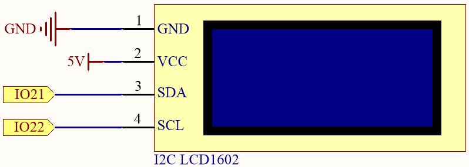
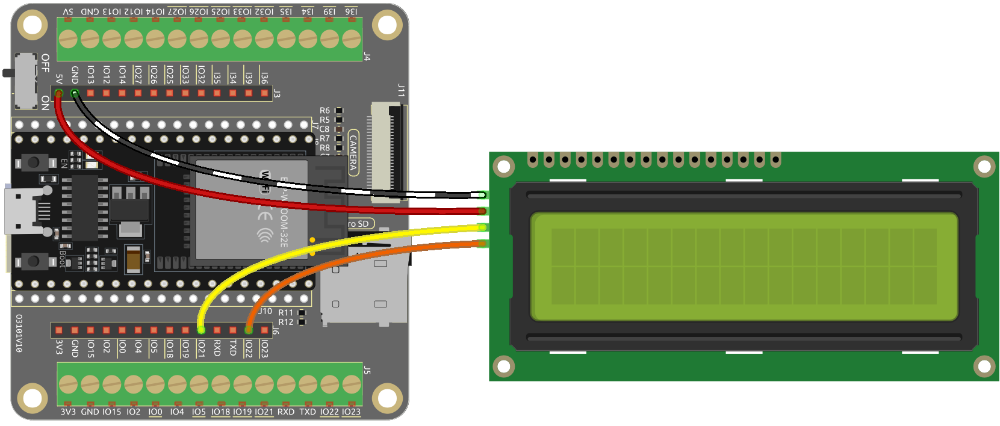

.. note::

    Hallo und willkommen in der SunFounder Raspberry Pi & Arduino & ESP32 Enthusiasten-Gemeinschaft auf Facebook! Tauchen Sie tiefer ein in die Welt von Raspberry Pi, Arduino und ESP32 mit anderen Enthusiasten.

    **Warum beitreten?**

    - **Expertenunterstützung**: Lösen Sie Nachverkaufsprobleme und technische Herausforderungen mit Hilfe unserer Gemeinschaft und unseres Teams.
    - **Lernen & Teilen**: Tauschen Sie Tipps und Anleitungen aus, um Ihre Fähigkeiten zu verbessern.
    - **Exklusive Vorschauen**: Erhalten Sie frühzeitigen Zugang zu neuen Produktankündigungen und exklusiven Einblicken.
    - **Spezialrabatte**: Genießen Sie exklusive Rabatte auf unsere neuesten Produkte.
    - **Festliche Aktionen und Gewinnspiele**: Nehmen Sie an Gewinnspielen und Feiertagsaktionen teil.

    👉 Sind Sie bereit, mit uns zu erkunden und zu erschaffen? Klicken Sie auf [|link_sf_facebook|] und treten Sie heute bei!

.. _ar_lcd1602:

2.6 Zeichenanzeige
===============================

Nun tauchen wir ein in die faszinierende Welt der Zeichenanzeige mit dem I2C LCD1602-Modul.

In diesem Projekt lernen wir, wie man das LCD-Modul initialisiert, die gewünschten Anzeigeparameter festlegt und Zeichendaten zur Anzeige auf dem Bildschirm sendet. Wir können individuelle Nachrichten darstellen, Sensormessungen anzeigen oder interaktive Menüs erstellen. Die Möglichkeiten sind grenzenlos!

Durch das Beherrschen der Kunst der Zeichenanzeige auf dem I2C LCD1602 erschließen wir neue Wege für Kommunikation und Informationsdarstellung in unseren Projekten. Lassen Sie uns in diese aufregende Reise eintauchen und unsere Zeichen auf dem LCD-Bildschirm zum Leben erwecken.

**Benötigte Komponenten**

Für dieses Projekt benötigen wir die folgenden Komponenten.

Es ist definitiv praktisch, ein ganzes Kit zu kaufen, hier ist der Link:

.. list-table::
    :widths: 20 20 20
    :header-rows: 1

    *   - Name
        - ARTIKEL IN DIESEM KIT
        - LINK
    *   - ESP32 Starter Kit
        - 320+
        - |link_esp32_starter_kit|

Sie können sie auch separat über die untenstehenden Links kaufen.

.. list-table::
    :widths: 30 20
    :header-rows: 1

    *   - KOMPONENTENVORSTELLUNG
        - KAUF-LINK

    *   - :ref:`cpn_esp32_wroom_32e`
        - |link_esp32_wroom_32e_buy|
    *   - :ref:`cpn_esp32_camera_extension`
        - |link_esp32_extension_board|
    *   - :ref:`cpn_wires`
        - |link_wires_buy|
    *   - :ref:`cpn_lcd`
        - |link_i2clcd1602_buy|

**Verfügbare Pins**

Hier ist eine Liste der verfügbaren Pins auf dem ESP32-Board für dieses Projekt.

.. list-table::
    :widths: 5 15
    :header-rows: 1

    *   - Verfügbare Pins
        - Verwendungszweck

    *   - IO21
        - SDA
    *   - IO22
        - SCL
    
**Schaltplan**

**Verdrahtung**

**Code**

.. note::

    * Öffnen Sie die Datei ``2.6_lcd1602.ino`` unter dem Pfad ``esp32-starter-kit-main\c\codes\2.6_lcd1602``.
    * Nachdem Sie das Board (ESP32 Dev Module) und den entsprechenden Port ausgewählt haben, klicken Sie auf den **Upload**-Knopf.
    * :ref:`unknown_com_port`
    * Hier wird die Bibliothek ``LiquidCrystal I2C`` verwendet, die Sie über den **Library Manager** installieren können.

        .. image:: img/lcd_lib.png

.. raw:: html

    <iframe src=https://create.arduino.cc/editor/sunfounder01/31e33e53-67b2-4e29-b78b-f647fd45fb0b/preview?embed style="height:510px;width:100%;margin:10px 0" frameborder=0></iframe>

Nach dem Hochladen dieses Programms wird das I2C LCD1602 für 3 Sekunden die Begrüßungsnachricht "Hallo, Sunfounder!" anzeigen. Danach zeigt der Bildschirm ein "ZÄHLER:"-Label und den Zählwert an, der sich jede Sekunde erhöht.

.. note:: 

    Wenn der Code und die Verkabelung korrekt sind, das LCD aber immer noch keinen Inhalt anzeigt, können Sie das Potentiometer auf der Rückseite justieren, um den Kontrast zu erhöhen.

**Wie funktioniert das?**

Durch den Aufruf der Bibliothek ``LiquidCrystal_I2C.h`` können Sie das LCD leicht steuern.

.. code-block:: arduino

    #include <LiquidCrystal_I2C.h>

Bibliotheksfunktionen:

* Erstellt eine neue Instanz der Klasse ``LiquidCrystal_I2C``, die ein bestimmtes LCD darstellt, das an Ihr Arduino-Board angeschlossen ist.

    .. code-block:: arduino

        LiquidCrystal_I2C(uint8_t lcd_Addr,uint8_t lcd_cols,uint8_t lcd_rows)

    * ``lcd_Addr``: Die Adresse des LCDs, standardmäßig auf 0x27 eingestellt.
    * ``lcd_cols``: Das LCD1602 hat 16 Spalten.
    * ``lcd_rows``: Das LCD1602 hat 2 Reihen.

* Initialisiert das LCD.

    .. code-block:: arduino

        void init()

* Schaltet die (optional) Hintergrundbeleuchtung ein.

    .. code-block:: arduino

        void backlight()

* Schaltet die (optional) Hintergrundbeleuchtung aus.

    .. code-block:: arduino

        void nobacklight()

* Schaltet das LCD-Display ein.

    .. code-block:: arduino

        void display()

* Schaltet das LCD-Display schnell aus.

    .. code-block:: arduino

        void nodisplay()

* Löscht das Display und setzt die Cursorposition auf Null.

    .. code-block:: arduino

        void clear()

* Setzt die Cursorposition auf col,row.

    .. code-block:: arduino

        void setCursor(uint8_t col,uint8_t row)

* Druckt Text auf dem LCD.

    .. code-block:: arduino

        void print(data,BASE)

    * ``data``: Die zu druckenden Daten (char, byte, int, long oder string).
    * ``BASE (optional)``: Die Basis, in der Zahlen gedruckt werden sollen.

        * ``BIN`` für Binär (Basis 2)
        * ``DEC`` für Dezimal (Basis 10)
        * ``OCT`` für Oktal (Basis 8)
        * ``HEX`` für Hexadezimal (Basis 16).
