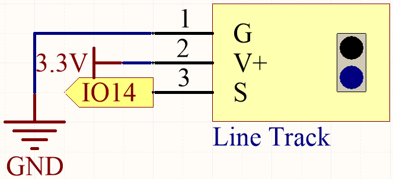
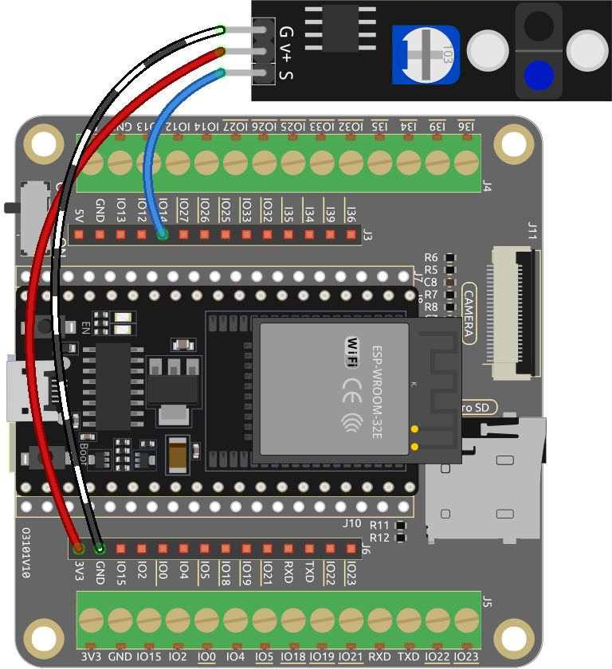

.. _ar_line_track:

5.4 Detect the Line
===================================

The line-tracking module is used to detect the presence of black areas on the ground, such as black lines taped with electrical tape.

Its emitter emits appropriate infrared light into the ground, which is relatively absorbed and weakly reflected by black surfaces. The opposite is true for white surfaces. If reflected light is detected, the ground is currently indicated as white. If it is not detected, it is indicated as black.

**Available Pins**

* **Available Pins**

    Here is a list of available pins on the ESP32 board for this project.

    .. list-table::
        :widths: 5 20

        *   - Available Pins
            - IO13, IO14, IO27, IO26, IO25, IO33, I35, I34, I39, I36, IO4, IO18, IO19, IO21, IO22, IO23

* **Strapping Pins (Input)**

    Strapping pins are a special set of pins that are used to determine specific boot modes during device startup 
    (i.e., power-on reset).

        
    .. list-table::
        :widths: 5 15

        *   - Strapping Pins
            - IO5, IO0, IO2, IO12, IO15 
    

    

    Generally, it is **not recommended to use them as input pins**. If you wish to use these pins, consider the potential impact on the booting process. For more details, please refer to the :ref:`esp32_strapping` section.

**Schematic**

When the line tracking module detects a black line, IO14 returns a high level. On the other hand, when it detects a white line, IO14 returns a low level. You can adjust the blue potentiometer to modify the sensitivity of this module's detection.

**Wiring**

* :ref:`cpn_esp32_wroom_32e`
* :ref:`cpn_esp32_camera_extension`
* :ref:`cpn_wires`
* :ref:`cpn_line_track`

**Code**

.. note::

   * You can open the file ``5.4_detect_the_line.ino`` under the path of ``esp32-ultimate-kit-main\c\codes\5.4_detect_the_line``. 
   * After selecting the board (ESP32 Dev Module) and the appropriate port, click the **Upload** button.
   
.. raw:: html

    <iframe src=https://create.arduino.cc/editor/sunfounder01/fc7f3fe9-179a-4a3a-acbf-a4014faf3920/preview?embed style="height:510px;width:100%;margin:10px 0" frameborder=0></iframe>

If the line tracking module detects a black line after the code has been uploaded successfully, "Black" will be shown in the Serial Monitor. Otherwise, "White" will be printed.
