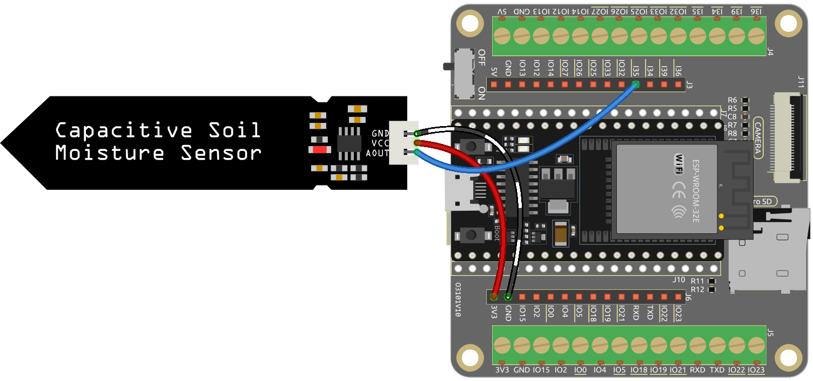

.. note::

    こんにちは、SunFounderのRaspberry Pi & Arduino & ESP32愛好家コミュニティへようこそ！Facebook上でRaspberry Pi、Arduino、ESP32についてもっと深く掘り下げ、他の愛好家と交流しましょう。

    **参加する理由は？**

    - **エキスパートサポート**：コミュニティやチームの助けを借りて、販売後の問題や技術的な課題を解決します。
    - **学び＆共有**：ヒントやチュートリアルを交換してスキルを向上させましょう。
    - **独占的なプレビュー**：新製品の発表や先行プレビューに早期アクセスしましょう。
    - **特別割引**：最新製品の独占割引をお楽しみください。
    - **祭りのプロモーションとギフト**：ギフトや祝日のプロモーションに参加しましょう。

    👉 私たちと一緒に探索し、創造する準備はできていますか？[|link_sf_facebook|]をクリックして今すぐ参加しましょう！

.. _ar_moisture:

5.9 土壌湿度の測定
==========================
この静電容量型土壌湿度センサーは、市場に出ている抵抗型センサーとは異なり、静電容量誘導の原理を利用して土壌の湿度を検出します。

土壌湿度センサーからの値を視覚的に読み取ることで、土壌の湿度レベルに関する情報を収集できます。この情報は、自動灌漑システム、植物の健康監視、環境センシングプロジェクトなど、さまざまな用途に役立ちます。

**必要な部品**

このプロジェクトには、以下のコンポーネントが必要です。

全てのキットを一括購入するのは非常に便利です。こちらがリンクです:

.. list-table::
    :widths: 20 20 20
    :header-rows: 1

    *   - 名前
        - このキットのアイテム
        - リンク
    *   - ESP32 Starter Kit
        - 320+
        - |link_esp32_starter_kit|

以下のリンクから個別に購入することもできます。

.. list-table::
    :widths: 30 20
    :header-rows: 1

    *   - コンポーネントの紹介
        - 購入リンク

    *   - :ref:`cpn_esp32_wroom_32e`
        - |link_esp32_wroom_32e_buy|
    *   - :ref:`cpn_esp32_camera_extension`
        - |link_esp32_extension_board|
    *   - :ref:`cpn_wires`
        - |link_wires_buy|
    *   - :ref:`cpn_soil_moisture`
        - |link_soil_moisture_buy|

**利用可能なピン**

* **利用可能なピン**

    このプロジェクトでESP32ボード上で利用可能なピンの一覧です。

    .. list-table::
        :widths: 5 15

        *   - 利用可能なピン
            - IO14, IO25, I35, I34, I39, I36

* **ストラッピングピン**

    以下のピンはストラッピングピンであり、ESP32の電源オンまたはリセット時の起動プロセスに影響します。しかし、ESP32が正常に起動した後は、通常のピンとして使用できます。

    .. list-table::
        :widths: 5 15

        *   - ストラッピングピン
            - IO0, IO12

**回路図**

.. image:: ../../img/circuit/circuit_5.9_soil_moisture.png

モジュールを土に挿入し、水をやると、I35で読み取る値が下がります。

**配線図**

**コード**

.. note::

    * ``esp32-starter-kit-main\c\codes\5.9_moisture`` のパス下にある ``5.9_moisture.ino`` ファイルを開きます。
    * ボード（ESP32 Dev Module）と適切なポートを選択した後、 **アップロード** ボタンをクリックします。
    * :ref:`unknown_com_port`
    
    
.. raw:: html

    <iframe src=https://create.arduino.cc/editor/sunfounder01/431302c2-3579-4be6-8142-c91d28757004/preview?embed style="height:510px;width:100%;margin:10px 0" frameborder=0></iframe>

シリアル通信のボーレートを115200に設定することを忘れないでください。

コードが正常にアップロードされると、シリアルモニターが土壌の湿度値を出力します。

モジュールを土に挿入し、水をやることで、土壌湿度センサーの値は小さくなります。
