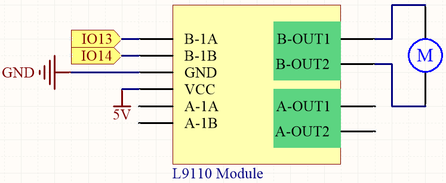
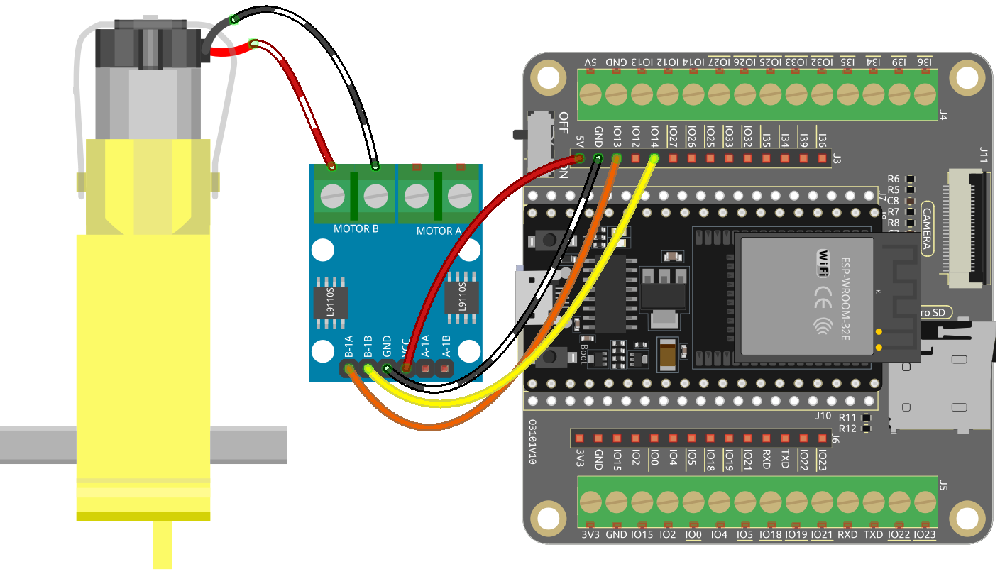

.. _ar_motor:

4.1 Motor
===========================

In this engaging project, we'll explore how to drive a motor using the L9110 module.

The L9110 is a compact motor driver module that is frequently used in robotics and mechatronics projects due to its simplicity and effectiveness. It's capable of controlling two DC motors or a single stepper motor.

By the end of this captivating project, you will have gained a thorough understanding of how digital signals and PWM signals can effectively be utilized to control motors. This invaluable knowledge will prove to be a solid foundation for your future endeavors in robotics and mechatronics. Buckle up and get ready to dive into the exciting world of motor control with the L9110 module!

**Available Pins**

Here is a list of available pins on the ESP32 board for this project.

.. list-table::
    :widths: 5 20 

    * - Available Pins
      - IO13, IO14, IO27, IO26, IO25, IO33, IO32, IO15, IO2, IO0, IO4, IO5, IO18, IO19, IO21, IO22, IO23

.. note::

  * **IO12** needs to be connected to the L9110 module after ESP32 starts up normally because the input pins of the L9110 module have a 10K pull-down resistor, which can prevent ESP32 from booting correctly.

**Schematic**

Here is the truth table of Motor B:

.. list-table:: 
    :widths: 25 25 50
    :header-rows: 1

    * - B-1A
      - B-1B
      - The state of Motor B
    * - 1
      - 0
      - Rotate clockwise
    * - 0
      - 1
      - Rotate counterclockwise
    * - 0
      - 0
      - Brake
    * - 1
      - 1
      - Stop
    
**Wiring**

* :ref:`cpn_esp32_wroom_32e`
* :ref:`cpn_esp32_camera_extension`
* :ref:`cpn_wires`
* :ref:`cpn_tt_motor`
* :ref:`cpn_l9110`

**Code**

.. note::

    * Open the ``4.1_motor.ino`` file under the path of ``esp32-ultimate-kit-main\c\codes\4.1_motor``.
    * After selecting the board (ESP32 Dev Module) and the appropriate port, click the **Upload** button.
    
    
.. raw:: html
    
  <iframe src=https://create.arduino.cc/editor/sunfounder01/13364fc5-5094-4a84-90ce-07a5f85556dc/preview?embed style="height:510px;width:100%;margin:10px 0" frameborder=0></iframe>

Once the code is successfully uploaded, you will observe the motor rotating clockwise for one second, then counter-clockwise for one second, followed by a two-second pause. This sequence of actions will continue in an endless loop.

**Learn More**

In addition to simply making the motor rotate clockwise and counterclockwise, you can also control the speed of the motor's rotation by using pulse-width modulation (PWM) on the control pin, as shown below.

.. note::

    * Open the ``4.1_motor_pwm.ino`` file under the path of ``esp32-ultimate-kit-main\c\codes\4.1_motor_pwm``.
    * After selecting the board (ESP32 Dev Module) and the appropriate port, click the **Upload** button.
    
    
.. raw:: html

  <iframe src=https://create.arduino.cc/editor/sunfounder01/32c262fd-9975-4137-9973-8b62d7240fee/preview?embed style="height:510px;width:100%;margin:10px 0" frameborder=0></iframe>

The previous code directly sets the two pins of the motor to high or low voltage levels to control the motor's rotation and stopping.

Here we use the |link_ledc| (LED control) peripheral to generate PWM signals to control the motor's speed. Through two ``for`` loops, the duty cycle of channel A is increased or decreased from 0 to 255 while keeping channel B at 0.

This way, you can observe the motor gradually increasing its speed to 255, then decreasing to 0, infinitely looping like this.

If you want the motor to rotate in the opposite direction, simply swap the values of channel A and channel B.
