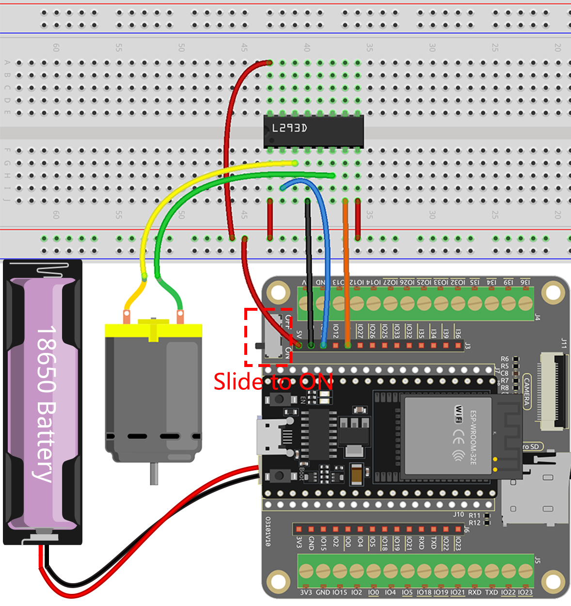

.. note::

    こんにちは、SunFounderのRaspberry Pi & Arduino & ESP32愛好家コミュニティへようこそ！Facebook上でRaspberry Pi、Arduino、ESP32についてもっと深く掘り下げ、他の愛好家と交流しましょう。

    **参加する理由は？**

    - **エキスパートサポート**：コミュニティやチームの助けを借りて、販売後の問題や技術的な課題を解決します。
    - **学び＆共有**：ヒントやチュートリアルを交換してスキルを向上させましょう。
    - **独占的なプレビュー**：新製品の発表や先行プレビューに早期アクセスしましょう。
    - **特別割引**：最新製品の独占割引をお楽しみください。
    - **祭りのプロモーションとギフト**：ギフトや祝日のプロモーションに参加しましょう。

    👉 私たちと一緒に探索し、創造する準備はできていますか？[|link_sf_facebook|]をクリックして今すぐ参加しましょう！

.. _ar_motor:

4.1 モーター
===========================

このプロジェクトでは、L293Dを使ってモーターを駆動する方法について探求します。

L293Dは、電子工作やロボットプロジェクトのモーター制御によく使用される汎用性の高い集積回路（IC）です。前進・後進の両方向に2つのモーターを駆動することができ、精密なモーター制御を要するアプリケーションで好まれて使用されます。

この魅力的なプロジェクトを終えるころには、デジタル信号とPWM信号を使ってモーターを効果的に制御する方法について、徹底的な理解を得ることができるでしょう。この貴重な知識は、ロボティクスやメカトロニクスの分野での将来の取り組みにおいて、確かな基盤となるはずです。準備を整えて、L293Dを使ったモーター制御のエキサイティングな世界に飛び込む準備をしましょう！

**必要な部品**

このプロジェクトには、以下の部品が必要です。

一式を購入するのが便利です。リンクはこちらです：

.. list-table::
    :widths: 20 20 20
    :header-rows: 1

    *   - 名前
        - このキットのアイテム
        - リンク
    *   - ESP32 Starter Kit
        - 320+
        - |link_esp32_starter_kit|

また、以下のリンクから個別に購入することもできます。

.. list-table::
    :widths: 30 20
    :header-rows: 1

    *   - コンポーネントの紹介
        - 購入リンク

    *   - :ref:`cpn_esp32_wroom_32e`
        - |link_esp32_wroom_32e_buy|
    *   - :ref:`cpn_esp32_camera_extension`
        - \-
    *   - :ref:`cpn_breadboard`
        - |link_breadboard_buy|
    *   - :ref:`cpn_wires`
        - |link_wires_buy|
    *   - :ref:`cpn_motor`
        - |link_motor_buy|
    *   - :ref:`cpn_l293d`
        - \-

**利用可能なピン**

このプロジェクトでESP32ボードで利用可能なピンのリストです。

.. list-table::
    :widths: 5 20 

    * - 利用可能なピン
      - IO13, IO14, IO27, IO26, IO25, IO33, IO32, IO15, IO2, IO0, IO4, IO5, IO18, IO19, IO21, IO22, IO23

**回路図**

.. image:: ../../img/circuit/circuit_4.1_motor_l293d.png

    
**配線図**

.. note:: 

  モーターは比較的高い電流が必要なので、最初にバッテリーを差し込み、拡張ボード上のスイッチをON位置にスライドしてバッテリー供給を有効にする必要があります。

**コード**

.. note::

    * ``esp32-starter-kit-main\c\codes\4.1_motor`` のパス下にある ``4.1_motor.ino`` ファイルを開きます。
    * ボード（ESP32 Dev Module）と適切なポートを選択した後、 **アップロード** ボタンをクリックします。
    * :ref:`unknown_com_port`
    
    
.. raw:: html
    
  <iframe src=https://create.arduino.cc/editor/sunfounder01/13364fc5-5094-4a84-90ce-07a5f85556dc/preview?embed style="height:510px;width:100%;margin:10px 0" frameborder=0></iframe>

コードが正常にアップロードされると、モーターが1秒間時計回りに回転し、次に1秒間反時計回りに回転し、その後2秒間停止するという動作を無限ループで続けることが観察できます。

**さらに学ぶ**

モーターを単に時計回りや反時計回りに回転させるだけでなく、以下に示すように、制御ピンにパルス幅変調（PWM）を使用してモーターの回転速度を制御することもできます。

.. note::

    * ``esp32-starter-kit-main\c\codes\4.1_motor_pwm`` のパス下にある ``4.1_motor_pwm.ino`` ファイルを開きます。
    * ボード（ESP32 Dev Module）と適切なポートを選択した後、 **アップロード** ボタンをクリックします。
    * :ref:`unknown_com_port`
    
    
.. raw:: html

  <iframe src=https://create.arduino.cc/editor/sunfounder01/32c262fd-9975-4137-9973-8b62d7240fee/preview?embed style="height:510px;width:100%;margin:10px 0" frameborder=0></iframe>

前述のコードでは、モーターの2つのピンを高電圧または低電圧に直接設定して、モーターの回転と停止を制御しています。

ここでは、 |link_ledc| （LEDコントロール）周辺機器を使用してPWM信号を生成し、モーターの速度を制御します。2つの ``for`` ループを通じて、チャンネルAのデューティサイクルを0から255まで増やしたり、チャンネルBを0に保ったまま減らしたりします。

この方法では、モーターの速度が徐々に255まで増加し、その後0まで減少し、このように無限ループするのが観察できます。

モーターを逆方向に回転させたい場合は、単純にチャンネルAとチャンネルBの値を交換してください。

