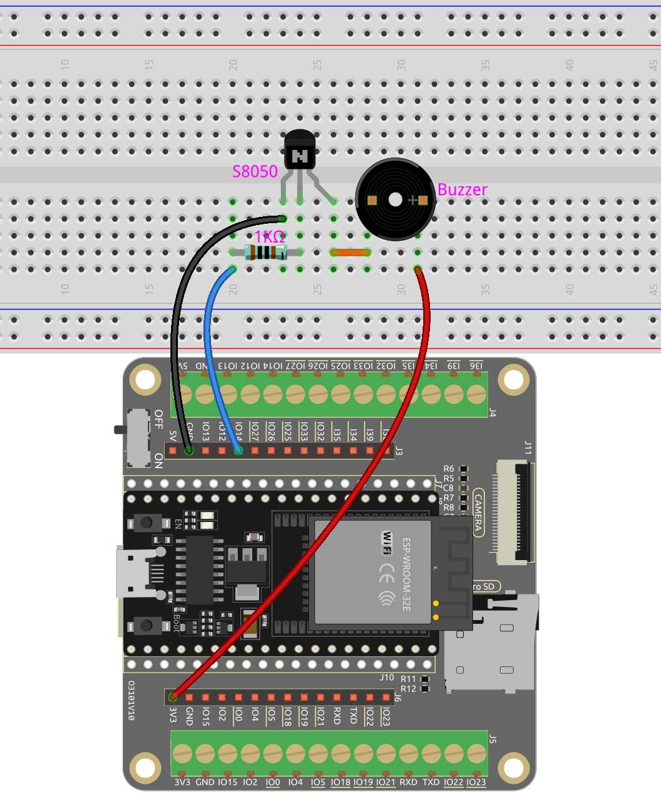

.. _ar_pa_buz:

3.2 Tono Personalizado
==========================================

En el proyecto anterior, utilizamos un zumbador activo; esta vez, usaremos un zumbador pasivo.

Al igual que el zumbador activo, el zumbador pasivo también utiliza el fenómeno de inducción electromagnética para funcionar. La diferencia es que el zumbador pasivo no tiene una fuente oscilante, por lo que no emitirá un sonido si se usan señales de CC.
Pero esto permite que el zumbador pasivo ajuste su propia frecuencia de oscilación y pueda emitir diferentes notas como "do, re, mi, fa, sol, la, si".

¡Hagamos que el zumbador pasivo emita una melodía!

**Componentes Necesarios**

En este proyecto, necesitaremos los siguientes componentes.

Es definitivamente conveniente comprar todo el kit, aquí está el enlace:

.. list-table::
    :widths: 20 20 20
    :header-rows: 1

    * - Nombre
      - ARTÍCULOS EN ESTE KIT
      - ENLACE
    * - Kit de inicio ESP32
      - 320+
      - |link_esp32_starter_kit|

También puedes comprarlos por separado en los siguientes enlaces.

.. list-table::
    :widths: 30 20
    :header-rows: 1

    * - INTRODUCCIÓN DE COMPONENTES
      - ENLACE DE COMPRA

    * - :ref:`cpn_esp32_wroom_32e`
      - |link_esp32_wroom_32e_buy|
    * - :ref:`cpn_esp32_camera_extension`
      - \-
    * - :ref:`cpn_breadboard`
      - |link_breadboard_buy|
    * - :ref:`cpn_wires`
      - |link_wires_buy|
    * - :ref:`cpn_resistor`
      - |link_resistor_buy|
    * - :ref:`cpn_buzzer`
      - \-
    * - :ref:`cpn_transistor`
      - |link_transistor_buy|

**Pines Disponibles**

Aquí hay una lista de pines disponibles en la placa ESP32 para este proyecto.

.. list-table::
    :widths: 5 20 

    * - Pines Disponibles
      - IO13, IO12, IO14, IO27, IO26, IO25, IO33, IO32, IO15, IO2, IO0, IO4, IO5, IO18, IO19, IO21, IO22, IO23

**Esquemático**

.. image:: ../../img/circuit/circuit_3.1_buzzer.png
    :width: 500
    :align: center

Cuando la salida IO14 es alta, después de la resistencia limitadora de corriente de 1K (para proteger el transistor), el S8050 (transistor NPN) conducirá, haciendo que el zumbador suene.

El rol del S8050 (transistor NPN) es amplificar la corriente y hacer que el sonido del zumbador sea más fuerte. De hecho, también puedes conectar el zumbador directamente a IO14, pero encontrarás que el sonido del zumbador es más bajo.

**Cableado**

Dos tipos de zumbadores están incluidos en el kit. 
Necesitamos usar el zumbador pasivo. Dale la vuelta, el PCB expuesto es el que queremos.

.. image:: ../../components/img/buzzer.png
    :width: 500
    :align: center

El zumbador necesita usar un transistor cuando trabaja, aquí usamos S8050 (Transistor NPN).

**Código**

.. note::

    * Abre el archivo ``3.2_custom_tone.ino`` bajo la ruta de ``esp32-starter-kit-main\c\codes\3.2_custom_tone``.
    * Después de seleccionar la placa (ESP32 Dev Module) y el puerto apropiado, haz clic en el botón **Subir**.
    * :ref:`unknown_com_port`
    
.. raw:: html

    <iframe src=https://create.arduino.cc/editor/sunfounder01/09a319a6-6861-40e1-ba1b-e7027bc0383d/preview?embed style="height:510px;width:100%;margin:10px 0" frameborder=0></iframe>

Después de subir exitosamente el código, escucharás el zumbador pasivo tocar una secuencia de 7 notas musicales.

**Cómo funciona?**

1. Define constantes para el pin del zumbador y la resolución PWM.

    .. code-block:: arduino

        const int buzzerPin = 14; //buzzer pin
        const int resolution = 8; 

2. Define un arreglo que contiene las frecuencias de las 7 notas musicales en Hz.

    .. code-block:: arduino

        int frequencies[] = {262, 294, 330, 349, 392, 440, 494};

3. Crea una función para tocar una frecuencia dada en el zumbador durante una duración especificada.

    .. code-block:: arduino

        void playFrequency(int frequency, int duration) {
            ledcWriteTone(0, frequency); // Start the tone
            delay(duration); // Wait for the specified duration
            ledcWriteTone(0, 0); // Stop the buzzer
        }
    
    * ``uint32_t ledcWriteTone(uint8_t chan, uint32_t freq);``: Esta función se usa para configurar el canal LEDC al tono PWM del 50% en la frecuencia seleccionada.

        * ``chan`` selecciona el canal LEDC.
        * ``freq`` selecciona la frecuencia de la señal pwm.

    Esta función retornará la ``frecuencia`` configurada para el canal. Si retorna ``0``, ocurre un error y el canal ledc no fue configurado.

4. Configura el canal PWM y adjunta el pin del zumbador en la función ``setup()``.

    .. code-block:: arduino

        void setup() {
            ledcSetup(0, 2000, resolution); // Set up the PWM channel
            ledcAttachPin(buzzerPin, 0); // Attach the buzzer pin to the PWM channel
        }

    * ``uint32_t ledcSetup(uint8_t channel, uint32_t freq, uint8_t resolution_bits);``: Esta función se usa para configurar la frecuencia y resolución del canal LEDC. Retornará la ``frecuencia`` configurada para el canal LEDC. Si retorna ``0``, ocurre un error y el canal ledc no fue configurado.
            
        * ``channel`` selecciona el canal LEDC a configurar.
        * ``freq`` selecciona la frecuencia del pwm.
        * ``resolution_bits`` selecciona la resolución para el canal ledc. El rango es de 1-14 bits (1-20 bits para ESP32).

    * ``void ledcAttachPin(uint8_t pin, uint8_t chan);``: Esta función se usa para adjuntar el pin al canal LEDC.

        * ``pin`` selecciona el pin GPIO.
        * ``chan`` selecciona el canal LEDC.

5. En la función ``loop()``, toca la secuencia de 7 notas con una breve pausa entre cada nota y una pausa de 1 segundo antes de repetir la secuencia.

    .. code-block:: arduino

        void loop() {
            for (int i = 0; i < 7; i++) {
                playFrequency(frequencies[i], 300); // Play each note for 300ms
                delay(50); // Add a brief pause between the notes
            }
            delay(1000); // Wait for 1 second before replaying the sequence
            }
