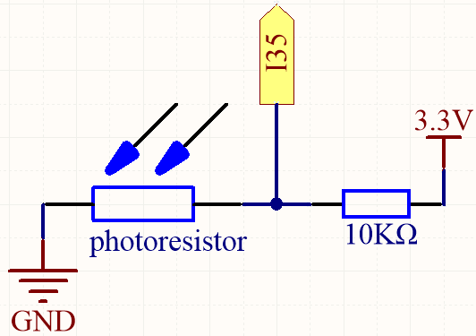
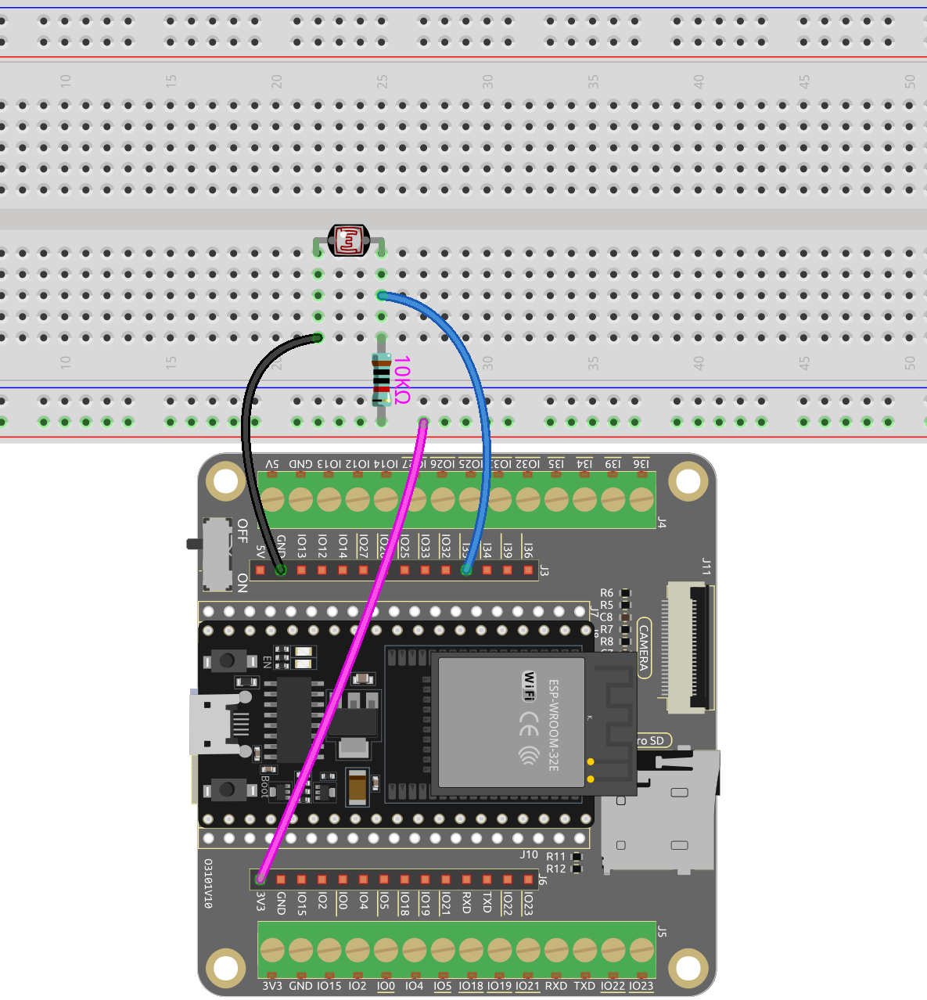

.. note::

    Hallo und willkommen in der SunFounder Raspberry Pi & Arduino & ESP32 Enthusiasten-Gemeinschaft auf Facebook! Tauchen Sie tiefer ein in die Welt von Raspberry Pi, Arduino und ESP32 mit anderen Enthusiasten.

    **Warum beitreten?**

    - **Expertenunterstützung**: Lösen Sie Nachverkaufsprobleme und technische Herausforderungen mit Hilfe unserer Gemeinschaft und unseres Teams.
    - **Lernen & Teilen**: Tauschen Sie Tipps und Anleitungen aus, um Ihre Fähigkeiten zu verbessern.
    - **Exklusive Vorschauen**: Erhalten Sie frühzeitigen Zugang zu neuen Produktankündigungen und exklusiven Einblicken.
    - **Spezialrabatte**: Genießen Sie exklusive Rabatte auf unsere neuesten Produkte.
    - **Festliche Aktionen und Gewinnspiele**: Nehmen Sie an Gewinnspielen und Feiertagsaktionen teil.

    👉 Sind Sie bereit, mit uns zu erkunden und zu erschaffen? Klicken Sie auf [|link_sf_facebook|] und treten Sie heute bei!

.. _ar_photoresistor:

5.7 Das Licht Fühlen
===========================

Der Fotowiderstand ist ein häufig verwendetes Gerät für analoge Eingaben, ähnlich einem Potentiometer. Sein Widerstandswert ändert sich abhängig von der Intensität des Lichts, das er empfängt. Bei starker Lichtexposition verringert sich der Widerstand des Fotowiderstands, und wenn die Lichtintensität abnimmt, steigt der Widerstand.

Indem wir den Wert des Fotowiderstands auslesen, können wir Informationen über die Umgebungslichtverhältnisse sammeln. Diese Informationen können für Aufgaben wie die Steuerung der Helligkeit einer LED, die Anpassung der Empfindlichkeit eines Sensors oder die Implementierung lichtabhängiger Aktionen in einem Projekt verwendet werden.

**Benötigte Komponenten**

Für dieses Projekt benötigen wir die folgenden Komponenten.

Es ist definitiv praktisch, ein ganzes Kit zu kaufen, hier ist der Link:

.. list-table::
    :widths: 20 20 20
    :header-rows: 1

    *   - Name
        - ARTIKEL IN DIESEM KIT
        - LINK
    *   - ESP32 Starter Kit
        - 320+
        - |link_esp32_starter_kit|

Sie können sie auch separat über die untenstehenden Links kaufen.

.. list-table::
    :widths: 30 20
    :header-rows: 1

    *   - KOMPONENTENVORSTELLUNG
        - KAUF-LINK

    *   - :ref:`cpn_esp32_wroom_32e`
        - |link_esp32_wroom_32e_buy|
    *   - :ref:`cpn_esp32_camera_extension`
        - \-
    *   - :ref:`cpn_breadboard`
        - |link_breadboard_buy|
    *   - :ref:`cpn_wires`
        - |link_wires_buy|
    *   - :ref:`cpn_resistor`
        - |link_resistor_buy|
    *   - :ref:`cpn_photoresistor`
        - |link_photoresistor_buy|

**Verfügbare Pins**

* **Verfügbare Pins**

    Hier ist eine Liste der verfügbaren Pins auf dem ESP32-Board für dieses Projekt.

    .. list-table::
        :widths: 5 15

        *   - Verfügbare Pins
            - IO14, IO25, I35, I34, I39, I36

* **Strapping Pins**

    Die folgenden Pins sind Strapping-Pins, die den Startprozess des ESP32 während des Einschaltens oder Resets beeinflussen. Sobald der ESP32 jedoch erfolgreich gestartet ist, können sie als normale Pins verwendet werden.

    .. list-table::
        :widths: 5 15

        *   - Strapping Pins
            - IO0, IO12

**Schaltplan**

Mit zunehmender Lichtintensität nimmt der Widerstand des lichtabhängigen Widerstands (LDR) ab, was zu einer Verringerung des auf I35 ausgelesenen Werts führt.

**Verdrahtung**

**Code**

.. note::

    * Öffnen Sie die Datei ``5.7_feel_the_light.ino`` unter dem Pfad ``esp32-starter-kit-main\c\codes\5.7_feel_the_light``.
    * Nachdem Sie das Board (ESP32 Dev Module) und den entsprechenden Port ausgewählt haben, klicken Sie auf den **Upload**-Knopf.
    * :ref:`unknown_com_port`
    
    
.. raw:: html

    <iframe src=https://create.arduino.cc/editor/sunfounder01/58b494c7-eef4-4476-af65-4823cef13f90/preview?embed style="height:510px;width:100%;margin:10px 0" frameborder=0></iframe>

Nachdem der Code erfolgreich hochgeladen wurde, druckt der Serielle Monitor die Fotowiderstandswerte von 0 bis 4095 aus. 
Je stärker die aktuelle Umgebungshelligkeit, desto größer der Wert, der im seriellen Monitor angezeigt wird.

.. note::
    Für den ESP32 liegt die Auflösung zwischen 9 und 12 und es wird die ADC-Hardwareauflösung geändert. Andernfalls wird der Wert verschoben.

    Standardmäßig ist sie 12 Bit (Bereich von 0 bis 4096) für alle Chips außer ESP32S3, wo der Standard 13 Bit (Bereich von 0 bis 8192) ist.

    Sie können ``analogReadResolution(10);`` zur ``setup()``-Funktion hinzufügen, um eine andere Auflösung festzulegen, wie z.B. ``20``.

    
