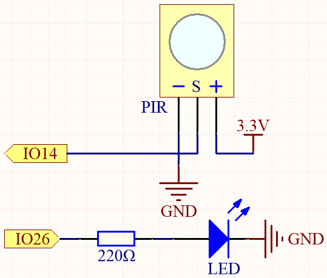
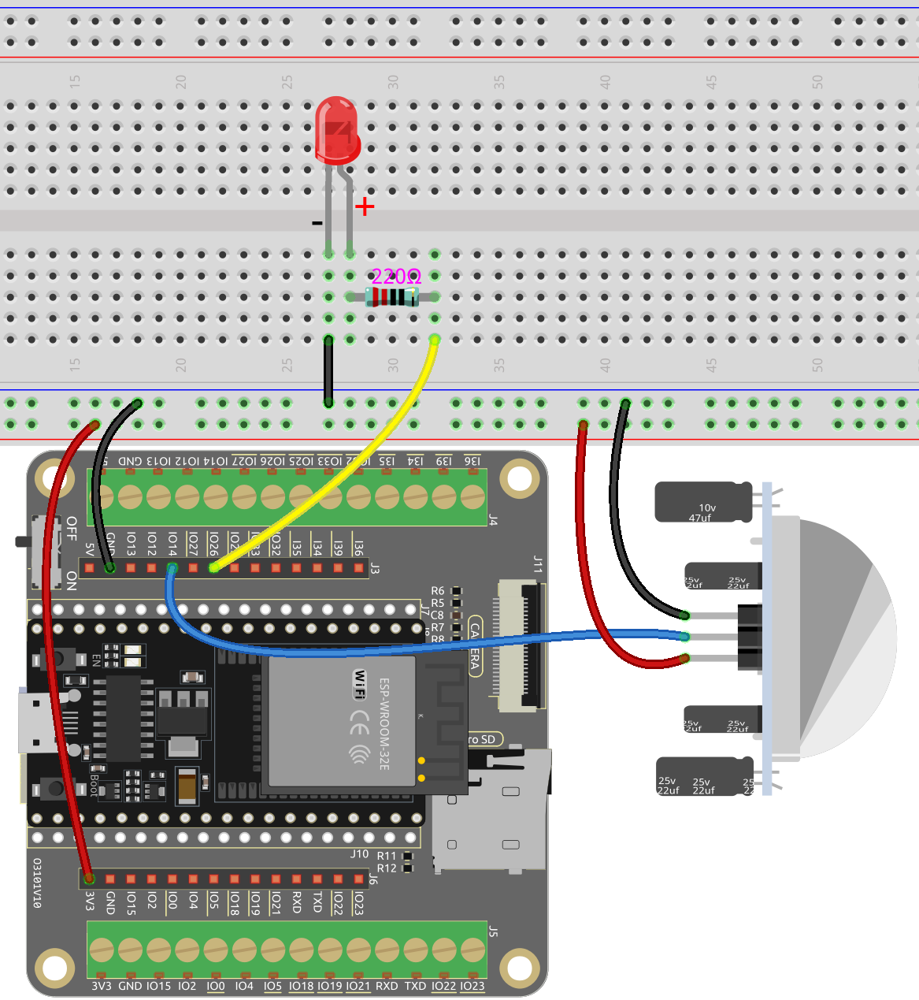

.. note::

    Hallo und willkommen in der SunFounder Raspberry Pi & Arduino & ESP32 Enthusiasten-Gemeinschaft auf Facebook! Tauchen Sie tiefer ein in die Welt von Raspberry Pi, Arduino und ESP32 mit anderen Enthusiasten.

    **Warum beitreten?**

    - **Expertenunterstützung**: Lösen Sie Nachverkaufsprobleme und technische Herausforderungen mit Hilfe unserer Gemeinschaft und unseres Teams.
    - **Lernen & Teilen**: Tauschen Sie Tipps und Anleitungen aus, um Ihre Fähigkeiten zu verbessern.
    - **Exklusive Vorschauen**: Erhalten Sie frühzeitigen Zugang zu neuen Produktankündigungen und exklusiven Einblicken.
    - **Spezialrabatte**: Genießen Sie exklusive Rabatte auf unsere neuesten Produkte.
    - **Festliche Aktionen und Gewinnspiele**: Nehmen Sie an Gewinnspielen und Feiertagsaktionen teil.

    👉 Sind Sie bereit, mit uns zu erkunden und zu erschaffen? Klicken Sie auf [|link_sf_facebook|] und treten Sie heute bei!

.. _ar_pir:

5.5 Menschliche Bewegung Erkennen
========================================

Der passive Infrarotsensor (PIR-Sensor) ist ein gängiger Sensor, der Infrarotstrahlung (IR), die von Objekten in seinem Sichtfeld ausgestrahlt wird, messen kann.
Einfach ausgedrückt, empfängt er Infrarotstrahlung, die vom Körper ausgestrahlt wird, und erkennt so die Bewegung von Menschen und anderen Tieren.
Konkreter gesagt, teilt er der Hauptsteuerplatine mit, dass jemand Ihr Zimmer betreten hat.

**Benötigte Komponenten**

Für dieses Projekt benötigen wir die folgenden Komponenten.

Es ist definitiv praktisch, ein ganzes Kit zu kaufen, hier ist der Link:

.. list-table::
    :widths: 20 20 20
    :header-rows: 1

    *   - Name
        - ARTIKEL IN DIESEM KIT
        - LINK
    *   - ESP32 Starter Kit
        - 320+
        - |link_esp32_starter_kit|

Sie können sie auch separat über die untenstehenden Links kaufen.

.. list-table::
    :widths: 30 20
    :header-rows: 1

    *   - KOMPONENTENVORSTELLUNG
        - KAUF-LINK

    *   - :ref:`cpn_esp32_wroom_32e`
        - |link_esp32_wroom_32e_buy|
    *   - :ref:`cpn_esp32_camera_extension`
        - |link_esp32_extension_board|
    *   - :ref:`cpn_breadboard`
        - |link_breadboard_buy|
    *   - :ref:`cpn_wires`
        - |link_wires_buy|
    *   - :ref:`cpn_resistor`
        - |link_resistor_buy|
    *   - :ref:`cpn_led`
        - |link_led_buy|
    *   - :ref:`cpn_pir`
        - |link_pir_buy|

**Verfügbare Pins**

* **Verfügbare Pins**

    Hier ist eine Liste der verfügbaren Pins auf dem ESP32-Board für dieses Projekt.

    .. list-table::
        :widths: 5 20

        *   - Verfügbare Pins
            - IO13, IO14, IO27, IO26, IO25, IO33, I35, I34, I39, I36, IO4, IO18, IO19, IO21, IO22, IO23
        *   - Für Ausgang
            - IO13, IO12, IO14, IO27, IO26, IO25, IO33, IO32, IO15, IO2, IO0, IO4, IO5, IO18, IO19, IO21, IO22, IO23

.. note::
    
    IO32 kann **nicht als Eingangspin** in diesem Projekt verwendet werden, da er intern mit einem 1K-Pull-Down-Widerstand verbunden ist, der seinen Standardwert auf 0 setzt.

* **Strapping Pins (Eingang)**

    Strapping-Pins sind eine spezielle Gruppe von Pins, die verwendet werden, um bestimmte Boot-Modi während des Gerätestarts 
    (d.h., Einschalt-Reset) zu bestimmen.

    
    .. list-table::
        :widths: 5 15

        *   - Strapping Pins
            - IO5, IO0, IO2, IO12, IO15 
    
    

    Generell wird **nicht empfohlen, sie als Eingangspins zu verwenden**. Wenn Sie diese Pins verwenden möchten, berücksichtigen Sie den potenziellen Einfluss auf den Boot-Vorgang. Weitere Details finden Sie im Abschnitt :ref:`esp32_strapping`.

**Schaltplan**

Wenn das PIR-Modul eine Bewegung erkennt, wird IO14 hoch gesetzt und die LED leuchtet auf. Andernfalls, wenn keine Bewegung erkannt wird, wird IO14 niedrig gesetzt und die LED schaltet sich aus.

.. note::
    Das PIR-Modul hat zwei Potentiometer: eines zur Einstellung der Empfindlichkeit, das andere zur Einstellung der Erkennungsdistanz. Um das PIR-Modul besser arbeiten zu lassen, müssen Sie beide gegen den Uhrzeigersinn bis zum Ende drehen.

    .. image:: ../../components/img/PIR_TTE.png
        :width: 300
        :align: center

**Verdrahtung**

**Code**

.. note::

    * Sie können die Datei ``5.5_pir.ino`` unter dem Pfad ``esp32-starter-kit-main\c\codes\5.5_pir`` öffnen. 
    * Nachdem Sie das Board (ESP32 Dev Module) und den entsprechenden Port ausgewählt haben, klicken Sie auf den **Upload**-Knopf.
    * :ref:`unknown_com_port`  

.. raw:: html

    <iframe src=https://create.arduino.cc/editor/sunfounder01/8b5f0cc8-b732-4ed2-b68e-bb7d0a73a1b8/preview?embed style="height:510px;width:100%;margin:10px 0" frameborder=0></iframe>
    
Nachdem der Code erfolgreich hochgeladen wurde, leuchtet die LED auf und geht aus, wenn das PIR-Modul eine vorbeigehende Person erkennt.

.. note::
    Das PIR-Modul hat zwei Potentiometer: eines zur Einstellung der Empfindlichkeit, das andere zur Einstellung der Erkennungsdistanz. Um das PIR-Modul besser arbeiten zu lassen, müssen Sie beide gegen den Uhrzeigersinn bis zum Ende drehen.

    .. image:: img/pir_back.png
